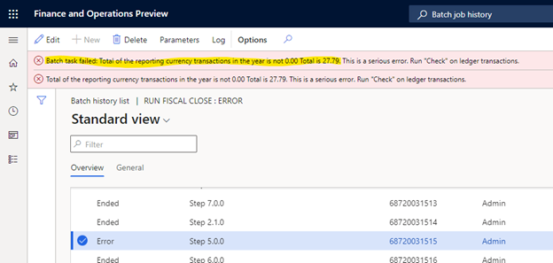

---
# required metadata

title: Reporting currency out of balance when running the year-end close
description: This article explains how reporting currency can be out of balance when running the year-end close
author: kweekley
ms.date: 12/12/2022
ms.topic: article
ms.prod: 
ms.technology: 

# optional metadata

ms.search.form: 
audience: Application User
# ms.devlang: 
ms.reviewer: twheeloc
# ms.tgt_pltfrm: 
# ms.custom:
# ms.assetid:
ms.search.region: Global
# ms.search.industry: 
ms.author: kweekley
ms.search.validFrom: 2022-01-31
ms.dyn365.ops.version: 10.0.25

---

# Reporting currency out of balance when running the year-end close

After enabling the **Awareness between ledger settlement and year end close feature** (the Awareness feature), ledger transactions that have been settled will no longer be included in the opening balance of the next fiscal year when running the general ledger year end close. Excluding ledger transactions that are settled may present a challenge for customers at year-end close if the Ledger is defined with a reporting currency.  

Ledger settlement is performed for only the accounting currency. When the ledger transactions are settled, validation only ensures the accounting currency debits equal the accounting currency credits. The reporting currency amounts for those ledger transactions aren’t validated and may not have debits = credits. In addition, ledger settlement doesn’t automatically calculate and post a gain/loss in the reporting currency. 

Due to these limitations, a gain/loss transaction must exist in the reporting currency when performing ledger settlement. If the gain/loss isn’t included in the ledger settlement, the year-end close will result in an out of balance message. 

The following example walks through the steps for how to address this prior to running the year-end close. 

## Example setup

The Awareness feature is enabled and main account 110180 is setup for Ledger settlement. The following illustration shows the ledger transactions that were posted within the DEMF legal entity. DEMF has an accounting currency of USD and a reporting currency of EUR.  

On the **Ledger settlement** page, (**General ledger > Periodic tasks > Ledger settlement**, the ledger transactions for main account 110180 are shown. Right-click on the grid and select **Insert columns**. Add the column **Amount in reporting currency** so you can see the transaction currency, accounting currency, and reporting currency amounts. 

The first two ledger transactions for 100.00 EUR are settled as a group, and the next two ledger transactions for 200.00 EUR are settled as a group (the two transactions will have different settlement IDs). This shows organizations will have multiple groups of ledger transactions settled at different times and with different settlement dates. After settlement is complete, the **Ledger settlement** page shows the following information when filtered to view **Settled transactions**. 

On the **Ledger settlement** page, right-click on the **Amount** column and **Amount in reporting currency** columns and choose **Total this column**. The accounting currency must have a difference of zero in order to settle. There is no validation though on the **Settlement amount** for the reporting currency. The following illustrations shows a difference of -27.79 USD for the reporting currency. 

 

## Year-end close

If the year-end close is now run for 2022, the process will end in an out of balance error. This is directly a result of the reporting currency not having a **Ledger settlement amount** that nets to zero.

 

## Posting reporting currency gain/loss

To run the year-end close successfully, the difference in the reporting currency amount must be accounted for, typically as a gain or loss, and included in the ledger settlement. The reporting currency gain/loss can be posted multiple ways:

•	If the main account is accounts payable or accounts receivable, the AR/AP settlement of those documents will generate the necessary gain/loss. That accounting entry must be included in the ledger settlement when settling the corresponding ledger transactions from the invoice, payments, credit notes, etc. 
•	If the main account is any account other than accounts payable or account receivable, the gain/loss will have to be manually entered. When the gain/loss is posted, the level of detail for the accounting entry is determined by your organization. 

• Identify the reporting currency gain/loss amount that must be posted. This must be done for each main account. 

As described earlier, this can be done on the **Ledger settlement** page:
1. Filter to the date range for which you want to post the gain/loss. If you plan on posting a gain/loss per month, filter for each month. If you plan on posting a gain/loss per fiscal year, filter for the entire year. 
2. Filter on the main account.
3. Filter show only **Settled transactions**.
4. Add a **Total** on the **Amount in reporting currency** column.
5. If you want to post the gain/loss at a more granular level, additional filtering can be done on the settlement ID, financial dimensions, etc. This total amount on the **Amount in reporting currency** column represents the amount for which to post the gain/loss. 
6. Go to **General ledger – Journal entries – Reporting currency adjustment journals**. 
7. Enter the transaction for the gain/loss. This journal will only post an adjustment in the reporting currency. The transaction currency and accounting currency amounts are always posted with a zero amount. If this journal hasn’t been used before, you may need to create a journal name with a journal type of **Reporting currency adjustment** under **General ledger – Journal setup – Journal names**. 
8. You might have to temporarily turn off the **Do not allow manual entry parameter** on the **Main account** page. This adjustment won't be posted if the main account doesn't allow for manual entry.

Post the adjustment journal and return to the **Ledger settlement** page. Select the main account for which you posted the gain/loss. The gain/loss adjustment must be included in a ledger settlement. Because the reporting currency amount isn’t required to net to zero, you can unsettle any prior transaction and settle them again, but this time include the gain/loss. How precise you want to be with the posting of the gain/loss and with the settlement of that gain/loss within **Ledger settlements** is up to your organization. 

Here the transactions for 200 EUR were unsettled and marked for settlement again, this time including the gain/loss adjustment. 

After settlement of those transactions, change the **Status** filter to view **Settled transactions**. The total **Amount in reporting currency** is now zero. The year-end close can now be run successfully. 

 

