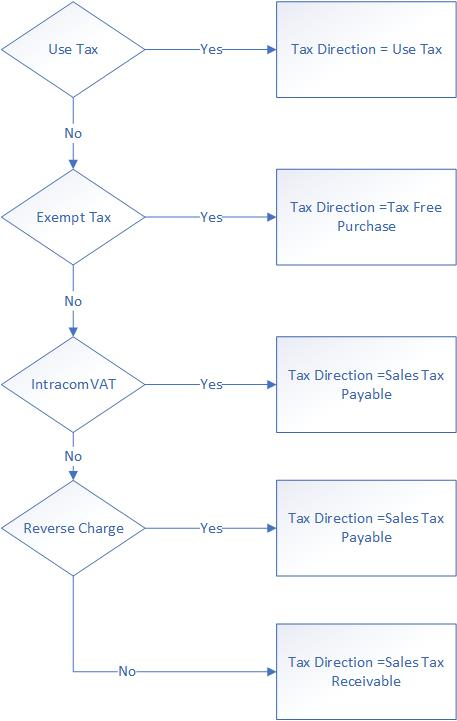
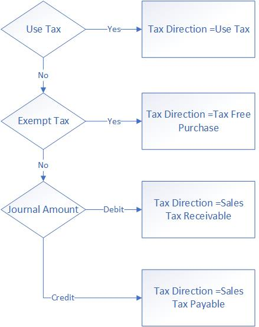

---
# required metadata

title: Sales tax calculation on general journal lines
description: This article explains how sales taxes are calculated for different types of accounts (vendor, customer, ledger, and project) on general journal lines.
author: EricWangChen
ms.date: 02/16/2022
ms.topic: article
ms.prod: 
ms.technology: 

# optional metadata

ms.search.form: TaxTable
# ROBOTS: 
audience: Application User
# ms.devlang: 
ms.reviewer: kfend

# ms.tgt_pltfrm: 
ms.custom: 4464
ms.assetid: 5f89daf1-acc2-4959-b48d-91542fb6bacb
ms.search.region: Global
# ms.search.industry: 
ms.author: wangchen
ms.search.validFrom: 2019-08-14
ms.dyn365.ops.version: 10.0.6

---

# Sales tax calculation on general journal lines
[!include [banner](../includes/banner.md)]

This article explains how sales taxes are calculated for different types of accounts (vendor, customer, ledger, and project) on general journal lines.

The process can be divided into three steps:

- Determine the sales tax direction.

- Determine the sales tax amount that will be stored a temporary sales tax table.

- Determine the sales tax amount and account on the voucher.

## Determine the sales tax direction

The way that the sales tax direction is determined depends on the type of account in the voucher. The sales tax direction is determined by the combination of account type and sales tax code. The following sections the possibilities in more detail. 

### Account type is Project

If a voucher has journal line where the account type is **Project**, all the journal lines in the voucher apply the same tax direction. The following illustration shows the rule. The following points show the possible tax directions for project accounts.

•	If the sales tax code is use tax, then sales tax direction is Use Tax.

•	If the sales tax code is exempt tax, then sales tax direction is Tax Free Purchase.

•	If the sales tax code is intracom VAT, then sales tax direction is Sales Tax Payable.

•	If the sales tax code is reverse charge, then sales tax direction is Sales Tax Payable.

Otherwise, sales tax direction is Sales Tax Receivable.

The following diagram illustrates the rule graphically.

### Account type is Vendor

If a voucher has journal line where the account type is **Vendor**, all the journal lines in the voucher apply the same tax direction. The following points show the possible tax directions for vendor accounts. 

•	If the sales tax code is use tax, then sales tax direction is Use Tax.

•	If the sales tax code is exempt tax, then sales tax direction is Tax Free Purchase.

•	If the sales tax code is intracom VAT, then sales tax direction is Sales Tax Payable.

•	If the sales tax code is reverse charge, then sales tax direction is Sales Tax Payable.

Otherwise, sales tax direction is Sales Tax Receivable.

The following diagram illustrates the rule graphically.

### Account type is Customer

If a voucher has a journal line where the account type is **Customer**, all the journal lines in the voucher apply the same tax direction. 

If the sales tax code is exempt tax, then sales tax direction is Tax Free Sale. Otherwise, sales tax direction is Sales Tax Payable.

### Account type is Ledger

The following illustration shows the rule that applies when a voucher has only journal lines where the account type is **Ledger**. The following points show the possible tax directions for ledger accounts.

•	If the sales tax code is use tax, then sales tax direction is Use Tax.

•	If the sales tax code is exempt tax, then sales tax direction is Tax Free Purchase.

Otherwise, if the journal amount is debit (positive), sales tax direction is Sales Tax Receivable; if the journal amount is credit (negative), sales tax direction is Sales Tax Payable. 

The following diagram illustrates the rule graphically.

#### Override the sales tax direction

You can override the sales tax direction on general journal lines when the voucher contains **Ledger** as either the account or the offset account.

1. Go to **General ledger** > **Chart of accounts** > **Accounts** > **Main accounts**, and select the **Legal entity overrides** FastTab. 
2. Add a legal entity for which the **Sales tax direction** should be overridden, and select **Sales tax**. 
3. Select the sales tax direction:

 - **Purchase** – for **Sales tax receivable** tax direction
 - **Sales** – for **Sales tax payable** tax direction

If, on the general journal line, the **Account type** isn't **Ledger**, on the **General** tab, set the **Sales tax direction** to **Yes** to override the sales tax direction for the offset ledger account.

## Determine the sales tax amount

This section describes how the sales tax amount sign is calculated.

The following table shows the generic rule for determining the sales tax direction and sign of sales tax amounts in the temporary sales tax table.

| Journal line amount | Sales tax direction  | Sales tax amount sign |
|---------------------|----------------------|-----------------------|
| Positive            | Sales Tax Receivable | Positive              |
| Positive            | Sales Tax Payable    | Negative              |
| Negative            | Sales Tax Receivable | Negative              |
| Negative            | Sales Tax Payable    | Positive              |

There's a special rule for vouchers that have only **Project** or **Ledger** lines, when a sales tax group or item sales tax group is selected on the **Ledger** line. This rule is controlled by the feature, **Enable independent sales tax calculation of general journals**. When this feature is turned off, the tax amount of the **Ledger** line uses the debit/credit direction of the **Project** line. When the feature is turned on, the tax amount of the **Ledger** line uses its own debit/credit direction. The following tables show the rule for each scenario. 

**Rule when the feature is turned on**

| Journal line amount of project | Sales tax direction  | Sales tax amount sign |
|--------------------------------|----------------------|-----------------------|
| Positive                       | Sales Tax Receivable | Positive              |
| Negative                       | Sales Tax Receivable | Negative              |

**Rule when the feature is turned off**

| Journal line amount of ledger  | Sales tax direction  | Sales tax amount sign |
|--------------------------------|----------------------|-----------------------|
| Positive                       | Sales Tax Receivable | Positive              |
| Negative                       | Sales Tax Receivable | Negative              |

## Determine the sales tax amount and account on the voucher

When you post sales taxes, the main account is retrieved from the ledger posting group profile. When sales taxes are receivable, the system uses the Sales Tax Receivable account that is specified in the profile. For sales taxes that are payable, the system uses Sales Tax Payable account that is specified in the profile.

The following table shows the generic rule.

| Sales tax direction  | Sales tax amount sign | Sales tax account      | Amount on voucher |
|----------------------|-----------------------|------------------------|-------------------|
| Sales Tax Receivable | Positive              | Tax Receivable Account | Positive (Debit)  |
| Sales Tax Receivable | Negative              | Tax Receivable Account | Negative(Credit)  |
| Sales Tax Payable    | Positive              | Tax Payable Account    | Negative(Credit)  |
| Sales Tax Payable    | Negative              | Tax Payable Account    | Positive (Debit)  |

[!INCLUDE[footer-include](../../includes/footer-banner.md)]
