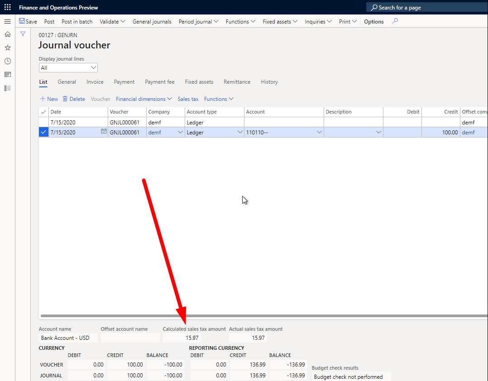
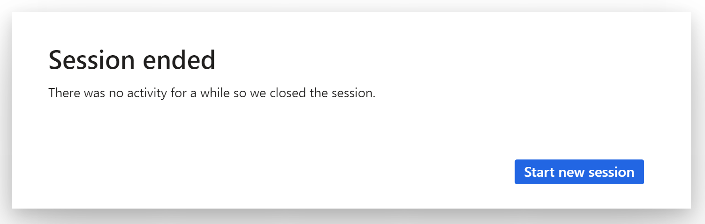
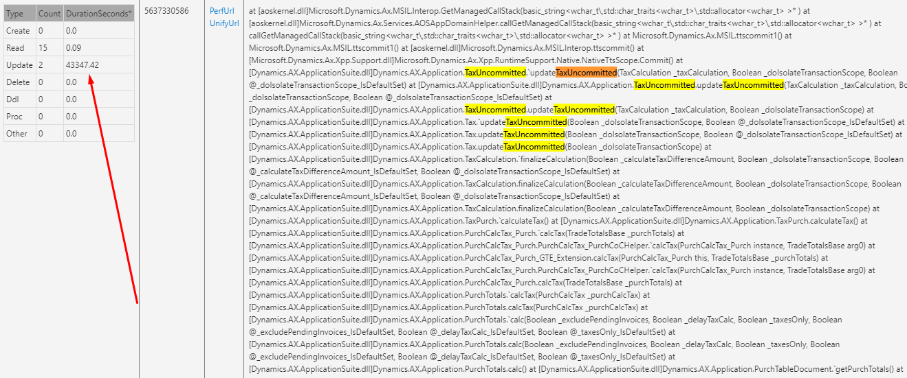

---
# required metadata

title: Tax calculation performance affects transactions
description: This topic provides troubleshooting information that is related to tax calculation performance and its effect on transactions.
author: shtao
ms.date: 04/07/2021
ms.topic: article
ms.prod: 
ms.technology: 

# optional metadata

# ms.search.form:
audience: Application user
# ms.devlang: 
ms.reviewer: kfend
ms.search.scope: Core, Operations
# ms.tgt_pltfrm: 
# ms.custom: 
ms.search.region: Global
# ms.search.industry: 
ms.author: wangchen
ms.search.validFrom: 2021-04-01
ms.dyn365.ops.version: 10.0.1
---

# Tax calculation performance affects transactions

[!include [banner](../includes/banner.md)]

Sometimes, a transaction is affected by performance issues that tax calculation is having. To troubleshoot this issue, follow the steps in the following sections as required.

## Review the transaction line count

Determine whether the transaction has a large number of lines (for example, more than several hundred). If it doesn't, move on to the next section. If the transaction does have several hundred lines, delay the tax calculation. For more information, see [Enable delayed tax calculation on journals](enable-delayed-tax-calculation.md). 

Next, you can determine whether any of the following conditions are met:

- There are import transactions from large files.
- Multiple sessions process the same transaction tax calculation at the same time.
- The transaction has multiple lines, and the views are updated in real time. For example, the **Calculated sales tax amount** field on the **General journal** page is updated in real time when a line's fields are changed.

   

If any of these conditions are met, delay the tax calculation.

## Review the call stack

Review the call stack to determine whether tax calculation is called multiple times. If it isn't, move on to the next section. If the call stack is called multiple times, follow these steps to help reduce the tax calculation times.

1. If the journal has considered the transaction, delay the tax calculation. For more information, see [Enable delayed tax calculation on journals](enable-delayed-tax-calculation.md).
2. If the transaction is a purchase order, and the application version is later than 10.0.15, you can delay the tax calculation until the final calculation by enabling the flighting for **PurchTableChangeMgmtDistributionUpdateOnToggle_KillSwitch**.

## Review the call stack timeline

Review the call stack timeline to determine whether the following issues exist. If they do, enable the flighting for **TaxUncommittedDoIsolateScopeFlighting** to fix the issue.

- The transaction causes the system to stop responding until the session ends. Therefore, the transaction can't calculate the tax result. The following illustration shows the "Session ended" message box that you receive.

    

- The **TaxUncommitted** methods take more time than other methods. For example, in the following illustration, the **TaxUncommitted::updateTaxUncommitted()** method takes 43,347.42 seconds, but other methods take 0.09 seconds.

    

## Customizing and calling tax calculation

When you customize, don't call tax calculation at the **insert()** or **update()** method for each line. Tax calculation should be called at the transaction level.

## Determine whether customization exists

If you've completed the steps in the previous sections but have found no issue, determine whether customization exists. If no customization exists, create a Microsoft service request for further support.

[!INCLUDE[footer-include](../../includes/footer-banner.md)]
