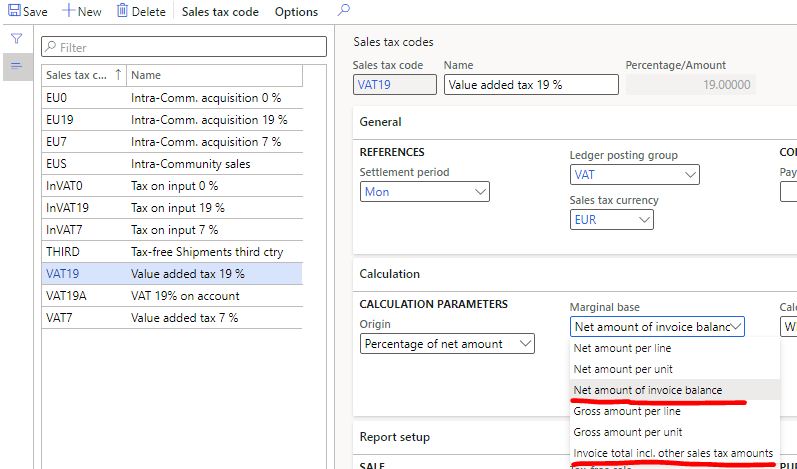

---
# required metadata

title: Tax is not calculated or the tax amount is 0
description:
author: shtao,maplnan
manager: beya
ms.date: 02/04/2021
ms.topic: article
ms.prod: 
ms.service: dynamics-ax-applications
ms.technology: 

# optional metadata

# ms.search.form:
audience: Application user
# ms.devlang: 
ms.reviewer: kfend
ms.search.scope: Core, Operations
# ms.tgt_pltfrm: 
# ms.custom: 
ms.search.region: Global
# ms.search.industry: 
ms.author: wangchen
ms.search.validFrom: 2021-04-01
ms.dyn365.ops.version: 10.0.1
---

# Tax is not calculated or the tax amount is 0

[!include [banner](../includes/banner.md)]

## **Symptom**

- The transaction has line amount that is not equal to 0, but the tax is not calculated, or the tax amount is 0.

 

## **Trouble shooting guide**

- **Step 1: Check whether the transaction picks the tax codes correctly. If the transaction does not pick tax codes, the transaction will not have tax calculation.**

  1. Go to *The transaction line > Line details > Setup > SALES TAX*, make sure the Item sales tax group* and *Sales tax group* have correct values. If not, please fill them with correct values; otherwise, go to next step 1.b.

     

  2. Go to *Tax > Indirect taxes > Sales tax > Sales tax groups > The sales tax group > Setup*, and go to *Tax > Indirect taxes > Sales tax > Item sales tax groups > The item sales tax group > Setup*. Make sure their intersection are the target tax codes. If not, please add correct sales tax codes into them; otherwise, go to next step 2.

     

     

- **Step 2: Check whether the picked tax codes are not exempt, and the picked tax codes have the correct tax rate value. If the tax code is exempt or the tax rate is 0, the tax calculation result is 0.**

- 1. Go to *Tax  > Indirect taxes > Sales tax > Sales tax groups > The sales tax group > Setup*, make sure the tax code '*Exempt*' is unmarked. If not, please unmark it; otherwise, go to next step 2.b.

     

  2. Go to *Tax > Indirect taxes > Sales tax > Sales tax codes > The sales tax code  > Value*,  make sure the tax rate value is not equal to 0. If not, please fill it     with the correct tax rate; otherwise, go to next step 3.

     

- **Step 3: Check whether the zero tax is the correct result. Some scenarios with zero tax are expected results.**

  1. Go to *General ledger* *> Ledger setup > General ledger parameters > Sales tax* to check whether the tax calculation method is Total.

     

  2. Go to *Tax > Indirect taxes > Sales tax > Sales tax codes > The sales tax code > Calculation > Marginal base* to check the marginal base is *Net amount of invoice balance* or *Invoice total incl. other sales tax amounts*. Refer to https://docs.microsoft.com/en-us/dynamics365/finance/general-ledger/marginal-base-field#invoice-total-incl-other-sales-tax-amounts 

  3. If one of step 3.a or step 3.b is met, then check whether the transaction's total amount is 0. If yes, the zero tax is the expected result. Because the tax calculation base on the total amount of the invoice balance, not line by line, after the tax calculation, the zero tax will be allocated to each line. So the expected is 0 and 0, not 190 and -190. 

     

- **Step 4: If no issue is found in above steps, check whether customization exists. If not, create a service request to Microsoft for further support.**

[!INCLUDE[footer-include](../../includes/footer-banner.md)]