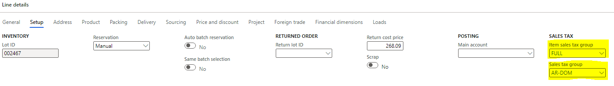
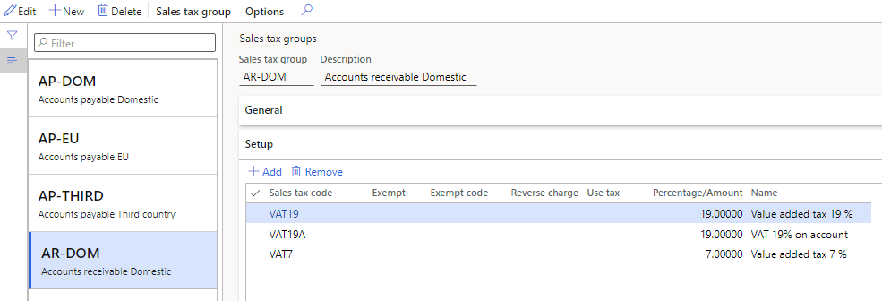
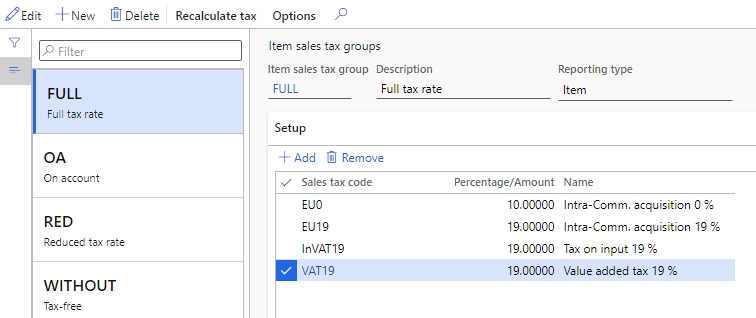
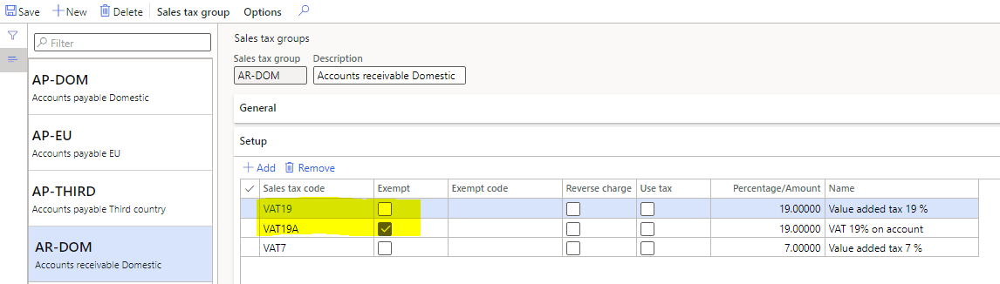
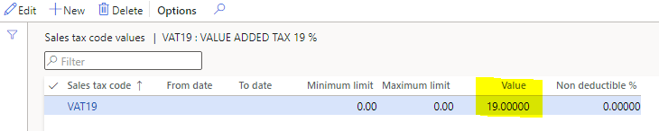
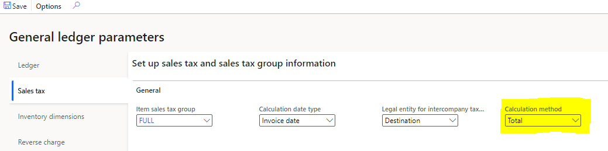

---
# required metadata

title: Tax isn't calculated or the tax amount is zero
description: This topic provides troubleshooting information that can help when the tax amount is 0 (zero) or tax isn't calculated.
author: shtao
ms.date: 04/01/2021
ms.topic: article
ms.prod: 
ms.technology: 

# optional metadata

# ms.search.form:
audience: Application user
# ms.devlang: 
ms.reviewer: kfend
ms.search.scope: Core, Operations
# ms.tgt_pltfrm: 
# ms.custom: 
ms.search.region: Global
# ms.search.industry: 
ms.author: wangchen
ms.search.validFrom: 2021-04-01
ms.dyn365.ops.version: 10.0.1
---

# Tax isn't calculated or the tax amount is zero

[!include [banner](../includes/banner.md)]

A transaction might have a line amount that isn't 0 (zero), but either tax isn't calculated or the calculated tax amount is 0. To troubleshoot this issue, follow the steps in the following sections as required.

## Verify that tax codes are correctly selected by the transaction

If the transaction doesn't select the correct tax codes, or if it doesn't select any tax codes, taxes won't be calculated on it. Follow these steps to verify that tax codes are correctly selected by the transaction. 

1. On the transaction line, on the **Line details** FastTab, on the **Setup** tab, in the **Sales tax** section, verify that the correct tax groups are selected in the **Item sales tax group** and **Sales tax group** fields. If the correct tax groups aren't selected, select them.

    

2. Go to **Tax** \> **Indirect taxes** \> **Sales tax** \> **Sales tax groups**.
3. Select the appropriate sales tax group, and then, on the **Setup** FastTab, make a note of the tax code in the **Sales tax code** field.

    

4. Go to **Tax** \> **Indirect taxes** \> **Sales tax** \> **Item sales tax groups**.
5. Select the appropriate item sales tax group, and then, on the **Setup** FastTab, verify that the tax code in the **Sales tax code** field matches the tax code of the sales tax group.

    

6. If the tax codes don't match, update the sales tax code for one of the groups.

## Verify that the selected tax codes aren't exempt and that they have the correct tax rate value

If the tax codes are exempt, or if the tax rate is 0 (zero), the tax calculation result will be 0. Follow these steps to determine whether the selected tax codes are exempt and to verify that the correct tax rate is applied to them.

1. Go to **Tax** \> **Indirect taxes** \> **Sales tax** \> **Sales tax groups**.
2. Select the appropriate sales tax group, and then, on the **Setup** FastTab, verify that the **Exempt** check box is cleared. If it's selected, clear it.

    

3. Go to **Tax** \> **Indirect taxes** \> **Sales tax** \> **Sales tax codes**.
4. Select the appropriate sales tax code, and then verify that the tax rate value in the **Value** field isn't 0 (zero). If it's 0, update the field so that it's set to the correct tax rate.

    

## Determine whether zero is the correct tax amount

In some scenarios, a tax amount of 0 (zero) is correct. Follow these steps to determine whether 0 is the correct tax amount for your transaction.

1. Go to **General ledger** \> **Ledger setup** \> **General ledger parameters**.
2. On the **Sales tax** tab, in the **Calculation method** field, verify that **Total** is selected.

    

3. Go to **Tax** \> **Indirect taxes** \> **Sales tax** \> **Sales tax codes**.
4. Select the appropriate sales tax code, select **Calculation** \> **Marginal base**, and verify that the marginal base is set to **Net amount of invoice balance** or **Invoice total incl. other sales tax amounts**. For more information, see the [Invoice total incl. other sales tax amounts](marginal-base-field.md#invoice-total-incl-other-sales-tax-amounts).
5. If the correct values are set in steps 2 and 4, determine whether the total amount of the transaction is 0 (zero). If the total amount is 0, a tax amount of 0 is the expected result. Because the tax calculation is based on the total amount of the invoice balance, and that amount isn't line by line, the tax amount of 0 will be allocated to each line after the tax calculation.

## Determine whether customization exists

If you've completed the steps in the previous sections but have found no issue, determine whether customization exists. If no customization exists, create a Microsoft service request for further support.

[!INCLUDE[footer-include](../../includes/footer-banner.md)]
