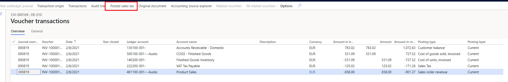
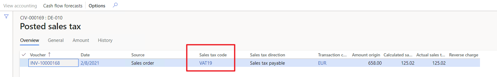
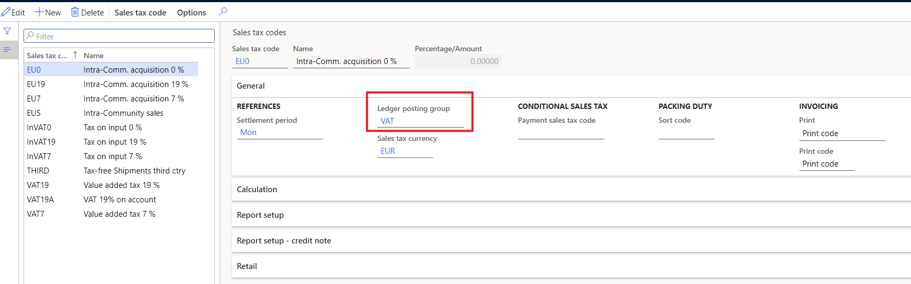
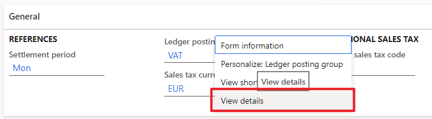
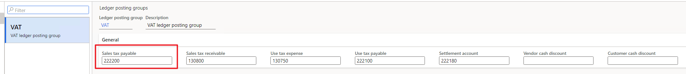
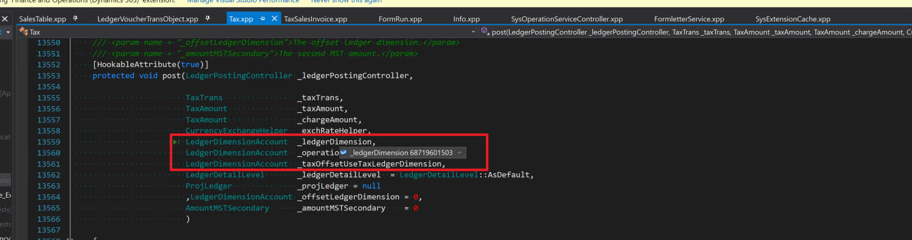
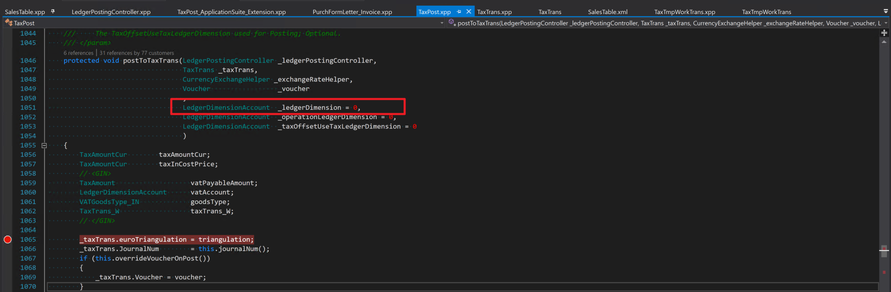
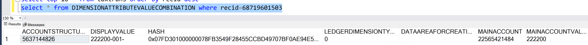

---
# required metadata

title: Tax is posted to the wrong ledger account in the voucher
description: This topic provides troubleshooting information that can help when tax is posted to the wrong ledger account in the voucher.
author: qire
ms.date: 04/12/2021
ms.topic: article
ms.prod: 
ms.technology: 

# optional metadata

#ms.search.form:
audience: Application user
# ms.devlang: 
ms.reviewer: kfend
ms.search.scope: Core, Operations
# ms.tgt_pltfrm: 
# ms.custom: 
ms.search.region: Global
# ms.search.industry: 
ms.author: wangchen
ms.search.validFrom: 2021-04-01
ms.dyn365.ops.version: 10.0.1
---

# Tax is posted to the wrong ledger account in the voucher

[!include [banner](../includes/banner.md)]

During posting, tax might be posted to the wrong ledger account in the voucher. To troubleshoot this issue, follow the steps in the following sections as required. The examples in this topic use a sales order as the business document.

## Find the tax code of the incorrectly posted tax transaction

1. On the **Voucher transactions** page, select the transaction that you want to work with, and then select **Posted sales tax**.

    [](./media/tax-posted-to-wrong-ledger-account-Picture1.png)

2. Review the value in the **Sales tax code** field. In this example, it's **VAT 19**.

    [](./media/tax-posted-to-wrong-ledger-account-Picture2.png)

## Check the ledger posting group of the tax code

1. Go to **Tax** \> **Indirect taxes** \> **Sales tax** \> **Sales tax codes**.
2. Find and select the tax code, and then review the value in the **Ledger posting group** field. In this example, it's **VAT**.

    [](./media/tax-posted-to-wrong-ledger-account-Picture3.png)

3. The value in the **Ledger posting group** field is a link. To view the details of the group's configuration, select the link. Alternatively, select and hold (or right-click) in the field, and then select **View details**.

    [](./media/tax-posted-to-wrong-ledger-account-Picture4.png)

4. In the **Sales tax payable** field, verify that the account number is correct, according to the transaction type. If it isn't, select the correct account to post to. In this example, the sales tax of the sales order should be posted to sales tax payable account 222200.

    [](./media/tax-posted-to-wrong-ledger-account-Picture5.png)

    The following table provides information about each field on the **Ledger posting groups** page.

    | Field                  | Description |
    |------------------------|-------------|
    | Sales tax payable      | The main account for outgoing sales taxes that are payable to the tax authority. |
    | Sales tax receivable   | The main account for incoming taxes that are received from the tax authority. |
    | Use tax expense        | The main account that is used to post deductible use taxes that vendors don't claim or report to the tax authority as part of European Union (EU) reverse charge Goods and Services Tax (GST)/Harmonized Sales Tax (HST). **Use tax** must be selected for the sales tax code in the sales tax group that is used in the transaction. This field isn't available if **Apply sales tax taxation rules** is selected on the **General ledger parameters** page. |
    | Use tax payable        | The main account that is used to post incoming use taxes that are payable to tax authorities. |
    | Settlement account     | The main account that is used to post the net balance of the ledger accounts that are specified in the **Use tax payable** and **Sales tax receivable** fields. |
    | Vendor cash discount   | The main account that is used to post a cash discount for sales tax codes that are associated with this ledger posting group. |
    | Customer case discount | The main account that is used to post a cash discount for sales tax codes that are associated with this ledger posting group. |

    For more information, see, [Set up Ledger posting groups for sales tax](tasks/set-up-ledger-posting-groups-sales-tax.md)

## Debug in code to check ledger dimensions

In the code, the posting account is determined by the ledger dimension. The ledger dimension saves the record ID of an account in the database.

1. For a sales order, add a breakpoint at the **Tax::saveAndPost()** and **Tax::post()** methods. Pay attention to the value of **\_ledgerDimension**.

    [](./media/tax-posted-to-wrong-ledger-account-Picture6.png)

    For a purchase order, add a breakpoint at the **TaxPost::saveAndPost()** and **TaxPost::postToTaxTrans()** methods. Pay attention to the value of **\_ledgerDimension**.

    [](./media/tax-posted-to-wrong-ledger-account-Picture7.png)

2. Run the following SQL query to find the display value of the account in the database, based on the record ID that is saved by the ledger dimension.

    ```sql
    select * from DIMENSIONATTRIBUTEVALUECOMBINATION where recid={the value of _ledgerDimension}
    ```

    [](./media/tax-posted-to-wrong-ledger-account-Picture8.png)

3. Examine the callstack to find where the **_ledgerDimension** value is assigned. Usually, the value is from **TmpTaxWorkTrans**. In this case, you should add a breakpoint at **TmpTaxWorkTrans::insert()** and **TmpTaxWorkTrans::update()** to find where the value assigned.

## Determine whether customization exists

If you've completed the steps in the previous sections but have found no issue, determine whether customization exists. If no customization exists, create a Microsoft service request for further support.

[!INCLUDE[footer-include](../../includes/footer-banner.md)]
