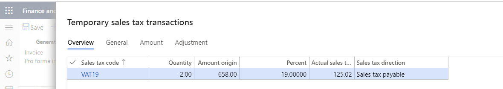

---
# required metadata

title: TaxTrans record is not generated
description:
author: qire
manager: beya
ms.date: 04/01/2021
ms.topic: article
ms.prod: 
ms.service: dynamics-ax-applications
ms.technology: 

# optional metadata

#ms.search.form:
audience: Application user
# ms.devlang: 
ms.reviewer: kfend
ms.search.scope: Core, Operations
# ms.tgt_pltfrm: 
# ms.custom: 
ms.search.region: Global
# ms.search.industry: 
ms.author: wangchen
ms.search.validFrom: 2021-04-01
ms.dyn365.ops.version: 10.0.1
---

# TaxTrans record is not generated

[!include [banner](../includes/banner.md)]

## Symptom

- Click *Posted sales tax* on transaction, there is no tax line or missing tax line.

  

## Trouble shooting guide

- **Step 1: Please check the sales tax before posting the transaction.**

  1. Click *Sales tax* button before posting to check the calculation result.

     

  2. We can see the result of calculation

     

  3. If there is no tax, please refer to [[Core Tax Calculation\]: Tax is not calculated or the tax amount is 0]

- **Step 2: Try to find the TaxTrans in all posted sales tax.**

  1. Go to Tax *-> Inquiries and reports -> Sales tax inquiries -> Posted sales tax* 

  2. Filter by *Vouche*r to locate the TaxTrans.

  3. If sales tax can be found, check the date. If date is different from the date of journal header, raise an service request to Microsoft for further support.

     

- **Step 3: Debug to check the detail, if the sales tax cannot be found in above step.**

  1. Please refer to [[Core Tax Posting\]: TaxTrans is incorrect] to debug if TmpTaxWorkTrans and TaxUncommitted is generated correctly.

  2. If TaxTmpWorkTrans or TaxUncommitted is generated, add breakpoint at TaxPost::SaveAndPost() and Tax::SaveAndPost to debug why the TaxTrans is not inserted.

     

     

- **Step 4: If no issue is found in above steps, check whether customization exists. If not, create a service request to Microsoft for further support.**

[!INCLUDE[footer-include](../../includes/footer-banner.md)]