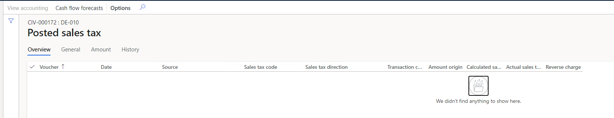
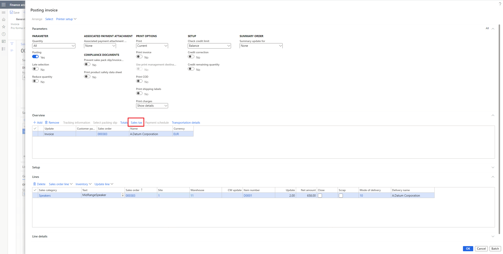
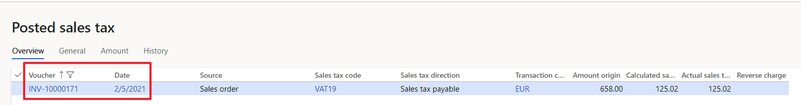
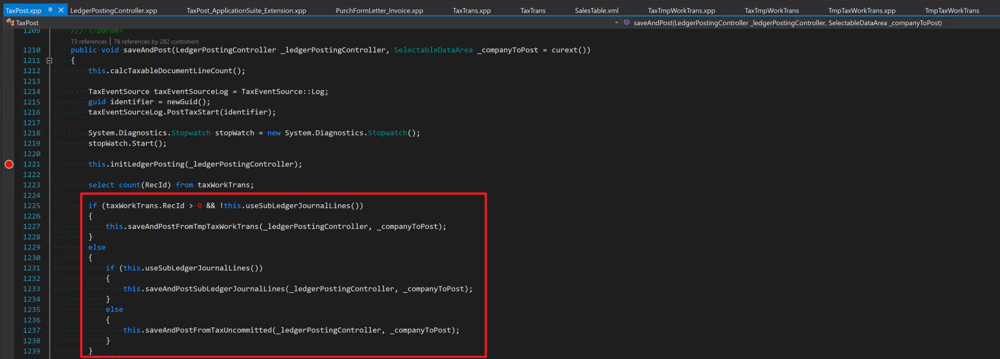
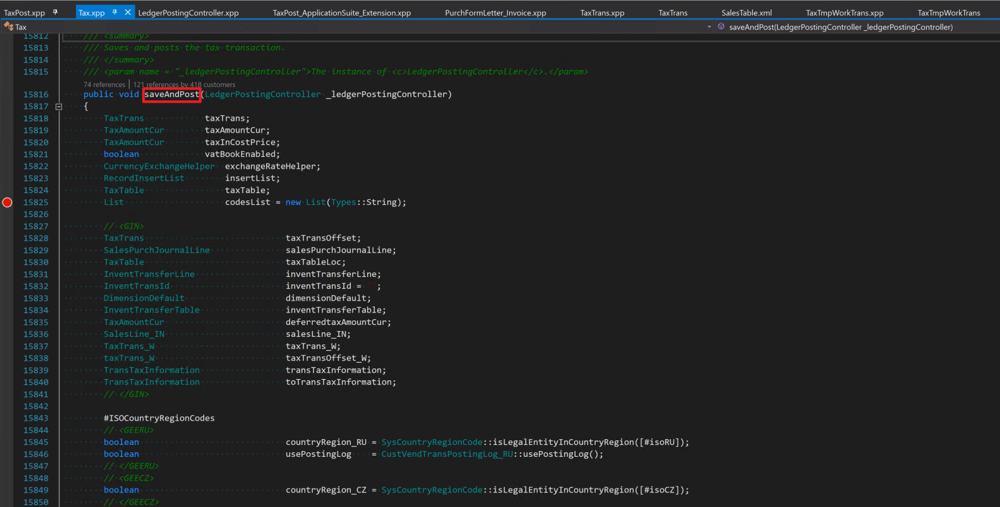

---
# required metadata

title: TaxTrans record isn't generated
description: This topic provides troubleshooting information that can help when a **TaxTrans** record isn't generated.
author: qire
manager: beya
ms.date: 04/13/2021
ms.topic: article
ms.prod: 
ms.service: dynamics-ax-applications
ms.technology: 

# optional metadata

#ms.search.form:
audience: Application user
# ms.devlang: 
ms.reviewer: kfend
ms.search.scope: Core, Operations
# ms.tgt_pltfrm: 
# ms.custom: 
ms.search.region: Global
# ms.search.industry: 
ms.author: wangchen
ms.search.validFrom: 2021-04-01
ms.dyn365.ops.version: 10.0.1
---

# TaxTrans record isn't generated

[!include [banner](../includes/banner.md)]

If you select **Posted sales tax** on a transaction, and there is no tax line or a tax line is missing, the **TaxTrans** record might not have been generated. 

   
   
To troubleshoot this issue, complete the steps in the following sections as required.

## Verify the sales tax before posting the transaction

1. Before you post the transaction, on the **Posting invoice** page, select **Sales tax** to check the calculation.

     

2. On the **Temporary sales tax transactions** page, view the result of the calculation. 
3. If there is no calculated tax, see the topic, [Tax isn't calculated or the tax amount is zero](sales-tax-troubleshooting-tax-not-calculated-amount-zero.md).

## Find the TaxTrans in all posted sales tax

1. Go to **Tax** > **Inquiries and reports** > **Sales tax inquiries** > **Posted sales tax**.
2. In the **Voucher** column, select the filter icon to to locate the **TaxTrans** record.
3. If you find the sales tax records you are looking for, check the date. If date is different from the date of journal header, create a Microsoft service request for further support.

     

## Debug to check details

  1. See the topic, [Field value in TaxTrans is incorrect](sales-tax-troubleshooting-field-value-taxtrans-incorrect.md) to debug and determine if **TmpTaxWorkTrans** and **TaxUncommitted** is generated correctly.
  2. If **TaxTmpWorkTrans** or **TaxUncommitted** is correctly generated, add a breakpoint at *TaxPost::SaveAndPost()* and *Tax::SaveAndPost* to debug why the **TaxTrans** is not inserted.

     

     

## Determine whether customization exists
If you've completed the steps in the previous sections but have found no issue, determine whether customization exists. If no customization exists, create a Microsoft service request for further support.

[!INCLUDE[footer-include](../../includes/footer-banner.md)]
