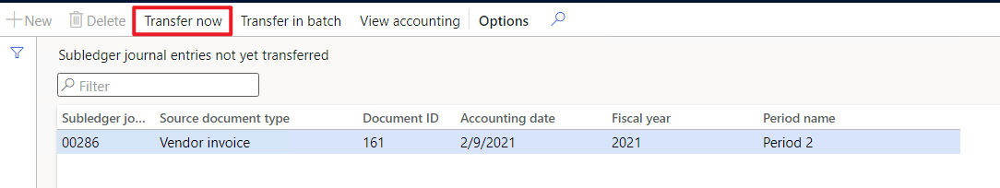

---
# required metadata

title: Voucher isn't generated
description: This topic provides information about how to troubleshoot when a voucher should be generated, but isn't.
author: qire
manager: beya
ms.date: 04/13/2021
ms.topic: article
ms.prod: 
ms.service: dynamics-ax-applications
ms.technology: 

# optional metadata

#ms.search.form:
audience: Application user
# ms.devlang: 
ms.reviewer: kfend
ms.search.scope: Core, Operations
# ms.tgt_pltfrm: 
# ms.custom: 
ms.search.region: Global
# ms.search.industry: 
ms.author: wangchen
ms.search.validFrom: 2021-04-01
ms.dyn365.ops.version: 10.0.1
---

# Voucher isn't generated

[!include [banner](../includes/banner.md)]

When a voucher should be generated, but the **Voucher transactions** page doesn't show any vouchers, use the sections in this topic to try and resolve the issue.

  
  

## Check the tax applicability 

1. Go to **Tax** > **Periodic tasks** > **Subledger journal entries not yet transferred**.
2. If there is a journal record, select the record, and then select **Transfer now**.
3. Check the **Voucher transactions** page again to see if the voucher was generated. 

     

## Determine whether customization exists
If you've completed the steps in the previous sections but have found no issue, determine whether customization exists. If no customization exists, create a Microsoft service request for further support.

[!INCLUDE[footer-include](../../includes/footer-banner.md)]
