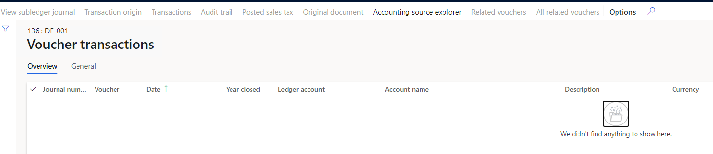

---
# required metadata

title: Voucher is not generated
description:
author: qire
manager: beya
ms.date: 04/01/2021
ms.topic: article
ms.prod: 
ms.service: dynamics-ax-applications
ms.technology: 

# optional metadata

#ms.search.form:
audience: Application user
# ms.devlang: 
ms.reviewer: kfend
ms.search.scope: Core, Operations
# ms.tgt_pltfrm: 
# ms.custom: 
ms.search.region: Global
# ms.search.industry: 
ms.author: wangchen
ms.search.validFrom: 2021-04-01
ms.dyn365.ops.version: 10.0.1
---

# Voucher is not generated

[!include [banner](../includes/banner.md)]

## Symptom

- In *Voucher transactions* no voucher is displayed

  

## Trouble shooting guide

- **Step 1: Check the tax applicability in tax configuration**

  1. Go to *Tax -> Periodic tasks -> Subledger journal entries not yet transferred*

  2. If there is journal not transferred, click *Transfer now* and check the voucher again.

     

- **Step 2: Check the voucher again.**

- **Step 3: If no issue is found in above steps, check whether customization exists. If not, create a service request to Microsoft for further support.**

[!INCLUDE[footer-include](../../includes/footer-banner.md)]