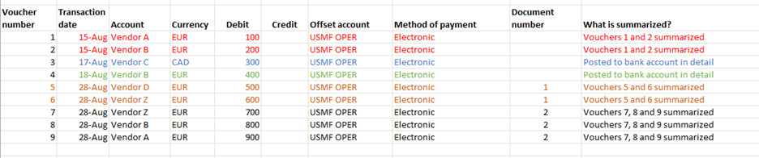
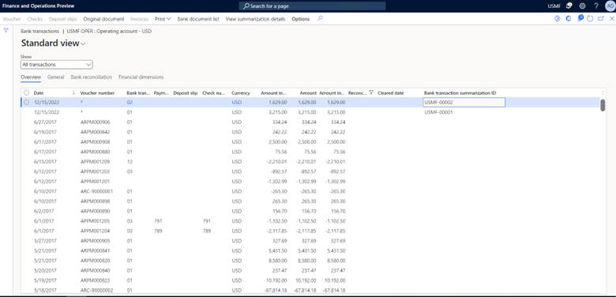
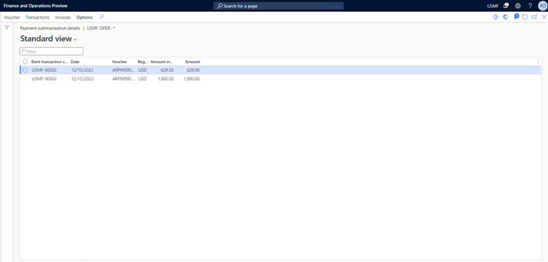

---
# required metadata

title: Post detailed payments for vendor and customers
description: This article describes the feature that posts detailed vendor and customer payments, but summarizes amounts in bank accounts.
author: kweekley
ms.date: 01/12/2023
ms.topic: article
ems.prod: 
ms.technology: 

# optional metadata

ms.search.form: DimensionFocus, LedgerTrialBalanceListPage
audience: Application User
# ms.devlang: 
ms.reviewer: twheeloc
# ms.tgt_pltfrm: 
ms.search.region: Global
# ms.search.industry: 
ms.author: kweekley
ms.search.validFrom: 2021-03-23
ms.dyn365.ops.version: 10.0.16

---

# Post detailed vendor and customer payments

The **Ability to post detailed vendor and customer payments, but summarize amounts to bank account** feature posts vendor and customer payments as separate vouchers, but summarizes the payments when the bank account balance is updated.

For example, your bank pays three vendors 100 euros (EUR) each on behalf of your organization. When the bank completes the transactions, the bank statement might show the three payments in detail, or it might show a summarized withdrawal of 300 EUR. If your bank summarizes the payments into a single withdrawal, this feature can be used to mimic that functionality. Therefore, it can help streamline the bank reconciliation process.

> [!IMPORTANT]
> This feature eliminates the need to record multiple vendor or customer payments in a single voucher number. To determine whether the parameters can be defined so that multiple subledger transactions are prohibited in a single voucher, see [One voucher](one-voucher.md).

## Setup

In the **Feature management** workspace, enable the feature that's named **Ability to post detailed vendor and customer payments, but summarize amounts to bank account**.

### Journal names

The ability to summarize payments to the bank subledger is supported for the following journal types:

- Daily (General journal)
- Vendor disbursement (Vendor payment journal)
- Customer payment (Customer payment journal)

On the **Journal names** page, two new fields are available in the **Bank** section: **Summarize amounts in bank account** and **Summarization criteria**.

When the **Summarize amounts in bank account** option is set to **No** (the default value), payments in a journal batch group will update the bank account in either detail or summary, depending on whether the payments are entered in a single voucher number. Posting to the bank account works just as does when the new feature is turned off. When the feature is turned on, we recommend that you no longer enter multiple payments in a single voucher number.

The **Summarize amounts in bank account** option can be set to **Yes** only if the **New voucher** field for the journal name is set to **In connection with balance**. In this case, the option promotes (but doesn't guarantee) the use of a single voucher per vendor or customer payment. When the new feature is turned on, summarization won't occur if the voucher contains more than one vendor or customer.

> [!NOTE]
> If the **New voucher** field is set to a value other than **In connection with balance**, and you try to set the **Summarize amounts in bank account** option to **Yes**, you will receive the following error message: "The Summarize amounts in bank account setting must be No when New voucher is set to Manual or One voucher number only."
>
> If the **Summarize amounts in bank account** option is set to **Yes**, and you try to change the value of the **New voucher** field to something other than **In connection with balance**, you will receive the following error message: "The New voucher setting must be In connection with balance when Summarize amounts in bank account is set to Yes."

If you set the **Summarize amounts in bank account** option to **Yes**, the **Summarization criteria** field becomes available. This field enables your organization to specify the criteria that are used to summarize payments to the bank account. The following values are available:

- **Do not summarize** – Payments won't be summarized, even if the **Summarize amounts in bank account** option is set to **Yes**.
- **Default criteria** – Payments that have the same bank account, method of payment, currency code, account type (either customer or vendor), and transaction date will be grouped for summarization.
- **Default criteria with document number** – Payments that have the same bank account, method of payment, currency code, account type (either customer or vendor), transaction date, and document number will be grouped for summarization. If the document number for more than one payment is blank, the blank value will be treated as a valid document number, and those payments will be summarized together.
- **Default criteria with payment reference** – Payments that have the same bank account, method of payment, currency code, account type (either customer or vendor), transaction date, and payment reference will be grouped for summarization. If the payment reference for more than one payment is blank, the blank value will be treated as a valid payment reference, and those payments will be summarized together.

## Parameters

When vendor or customer payments are summarized, a new number is assigned to the single bank account transaction.

On the **Cash and bank management parameters** page, on the **Number sequences** tab, define a number sequence for the **Bank transaction summarization ID** reference.

### Entering payments in a journal

When this feature is used, payments can be summarized to the bank account when they're entered from any of the following journals:

- Accounts payable - Payments – Vendor payment journal
- Accounts receivable - Payments - Customer payment journal
- General ledger - Journal entries - General journals

After a journal is created, verify the summarization settings on the **Setup** tab of the journal batch header. Default settings are taken from the journal name, but you can override them for individual journal batch numbers.

After all payments are entered in the journal, the following criteria are used during posting to determine which payments can be considered for summarization. These criteria affect how payments should be entered in the journal.

- Only payments that have the following combinations of an account and an offset account are considered for summarization: Vendor/Bank, Bank/Vendor, Customer/Bank, and Bank/Customer. Payments that are posted to a ledger account (*bridged payments*) aren't considered for summarization.
- Each payment voucher must contain only a single vendor or customer. If a voucher number contains multiple vendors or customers, it won't be considered for summarization.
- More than one payment, in separate vouchers, must exist in the journal batch number.
- Payments in different journal batch numbers aren't considered for summarization.

### Posting payments in a journal

During posting, the group of payment lines is considered for summarization as described in the previous section. After the group of payment lines is determined, summarization occurs, based on the settings on the journal batch header.

- Bank transaction summarization won't occur if the **Summarize amounts in bank account** option is set to **No**, or if the **Summarization criteria** field on the journal batch header is set to **Do not summarize**.

    If a journal name was defined so that payments are posted to the bank account in summary, but the **Summarization criteria** field on the journal batch header is set to **Do not summarize**, the transactions won't be summarized.

- Bank transaction summarization will occur when the **Summarize amounts in bank account** option is set to **Yes**, and the **Summarization criteria** field is set to **Default criteria**, **Default criteria with document number**, or **Default criteria with payment reference**. For more information, see the description of the **Summarization criteria** field in the [Journal names](#journal-names) section.

More than one group of summarized payments can be posted to a bank account. For example, if the journal contains a group of vendor payments and a group of customer payments, you can have two or more summarized payments. One or more summarized bank account transactions can be created for the vendor payments, and one or more summarized bank account transactions can be created for the customer payments.

For the next example, the following vendor payments were entered in a journal. The journal batch number was set up so that the **Summarization criteria** field is set to **Default criteria with document number**. During posting, the payments are summarized, or not summarized, as shown here.

| Voucher number | Transaction date | Account | Currency | Debit | Credit | Offset account | Method of payment | Document number | What's summarized? |
|---|---|---|---|---|---|---|---|---|---|
| 1 | August 15 | Vendor A | EUR | 100 | | USMF OPER | Electronic | | Vouchers 1 and 2 summarized |
| 2 | August 15 | Vendor B | EUR | 200 | | USMF OPER | Electronic | | Vouchers 1 and 2 summarized |
| 3 | August 17 | Vendor C | CAD | 300 | | USMF OPER | Electronic | | Posted to bank account in detail |
| 4 | August 18 | Vendor B | EUR | 400 | | USMF OPER | Electronic | | Posted to bank account in detail |
| 5 | August 28 | Vendor D | EUR | 500 | | USMF OPER | Electronic | 1 | Vouchers 5 and 6 summarized |
| 6 | August 28 | Vendor Z | EUR | 600 | | USMF OPER | Electronic | 1 | Vouchers 5 and 6 summarized |
| 7 | August 28 | Vendor Z | EUR | 700 | | USMF OPER | Electronic | 2 | Vouchers 7, 8, and 9 summarized |
| 8 | August 28 | Vendor B | EUR | 800 | | USMF OPER | Electronic | 2 | Vouchers 7, 8, and 9 summarized |
| 9 | August 28 | Vendor A | EUR | 900 | | USMF OPER | Electronic | 2 | Vouchers 7, 8, and 9 summarized |

<!---->

Five transactions will be posted to the bank account. For two, the original payment details will be maintained. For the other three, payments will be summarized based on the summarization rules.

### After payments are posted in a journal

After posting is completed, you can find the summarized (or detailed) payments in the transactions of the bank account. Go to **Cash and bank management** \> **Bank accounts** \> **Bank accounts**.

For any summarized payment, an asterisk (\*) will be shown in the **Voucher number** field. Every payment is still posted in detail to the general ledger.

All summarized bank account transactions will have a unique summarization ID. If the **Summarization criteria** field was set to **Default criteria with document number**, the document number from the payment lines will be used as the summarization ID. Otherwise, the summarization ID will be generated from the number sequence that was configured on the **Cash and bank management parameters** page. If the summarization ID that will be assigned to a summarized bank transaction is already used by another summarized bank transaction, a new one will be selected from the number sequence. The payment reference isn't used as a summarization ID.

Users can view the payment details of a summarized bank account transaction by selecting **View summarization details** on the **Payment summarization details** page.

While you're viewing the summarization details, you can view the general ledger voucher of each payment, return to the bank account summarized transaction, or view the settlement information for the selected payment.

The bank account summarized transactions will also be shown on the bank statement. Therefore, bank reconciliation is easier, regardless of whether the manual account reconciliation or advanced bank reconciliation is used. Both reconciliation processes show the bank summarization ID. If advanced bank reconciliation is enabled for the bank account, a bank document of the **Summarized transaction** type will be generated for the bank account. Users can match and reconcile transactions in the same way for other types of bank documents.

