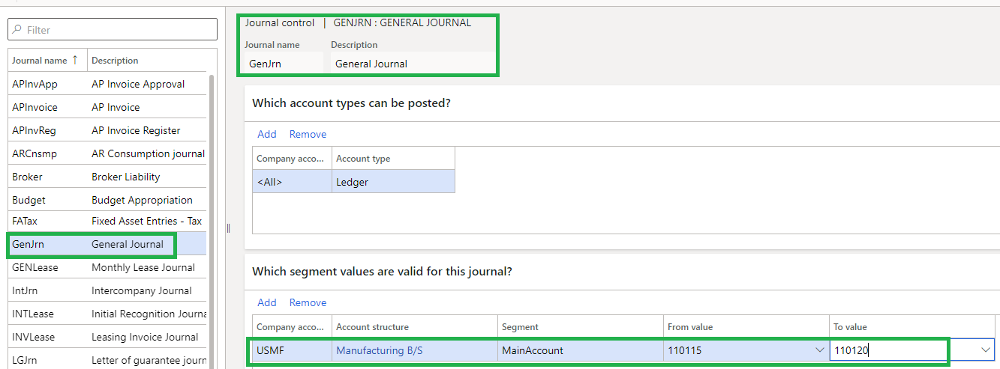

--- 
title: Create advanced rules for journals
description: Learn about the process of creating advanced rules for journals.
author: aprilolson
ms.author: aolson
ms.topic: how-to
ms.date: 09/05/2025
ms.custom:
ms.reviewer: twheeloc 
audience: Application User  
ms.search.region: Global
ms.search.validFrom: 2016-06-30
ms.search.form: LedgerJournalSetup, LedgerJournalControl, CompanyLookup, LedgerJournalPostControl
ms.dyn365.ops.version: Version 7.0.0 
---
# Create advanced rules for journals

[!include [banner](../../includes/banner.md)]

This procedure steps through creating advanced rules for journals. This includes setting up journal control and user posting restrictions. This procedure uses the USMF demo data company.

## Overview

Journal control lets you restrict which accounts and dimension values users can post to on a specific journal. You can control two things:

- **Which account types can be posted** — Limit the journal to specific account types, such as ledger, customer, or vendor accounts.
- **Which segment values are valid** — Restrict the dimension values that users can enter when posting to the journal. You select an account structure and a segment within it, then define a range of allowed values.

Journal control is separate from account structures. Account structures define which dimension combinations are valid across the system, while journal control adds an additional layer of restriction that applies only to a specific journal name.

## Set up journal control
1. Go to **General ledger > Journal setup > Journal names**.
2. In the list, find and select the desired record.
3. On the **Action pane**, click **Journal control**.
4. On the **Which account types can be posted** FastTab, click **Add**.
5. In the **Company accounts** field, click the drop-down button to open the lookup.
6. In the list, find and select the desired record.
7. In the list, click the link in the selected row.
8. On the **Which segment values are valid for this journal** FastTab, click **Add**.
9. In the **Account structure** field, click the drop-down button to open the lookup.
10. In the list, find and select the desired record.
11. In the list, click the link in the selected row.
12. In the **Segment** field, click the drop-down button to open the lookup.
13. In the list, click the link in the selected row.
14. In the **From value** field, click the drop-down button to open the lookup.
15. In the list, find and select the desired record.
16. In the list, click the link in the selected row.
17. In the **To value** field, click the drop-down button to open the lookup.
18. In the list, find and select the desired record.
19. In the list, click the link in the selected row.

### How journal control restrictions work across account structures

Journal control restrictions apply **per account structure**, not globally across all structures on the ledger. This means:

- If no journal control segment values are specified for an account structure, **all values** for all segments in that structure are allowed.
- If you add a restriction for a particular account structure, it only restricts segments for **that structure** — other account structures remain unrestricted.
- If you intend to restrict a dimension value to only one account strucutre, you must also define restrictions for every other structure on the ledger to prevent values from being entered against them.

Journal control is **open by default**. Adding a restriction in one context doesn't disable access in other contexts.

For example, suppose your ledger has two account structures: one allowing main accounts 100000–199999 and another allowing 600000–699999. If you set up a journal control restriction that only allows main accounts 110000–130000 on the first structure, users can still enter any account in the 600000–699999 range because no restriction exists on the second structure.

To fully restrict journal entries, add journal control segment values for **every** account structure assigned to the ledger.

> [!NOTE]
> All dimension values are compared as strings, not numbers. A range like `401100..401400` includes the value `4012` because string sorting places "4012" between "401100" and "401400". If you use variable-length identifiers, be aware that string comparison may produce unexpected results. For more information, see [Account structures overview](../configure-account-structures.md#valid-and-invalid-characters-in-criteria).

## Set up posting restrictions
1. Close the page.
2. Click **Posting restrictions**.
3. In the **How do you want to set up posting restrictions** field, select **By user group**.
4. In the tree, check **The group that you want to allow posting for this journal name**.
5. Click **OK**.

[!INCLUDE[footer-include](../../../includes/footer-banner.md)]
