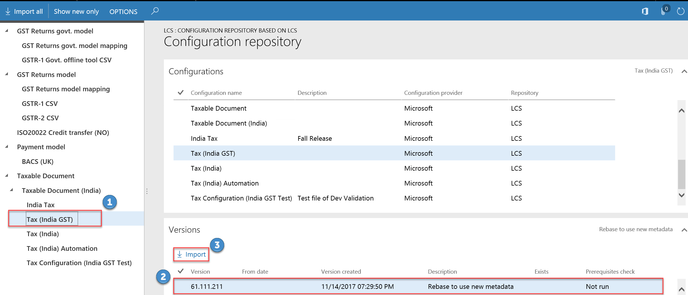

---
# required metadata

title: Tax engine import configuration
description: This topic provides information about import tax engine configuration.
author: kailiang
ms.date: 10/15/2018
ms.topic: article
ms.prod: 
ms.technology: 

# optional metadata

ms.search.form: ERSolutionTable, ERDataModelDesigner, ERModelMappingTable, GTE
audience: IT Pro
# ms.devlang: 
ms.reviewer: kfend
# ms.tgt_pltfrm: 
ms.search.region: India
# ms.search.industry: 
ms.author: kailiang
ms.search.validFrom: 2017-12-31
ms.dyn365.ops.version: 7.3

---

# Tax engine import configuration

[!include [banner](../includes/banner.md)]

This topic provides information about import tax engine configuration.

### Create a Lifecycle Services (LCS) configuration repository
1. Go to **Organization administration** > **Workspaces** > **Electronic reporting**.
2. In the **Configuration providers** section, click **Repositories** on the **Microsoft** provider tile.

3. Click **Add**. 
4. Select the **LCS** option. 
5. Click **Create repository** to create an LCS configuration repository.
6. Enter a name and description for the repository and then click **OK**.

### Import configurations from LCS
1. Go to **Organization administration** > **Workspaces** > **Electronic reporting**.
2. In the **Configuration providers** section, click **Repositories** on the **Microsoft** provider tile.
3. Select the configuration repository that you just created. 
4. Click **Open**.
5. In the tree, select the latest tax document (for example, select **Tax (India GST)**).
6. In the **Versions** section, click **Import**.

7. Click **Yes** to confirm the import.

[!INCLUDE[footer-include](../../includes/footer-banner.md)]
