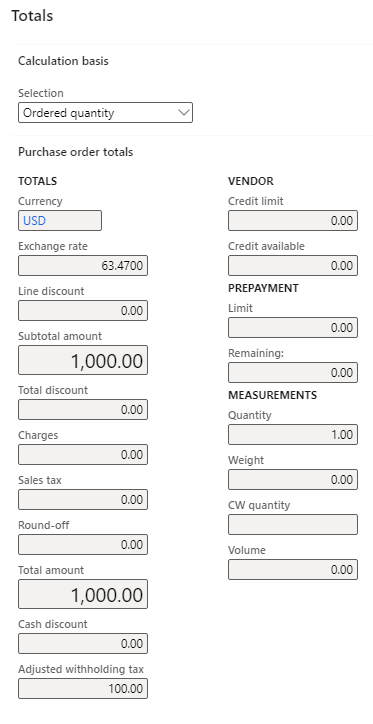
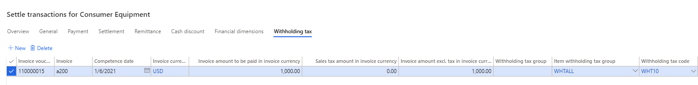

---
# required metadata

title: Withholding tax in purchase transactions
description: For vendors who are liable to withholding tax, you can assign the default **Withholding tax group** on the **All vendors** page.
author: kailiang
ms.date: 01/12/2021
ms.topic: article
ms.prod: 
ms.technology: 

# optional metadata

ms.search.form: 
# ROBOTS: 
audience: Application User
# ms.devlang: 
ms.reviewer: kfend
# 
# ms.tgt_pltfrm: 
ms.assetid: b4b406fa-b772-44ec-8dd8-8eb818a921ef
ms.search.region: Global
# ms.search.industry: 
ms.author: kailiang
ms.search.validFrom: 2020-01-12
ms.dyn365.ops.version: AX 10.0.16

---

# Withholding tax in purchase transactions

For vendors who are liable to withholding tax, you can assign the default **Withholding tax group** on the **All vendors** page.

1. Go to **Navigation pane > Modules > Accounts payable > Vendors > All vendors**.

2. Click the respective Vendor account, click **Edit**.

3. In **Invoice and delivery** tab, set the **Calculate withholding tax** field to **Yes**.

   > [!NOTE] 
   > Withholding tax will not be calculated if **Calculate withholding tax** is not switched on for this vendor in the data.

4. Select a withholding tax group in **Withholding tax group**.

5. Click **Save**.

For items/services which are liable to withholding tax, you can assign the default **Item withholding tax group** in **Released Products**.

1. Go to **Navigation pane > Modules > Product information management > Products > Released products**.

2. Click the respective Item number, click **Edit**.

3. In **Purchase** tab, click **Calculate withholding tax**.

   > [!NOTE] 
   > Withholding tax will not be calculated if **Calculate withholding tax** isn't set to **Yes** for this Item in the **Purchase** tab on the **Released product** page.

4. Select an item withholding tax group in **Item withholding tax group** list.

5. Click **Save**.

Withholding tax groups and Item withholding tax groups can be assigned in pages: 

- **Purchase order**
- **Vendor invoice**
- **Invoice journal**

The default Withholding tax group and Item withholding tax group will be carried into the lines when creating **Purchase orders** and/or **Pending Vendor invoices**. For **Vendor invoice journal**, you can switch on **Calculate withholding tax** and select **Item withholding tax group** in the **General** tab in the journal.

The temporary amount of withholding tax is available in the field **Adjusted withholding tax** of the **Totals** tab on the **Purchase order** page.

   > [!NOTE] 
   > Starting 10.0.35, a new option **Estimate withholding tax amount on invoice** is added to the **General ledger parameters > Withholding tax** tab. Once enabled, a Withholding tax buttion will be available on purchase order and vendor invoice to estimate the withholding tax amount.

Withholding tax is calculated on **Vendor payment journal**. You can manually adjust the applicable withholding tax codes as well as the actual withholding tax amounts in the **Withholding tax** tab on the **Settle transactions** page.

The derived withholding tax amount will be deducted from the vendor payment and posted to the **Withholding tax account** in a related voucher.

[!INCLUDE[footer-include](../../includes/footer-banner.md)]
