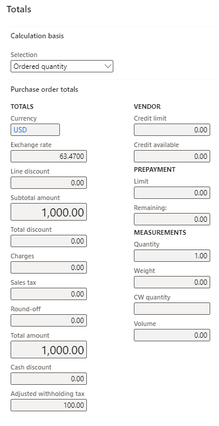
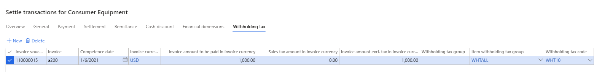

# Withholding tax in purchase transactions

For vendors who are liable to withholding tax, assign the default **Withholding tax group** on the **All vendors** page.

1. Go to **Navigation pane > Modules > Accounts payable > Vendors > All vendors**.

1. Click the respective Vendor account, and then click **Edit**.

1. In the **Invoice and delivery** tab, set the **Calculate withholding tax** field to **Yes**.

   > [!NOTE]
   > The system doesn't calculate withholding tax if you don't switch on **Calculate withholding tax** for this vendor in the data.

1. Select a withholding tax group in **Withholding tax group**.

1. Click **Save**.

For items and services that are liable to withholding tax, assign the default **Item withholding tax group** in **Released Products**.

1. Go to **Navigation pane > Modules > Product information management > Products > Released products**.

1. Click the respective Item number, and then click **Edit**.

1. In the **Purchase** tab, click **Calculate withholding tax**.

   > [!NOTE]
   > The system doesn't calculate withholding tax if you don't set **Calculate withholding tax** to **Yes** for this item in the **Purchase** tab on the **Released product** page.

1. Select an item withholding tax group in **Item withholding tax group** list.

1. Click **Save**.

Assign withholding tax groups and item withholding tax groups in these pages:

- **Purchase order**
- **Vendor invoice**
- **Invoice journal**

The default withholding tax group and item withholding tax group are carried into the lines when creating **Purchase orders** and **Pending Vendor invoices**. For **Vendor invoice journal**, you can switch on **Calculate withholding tax** and select **Item withholding tax group** in the **General** tab in the journal.

The temporary amount of withholding tax is available in the field **Adjusted withholding tax** of the **Totals** tab on the **Purchase order** page.

   > [!NOTE]
   > Starting in version 10.0.33, a new option **Estimate withholding tax amount on invoice** is available on the **Withholding tax** tab of the **General ledger parameters** page. When you enable this option, a **Withholding tax** button is available on purchase orders and vendor invoices to estimate the withholding tax amount.

The system calculates withholding tax on **Vendor payment journal**. You can manually adjust the applicable withholding tax codes and the actual withholding tax amounts in the **Withholding tax** tab on the **Settle transactions** page.

The derived withholding tax amount is deducted from the vendor payment and posted to the **Withholding tax account** in a related voucher.

[!INCLUDE[footer-include](../../includes/footer-banner.md)]
