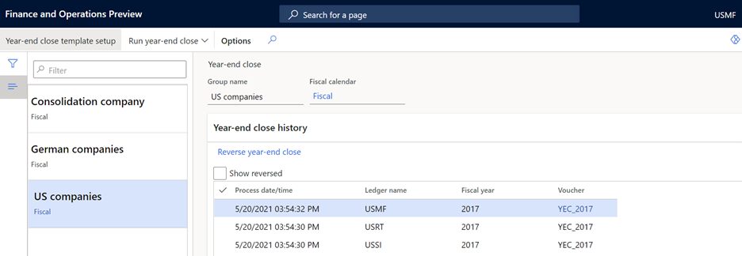
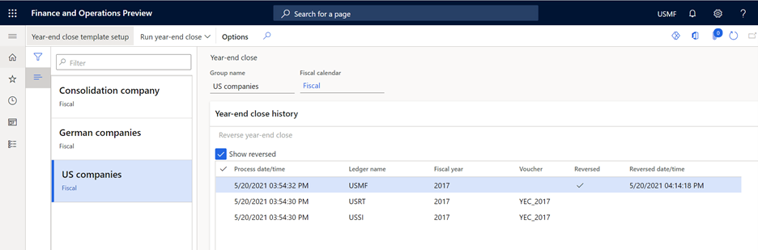

---
# required metadata

title: Year-end close
description: This article describes the required setup and steps for running the general ledger year-end close process. 
author: kweekley
ms.date: 11/06/2022
ms.topic: article
ms.prod: 
ms.technology: 

# optional metadata

ms.search.form: LedgerClosingSheet
# ROBOTS: 
audience: Application User
# ms.devlang: 
ms.reviewer: twheeloc
# ms.tgt_pltfrm: 
ms.assetid: c64eed1d-df17-448e-8bb6-d94d63b14607
ms.search.region: Global
# ms.search.industry: 
ms.author: kweekley
ms.search.validFrom: 2016-02-28
ms.dyn365.ops.version: AX 7.0.0

---

# Year-end close

[!include [banner](../includes/banner.md)]

This article describes the required setup and steps for running the general ledger year-end close process.

At the end of a fiscal year, you must run the year-end close process to transfer opening balances to the new year. Most organizations will run the year-end close process multiple times. The first run moves the balances into the new fiscal year. The process can then be rerun as many times as required to move the balances from adjusting entries into the new fiscal year.

During the year-end close process, there are two types of possible transactions created. An Opening transaction is always generated and is used to create the opening balances in the new fiscal year. The Opening transaction shows the balance sheet ledger account balances in the new fiscal year and balances from the profit and loss ledger account balances in the retained earnings ledger account in the new fiscal year. The Closing transaction is optionally created to bring the balances of the profit and loss accounts down to zero in the fiscal year being closed.

## Prepare to run the year-end close

Before you run the year-end close process, validate the settings for the following:

On the **Main account** page:

- Verify that the **Main account type** field is correctly set for each main account. The main account type determines whether the balance of the main account will be brought forward as an opening balance or closed into retained earnings in the opening transaction.
- The balance of the main account can be transferred to a new main account during the year-end close. Enter the new main account in the **Opening account** field. Typically, this field is used for balance sheet main accounts when the main account is inactivated and a new main account is used for the new fiscal year.

On the **General ledger parameters** page under **Fiscal year close**:

- The **Delete existing year-end entries when re-closing the year** option is used to specify whether the system-generated opening transaction from a previous year-end close should be deleted when the year-end close is rerun. If this option is set to **Yes**, the previous opening and optional closing transactions are deleted, and a new opening or closing transaction is created based on the current balances. If this option is set to **No**, the previous opening and optional closing transactions remain, and an additional opening or closing transaction is created to move the balances forward from adjusting transactions that are posted after the previous year-end close.
- The **Create closing transactions during transfer** option is used to create closing transactions in the fiscal year that is being closed, to bring the balances of all main accounts to 0 (zero). If this option is set to **Yes**, both the opening transaction and the closing transaction are created. If this option is set to **No**, only the opening transaction is created in the next fiscal year to transfer the balances. The main account balances remain at the end of the fiscal year.
- The **Set fiscal year status to permanently closed** option is used to set the fiscal year to a permanently closed status. Use this option carefully, because periods that have a permanently closed status can't be reopened. Therefore, adjustments can't be posted to the fiscal year. As a best practice, this option should be set to **No**.
- The **Voucher number must be filled in** option has been removed. A voucher is now required when the year-end close process is run. At that time, the voucher number is manually entered.

On the **Fiscal calendar** page:

- The next fiscal year must exist before the year-end close is run. Otherwise, the beginning balances can't be created in the opening period.

On the **Ledger calendar** page:

- Optional: Each fiscal period for the fiscal year that is being closed can be set to **On hold** to prevent new transactions from being entered. When adjusting entries are identified, the on-hold periods can be reopened so that adjusting entries can be posted, even if the year-end close process has already been run.

On the **Year-end close template setup** page:

- When the **General ledger year-end enhancements** feature is turned on, the process of setting up of the year-end close template is separated from the process of running the year-end close. The template can be defined on the **Year-end close template setup** page (**General ledger \> Ledger setup \> Year-end close template setup**), or it can be accessed from the year-end close process.

## Define year-end close templates

After the configuration is complete, the year-end close process can be run. On the **Year-end close template setup** page, a template can be defined for the group of legal entities that the year-end close process will be run for. The template will be reused at each year-end close, but it can be modified if your organization changes.

First, set the **Group name** field for the template, and select the fiscal calendar. The group name should identify the group of legal entities that is included. When you're determining the groups of legal entities, remember that legal entities can be included in the same group only if the same fiscal calendar is selected for them. For example, the templates can be set up based on geography, and separate groups can be created for North American legal entities, Europe, the Middle East, and Africa (EMEA) legal entities, and Asia-Pacific (APAC) legal entities.

Next, the legal entities can be added to the template. Legal entities can be added by selecting an organizational hierarchy or by selecting the legal entities. If an organizational hierarchy is selected, only legal entities within the hierarchy that use the selected fiscal calendar will be added to the template. If you use legal entities to add to the template, only legal entities with the same fiscal calendar can be added. The same fiscal calendar is required because the year-end close is run by selecting a fiscal year, which can vary from calendar to calendar.

After the legal entities are added, define the retained earnings main accounts for each legal entity.

The **Financial dimension** tab is used to define which financial dimensions will be used on the opening transaction. Note that the setup on this tab applies only to the legal entity that is selected in the **Legal entities** grid. You must repeat the setup for each legal entity in the grid.

The **Transfer balance sheet dimensions** option is used to specify whether the financial dimensions on transactions that are posted to balance sheet accounts should be maintained on the opening transaction. As a best practice, this option should be set to **Yes**. The setting for the balance sheet dimensions doesn't affect existing balances in the retained earnings ledger accounts. Those balances are determined by the profit and loss dimensions that are defined in the next section. For example, fiscal year 2019 was the first year that was closed, and the **Close all** option was used to select the **Department** and **Cost center** dimensions for closing. In this case, a separate retained earnings account was created for each combination of a department and a cost center. When the year-end close is run for fiscal year 2020, the retained earnings from the previous year remain exactly as they were posted, even if the **Transfer balance sheet dimensions** is set to **No**. Balances that are posted to retained earnings from previous year-end closes are never changed.

The **Transfer profit and loss dimensions** section is used to specify which financial dimensions on transactions that are posted to profit and loss accounts will be transferred to the retained earnings main account. First, identify the financial dimensions that are relevant to the selected legal entity. These financial dimensions include any financial dimension that was posted against during the year, even if the financial dimension isn't part of an active account structure. Next, define each dimension as either **Close single** or **Close all**. The default option is **Close all**. This option maintains the original financial dimension values from posted transactions and uses them to create the opening balances for the retained earnings account. Separate retained earnings beginning balances will be created for each unique combination of financial dimension values. If **Close single** is selected, all posted transactions that have that financial dimension will be summarized into a retained earnings beginning balance for the dimension value that is entered in the field that appears after **Close single**. For example, all transactions for the fiscal year were posted with the account structure **Main account - Department**. For the **Department** financial dimension on the template, **Close single** is selected, and **100** is entered as the dimension value. If the total income of all transactions that are posted to departments 200, 300, and 400 is $100,000, one opening balance will be created for **Retained earnings - 100**. If you select **Close single** but leave the financial dimension value blank, all transactions will be posted to retained earnings, and the dimension value will be blank.

## Run the year-end close process

After the year-end close templates are created, you can initiate the year-end close process on the **Year-end close** page (**General ledger \> Period close \> Year-end close**). Before you run the year-end close, you can add new year-end close templates or modify existing templates by selecting **Year-end close template setup** to open the setup page for the templates.

Select the year-end close template, and then, on the Action Pane, select **Run year-end close**. Select either all legal entities or a subset of legal entities from the template that you're running the year-end close for. If you're running the year-end close for the first time in a fiscal year, you will probably select all the legal entities, so that you create beginning balances for all of them. If you've previously run the year-end close, you might want to rerun it only for the legal entities that adjusting entries were posted for.

Next, select the fiscal year to run the year-end close process against. If more than one closing period exists for the last period of the fiscal year, the **Period name** field becomes available. You can then select the closing period to use to post the closing transaction, if the setup is defined to create the closing transaction.

Next, enter a voucher number. The same voucher number will be used for all the legal entities that you've selected for the year-end close process. The voucher number isn't generated by using a number sequence.

By default, the year-end close process runs in batch mode. Therefore, after you initiate it, you can return to other activities.

Because account structures can change throughout a fiscal year, the relevant account structure can't always be identified. Therefore, the year-end close process doesn't adhere to account structures. When opening transactions are created, the balances are brought forward with financial dimensions, as defined in the year-end close template. The beginning balances entries can include financial dimensions that are no longer in the current account structure and segment combinations that are no longer valid in the current account structure. If your organization wants to exclude a financial dimension for the retained earnings beginning balance, define the financial dimension as **Close single**, and leave the dimension value blank.

After the process is completed, a record is created for each combination of a legal entity and a fiscal year. You will see records only for legal entities that you have access to. Each record includes the system date and time when the process was run, and a direct link to the vouchers that were created for the year-end close.

If you rerun the year-end close, you will see one or multiple records for each combination of a legal entity and a fiscal year, depending on the setting of the **Delete existing year-end entries when re-closing the year** option on the **General ledger parameters** page:

- If the option is set to **Yes**, the voucher for the previous year-end close is deleted. The record is marked as **Reversed**, and stamped with the date and time when the reversal was done. Additionally, the link to the voucher number is removed. When the year-end close is completed, a new record will be created for the new voucher that is created.
- If the option is set to **No**, the record for the previous year-end close remains, together with the link to the voucher. Each time that the year-end close is rerun, a new record will be created, together with a link to the new vouchers.

## Reverse the year-end close process

On the **Year-end close** page, you can reverse a year-end close. Select the record for the combination of a legal entity and a fiscal year that must be reversed, and then select **Reverse year-end close**. The reversal process deletes all opening and closing vouchers that were created for the fiscal year. The record is marked as **Reversed**, and stamped with the date and time when the reversal was done. Additionally, the link to the voucher number is removed. Like the year-end close process, the reversal runs in batch mode.

A **Show reversed** checkbox that is available above the grid lets you hide or show the records for reversed year-end close processes. After you run the **Reverse year-end close** process, you might have to select the **Show reversed** checkbox to see the record. You can set additional filters to view other information.

For more information, see [Close the general ledger at period end](close-general-ledger-at-period-end.md) and [Close the fiscal year](tasks/close-fiscal-year.md).

[!INCLUDE[footer-include](../../includes/footer-banner.md)]
