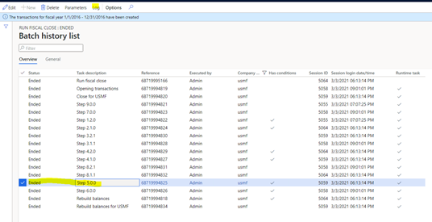
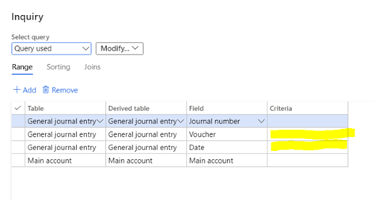
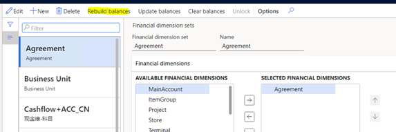

---
# required metadata

title: Year-end close missing opening balances 
description: This topic explains why opening balances might be missing when you close a year, and how to rebuild those balances if they are missing.
author: kweekley
ms.date: 05/12/2021
ms.topic: index-page
ms.prod: 
ms.technology: 

# optional metadata

ms.search.form: 
audience: Application User
# ms.devlang: 
ms.reviewer: roschlom
# ms.tgt_pltfrm: 
# ms.custom: 
ms.search.region: Global 
# ms.search.industry: 
ms.author: kweekley
ms.search.validFrom: 2020-12-14
ms.dyn365.ops.version: 10.0.14

---

# Year-end close missing opening balances

[!include [banner](../includes/banner.md)]

This topic explains why opening balances might be missing when you close a year, and how to rebuild those balances if they are missing.

### Symptom

Why are there no beginning balances after running the General ledger year-end close? 

### Resolution

Here are things to check if you've closed a year in General ledger, and then generated a trial balance that doesn't display opening balances for the next fiscal year.

If the **Undo previous close** field is set to **Yes**, the previous year-end close for the same fiscal year is being reversed. When running a process to reverse the year-end close, all entries for both closing and opening balances will be deleted, as if the year had never been closed. The vouchers are also deleted. The year-end close process will not run again automatically. You must start the process again, this time updating the **Undo previous close** option to **No**.

This scenario is covered in the year-end close FAQ topic. For more information, see [Year-end activities FAQ](faq-year-end-activities.md).

### Symptom

I ran year-end close with the **Undo previous close** option set to **No**, and I still do not have opening balances for my fiscal year.

### Resolution

First check the status of the batch job. Closing a year includes a number of separate tasks, but the most critical step is the batch task with the task description **Step 5.0.0**. Posting the opening transactions, and optionally the closing transactions, to General ledger takes place during this step. 

If this step ended successfully but you don’t see opening balances on the **Trial balance inquiry** page (**General ledger > Inquires and reports > Trial balance**), review the results of the year-end close batch job to see if the Rebuild balances step completed successfully.

If this step has failed for any reason, the opening (and optionally closing) transactions were likely posted successfully. You can verify that the General ledger transactions were posted successfully using the **Voucher transactions inquiry** page by specifying the voucher number and date provided on the year-end close dialog for the year that you closed, (**General Ledger > Inquiries and reports > Voucher transactions**).

If the opening (and optionally closing) vouchers are present, you don’t need to run the year-end close again. Instead refer to the next section for information about how to move forward.

### Symptom

The “Rebuild balances” step in the year-end close failed, do I need to re-run the entire year-end close process?

### Resolution

The Rebuild balances step updates the General ledger balances that are used when the Trial balance inquiry is generated.  It is the final step in the year-end close process.  If this step is the only step that failed, the General ledger transactions have posted successfully.  You do not need to run the year-end close again. You can run the process to rebuild the balances manually using the **Financial dimension sets** page (**General ledger > Chart of accounts > Dimensions > Financial dimension sets**).

If this step takes a long time to process, we recommend reviewing the best practices for financial dimension sets as described in [Best practices for updating Financial dimension sets](https://community.dynamics.com/365/financeandoperations/b/dynamics-365-finance-blog/posts/best-practices-for-updating-financial-dimension-set-dimension-sets). 

