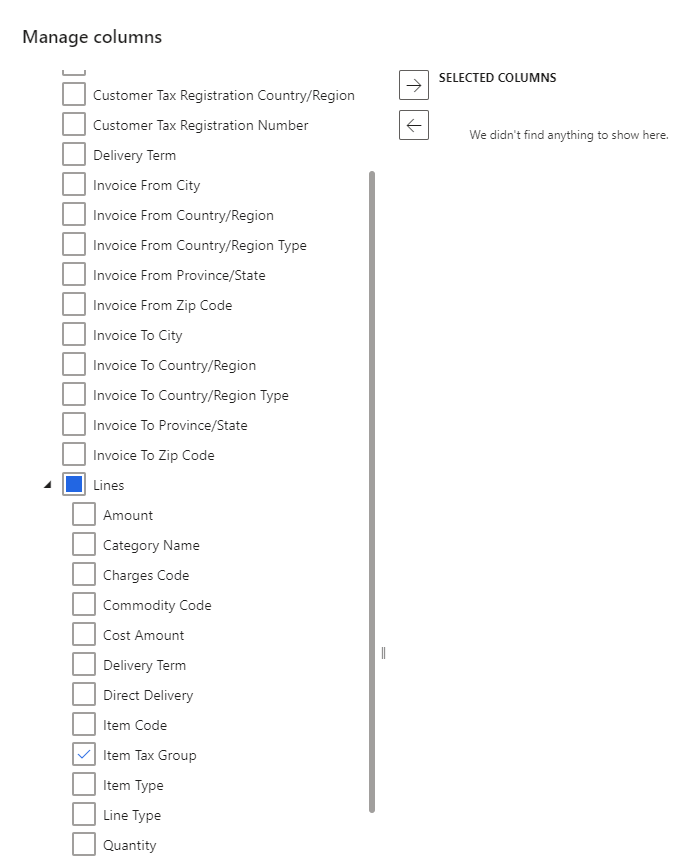
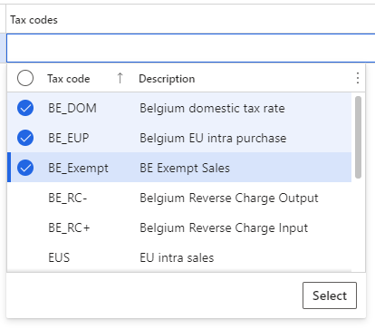

---
# required metadata 

title: Set up item tax groups
description: This topic explains how to set up item tax groups in the Tax Calculation service. 
author: wangchen
ms.date: 11/24/2021
ms.topic: business-process 
ms.prod:  
ms.technology:  

# optional metadata 

ms.search.form: TaxTable, TaxData   
audience: Application User 
# ms.devlang:  
ms.reviewer: kfend
# ms.tgt_pltfrm:  
# ms.custom:  
ms.search.region: Global
# ms.search.industry: 
ms.author: wangchen
ms.search.validFrom: 2021-10-26 
ms.dyn365.ops.version: Version 10.0.21 
---

# Set up item tax groups

[!include [banner](../includes/banner.md)]

This topic explains how to set up item tax groups in the Tax Calculation service. The topic also explains how to set up the item tax group applicability matrix and configure lines within the matrix.

Item tax groups in the Tax Calculation service have a similar concept as item sales tax groups in Dynamics 365 Finance. They are a group of tax codes. The Tax Calculation service uses the intersection of tax group and item tax group to determine the tax codes.

> [!IMPORTANT]
> Item tax group setup in the Tax Calculation service is legal entity-agnostic. You can complete this setup in the Regulatory Configuration Service (RCS) only once. When you enable the Tax Calculation service in Finance, the item tax groups will be synchronized automatically for the selected legal entity.

## Set up an item tax group 

Complete the steps in this section to set up an item tax group.

1. Sign into [Regulatory Configuration Service](https://marketing.configure.global.dynamics.com/).
2. Go to Workspaces > Globalization features > Tax calculation.
3. Select the feature and version which you want to set up, and click **Edit** to open the setup form.
4. On the **General** tab, select **Configuration version**.
5. Open the **Item tax group** tab, select **Manage column**. If this is your first time configuring an item tax group, the **Manage column** page will be populated automatically.
6. Expand **Lines** and select the **Item tax group** check box.

  

7. Select the **Add** arrow to add this field to the **Selected Columns** list.

   

8. Select **OK**.

### Configure an item tax group

After you set up an item tax group, the applicability rule matrix is created. You can add lines to the matrix to configure the item tax group.

1. On the **Item tax group** tab, select **Add** and in the **Item tax group** field, enter the name of the item tax group.

  > [!IMPORTANT]
  > We recommend you limit the length of item tax group name to 10 characters. This name is synchronized with Finance which has a limit of 10 characters for the item sales tax group name.

2. Select the tax codes to include in this item tax group. You can select multiple tax codes under one item tax group by selecting the radio button next to the tax code name.

  

3. Repeat step 1 and 2 to add multiple item tax groups.

[!INCLUDE[footer-include](../../includes/footer-banner.md)]
