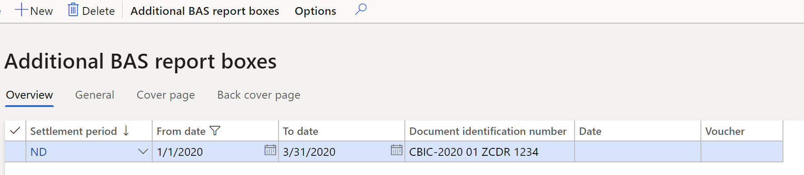

# Business activity statement (BAS)

This article provides information about the Business activity statement (BAS) for Australia. The BAS is a form that all businesses submit to the Australian Taxation Office (ATO) to report their taxation obligations.

The Business activity statement (BAS) feature is designed to help you fill in your BAS. The statement resembles the calculation worksheet that the ATO provides when you receive the BAS form in the mail.

The BAS includes the following taxation liabilities:

- Goods and Services Tax (GST) amounts that you owe the ATO from sales
- GST amounts that the ATO owes you from purchases
- Pay-As-You-Go (PAYG) Tax Withheld
- PAYG Installment
- Fringe Benefit Tax (FBT)

## Set up sales tax reporting codes

Set up sales tax reporting codes by following the instructions in [Set up sales tax reporting codes](../general-ledger/tasks/set-up-sales-tax-reporting-codes.md). The following reporting codes are associated with fields on the BAS report.

<table>
<thead>
<tr>
<td>
<p><strong>Report layout</strong></p>
</td>
<td>
<p><strong>Reporting code</strong></p>
</td>
<td>
<p><strong>Report text</strong></p>
</td>
<td>
<p><strong>Report setup</strong></p>
</td>
<td>
<p><strong>Field on the BAS report</strong></p>
</td>
</tr>
</thead>
<tbody>
<tr>
<td colspan="5">
<p><strong>GST</strong></p>
</td>
</tr>
<tr>
<td>
<p>Default</p>
</td>
<td>
<p>1</p>
</td>
<td>
<p>G1 Total sales &amp; income and other supplies</p>
</td>
<td>
<p>Taxable sales and Sales tax payable</p>
</td>
<td>
<p>G1</p>
</td>
</tr>
<tr>
<td>
<p>Default</p>
</td>
<td>
<p>2</p>
</td>
<td>
<p>G2 GST free exports</p>
</td>
<td>
<p>Tax-free sales or Taxable sales</p>
</td>
<td>
<p>G2</p>
</td>
</tr>
<tr>
<td>
<p>Default</p>
</td>
<td>
<p>3</p>
</td>
<td>
<p>G3 Other GST free supplies</p>
</td>
<td>
<p>Tax-free sales or Taxable sales</p>
</td>
<td>
<p>G3</p>
</td>
</tr>
<tr>
<td>
<p>Default</p>
</td>
<td>
<p>4</p>
</td>
<td>
<p>G4 Input taxed sales &amp; income and other supplies</p>
</td>
<td>
<p>Taxable purchases and Sales tax receivable</p>
</td>
<td>
<p>G4</p>
</td>
</tr>
<tr>
<td>
<p>Default</p>
</td>
<td>
<p>7</p>
</td>
<td>
<p>G7 Adjustment payable</p>
</td>
<td>
<p>Sales tax payable</p>
</td>
<td>
<p>G7</p>
</td>
</tr>
<tr>
<td>
<p>Default</p>
</td>
<td>
<p>10</p>
</td>
<td>
<p>G10 Capital acquisitions</p>
</td>
<td>
<p>Taxable purchases and Sales tax receivable</p>
</td>
<td>
<p>G10</p>
</td>
</tr>
<tr>
<td>
<p>Default</p>
</td>
<td>
<p>11</p>
</td>
<td>
<p>G11 Other acquisitions</p>
</td>
<td>
<p>Taxable purchases and Sales tax receivable</p>
</td>
<td>
<p>G11</p>
</td>
</tr>
<tr>
<td>
<p>Default</p>
</td>
<td>
<p>18</p>
</td>
<td>
<p>G18 Adjustment (credit)</p>
</td>
<td>
<p>Sales tax receivable</p>
</td>
<td>
<p>G18</p>
</td>
</tr>
<tr>
<td>
<p>Default</p>
</td>
<td>
<p>1013</p>
</td>
<td>
<p>G10 and G13 Acquisitions for making input taxed sales, income, and other supplies</p>
</td>
<td>
<p>Taxable purchases and Sales tax receivable</p>
</td>
<td>
<p>G10 and G13</p>
</td>
</tr>
<tr>
<td>
<p>Default</p>
</td>
<td>
<p>1014</p>
</td>
<td>
<p>G10, G14 Capital acquisitions with no GST in the price</p>
</td>
<td>
<p>Tax-free purchases or Taxable purchases</p>
</td>
<td>
<p>G10 and G14</p>
</td>
</tr>
<tr>
<td>
<p>Default</p>
</td>
<td>
<p>1015</p>
</td>
<td>
<p>G10, G15 Capital acquisitions for private use or with non-deductible tax</p>
<p><strong>Note:</strong> On the <strong>Sales tax codes</strong> page (<strong>Tax &gt; Indirect taxes &gt; Sales tax &gt; Sales tax codes</strong>), enter a value in the <strong>Non deductible</strong> field for the sales tax code that uses this reporting code in the setup.</p>
</td>
<td>
<p>Taxable purchases and Sales tax receivable</p>
</td>
<td>
<p>G10 and G15</p>
</td>
</tr>
<tr>
<td>
<p>Default</p>
</td>
<td>
<p>101</p>
</td>
<td>
<p>1C Wine equalization tax payable</p>
</td>
<td>
<p>Sales tax payable</p>
</td>
<td>
<p>1C</p>
</td>
</tr>
<tr>
<td>
<p>Default</p>
</td>
<td>
<p>102</p>
</td>
<td>
<p>1D Wine equalization tax refundable</p>
</td>
<td>
<p>Sales tax receivable</p>
</td>
<td>
<p>1D</p>
</td>
</tr>
<tr>
<td>
<p>Default</p>
</td>
<td>
<p>201</p>
</td>
<td>
<p>1E Luxury car tax payable</p>
</td>
<td>
<p>Sales tax payable</p>
</td>
<td>
<p>1E</p>
</td>
</tr>
<tr>
<td>
<p>Default</p>
</td>
<td>
<p>202</p>
</td>
<td>
<p>1F Luxury car tax refundable</p>
</td>
<td>
<p>Sales tax receivable</p>
</td>
<td>
<p>1F</p>
</td>
</tr>
</tbody>
</table>

You can also set up the following reporting codes, and then make transactions or manually fill in corresponding fields of the BAS report. For more information, see the [Generate additional BAS report boxes for the settlement period](#_Generate_additional_BAS) section later in this article.

<table>
<tbody>
<tr>
<td>
<p><strong>Report layout</strong></p>
</td>
<td>
<p><strong>Reporting code</strong></p>
</td>
<td>
<p><strong>Report text</strong></p>
</td>
<td>
<p><strong>Field on the BAS report</strong></p>
</td>
</tr>
<tr>
<td>
<p>Default</p>
</td>
<td>
<p>700</p>
</td>
<td>
<p>7 Deferred company/ fund installment</p>
</td>
<td>
<p>7</p>
</td>
</tr>
<tr>
<td>
<p>Default</p>
</td>
<td>
<p>701</p>
</td>
<td>
<p>7A Deferred GST on imports</p>
</td>
<td>
<p>7A</p>
</td>
</tr>
<tr>
<td colspan="4">
<p>
</td>
</tr>
<tr>
<td>
<p>Default</p>
</td>
<td>
<p>400</p>
</td>
<td>
<p>4 Pay-As You Go Withholding</p>
</td>
<td>
<p>4</p>
</td>
</tr>
<tr>
<td>
<p>Default</p>
</td>
<td>
<p>501</p>
</td>
<td>
<p>5A Pay As You Go Installment</p>
</td>
<td>
<p>5A</p>
</td>
</tr>
<tr>
<td>
<p>Default</p>
</td>
<td>
<p>502</p>
</td>
<td>
<p>5B Credit arising from reduced Pay As You Go installment</p>
</td>
<td>
<p>5B</p>
</td>
</tr>
<tr>
<td>
<p>Default</p>
</td>
<td>
<p>31</p>
</td>
<td>
<p>W1 Total of salary, wages, and other payments</p>
</td>
<td>
<p>W1</p>
</td>
</tr>
<tr>
<td>
<p>Default</p>
</td>
<td>
<p>32</p>
</td>
<td>
<p>W2 Amounts withheld from salary, wages, and other payments</p>
</td>
<td>
<p>W2</p>
</td>
</tr>
<tr>
<td>
<p>Default</p>
</td>
<td>
<p>33</p>
</td>
<td>
<p>W3 Amounts withheld from investment distributions where no TFN is quoted</p>
</td>
<td>
<p>W3</p>
</td>
</tr>
<tr>
<td>
<p>Default</p>
</td>
<td>
<p>34</p>
</td>
<td>
<p>W4 Amounts withheld from payment of invoices where no ABN is quoted</p>
</td>
<td>
<p>W4</p>
</td>
</tr>
<tr>
<td>
<p>Default</p>
</td>
<td>
<p>51</p>
</td>
<td>
<p>T1 Installment income</p>
</td>
<td>
<p>T1</p>
</td>
</tr>
<tr>
<td colspan="4">
<p>
</td>
</tr>
<tr>
<td>
<p>Default</p>
</td>
<td>
<p>601</p>
</td>
<td>
<p>6A Fringe benefit tax installment</p>
</td>
<td>
<p>6A</p>
</td>
</tr>
<tr>
<td>
<p>Default</p>
</td>
<td>
<p>602</p>
</td>
<td>
<p>6B Credit arising from fringe benefits tax installment</p>
</td>
<td>
<p>6B</p>
</td>
</tr>
<tr>
<td>
<p>Default</p>
</td>
<td>
<p>61</p>
</td>
<td>
<p>F1 ATO-calculated fringe benefits tax installment</p>
</td>
<td>
<p>F1</p>
</td>
</tr>
<tr>
<td>
<p>Default</p>
</td>
<td>
<p>62</p>
</td>
<td>
<p>F2 Estimated total fringe benefits tax payable</p>
</td>
<td>
<p>F2</p>
</td>
</tr>
<tr>
<td>
<p>Default</p>
</td>
<td>
<p>63</p>
</td>
<td>
<p>F3 Varied fringe benefits tax installment</p>
</td>
<td>
<p>F3</p>
</td>
</tr>
</tbody>
</table>

You can also set up the following reporting codes. However, we recommend that you use reporting codes 1013 through 1015, which generate both field G10 and fields G13 through G15, because the amount in field G10 of the BAS report must contain the amounts in fields G13 through G15.

| **Report layout** | **Reporting code** | **Report text** | **Field on the BAS report** |
| --- | --- | --- | --- |
| Default | 13 | G13 Acquisitions for making input taxed sales &amp; income and other supplies | G13 |
| Default | 14 | G14 Acquisitions with no GST in the price | G14 |
| Default | 15 | G15 Non-income tax deductible acquisitions | G15 |

## Set up the BAS

1. In Microsoft Dynamics 365 Finance, go to **Organization administration > Organizations > Legal entities**.
2. On the **Legal entities** page, on the **Tax registration** FastTab, in the **Tax registration number** field, enter the tax registration number.
3. In [Microsoft Dynamics Lifecycle Services (LCS)](https://lcs.dynamics.com/V2), in the Shared asset library, download the latest versions of the Electronic reporting (ER) configurations for the following report format:

    - BAS(AU)

    For more information, see [Download Electronic reporting configurations from Lifecycle Services](../../fin-ops-core/dev-itpro/analytics/download-electronic-reporting-configuration-lcs.md).

4. Back in Finance, go to **General ledger > Ledger setup > General ledger parameters**.
5. On the **Sales tax** tab, set the **Apply sales tax taxation rules** option to **No**.
6. In the **Format mapping** field, select the **BAS(AU)** format that you downloaded earlier.

## Set up additional BAS report boxes

### <a name= "_Set_up_an_additional_bas_reconciliation_account"></a>Set up an additional BAS reconciliation account

1. Go to **Tax > Setup > Sales tax > Additional BAS reconciliation account**.
2. In the **BAS reconciliation account** field, specify the ledger account that will be used in the _Settle and post GST_ procedure to post sales tax amounts that are manually entered.

### <a name= "_Set_up_PAYG"></a>Set up PAYG reason codes

1. Go to **Tax > Setup > Sales tax > BAS PAYG reason codes**.
2. Select **New**, and set the **Reason code** and **Description** fields.

For a list of PAYG reason codes, see [PAYG reason codes](https://www.ato.gov.au/Rates/PAYG-installment-variations---reason-codes/).

### <a name= "_Set_up_fringe"></a>Set up fringe benefit reason codes

1. Go to **Tax > Setup > Sales tax > BAS fringe benefit reason codes**.
2. Select **New**, and set the **Reason code** and **Description** fields.

For a list of fringe benefit reason codes, see [FBT reason codes](https://www.ato.gov.au/Business/Business-activity-statements-(BAS)/In-detail/Instructions/FBT---how-to-complete-your-activity-statement-labels/?page=1#F4Reasoncodeforvariation).

## Generate and print the BAS report

### <a name= "_Generate_additional_BAS"></a> Generate additional BAS report boxes for the settlement period

1. Go to **Tax > Declarations > Sales tax > Additional BAS report boxes**.
2. Select **New**, and set the following fields.

    | **Field** | **Description** |
    | --- | --- |
    | Settlement period | Select the settlement period for sales tax reporting. |
    | From date | Enter the start date of the settlement period. |
    | To date | Enter the end date of the settlement period. |
    | Document identification number | Enter the document identification number for the BAS. |
    | Date | The date when tax is settled. This field is automatically set when you create a sales tax payment. |
    | Voucher | The voucher number of the sales tax payment. This field is automatically set when you create a sales tax payment. |

    

    > [!NOTE]
    > When you create a sales tax payment, the date and voucher are filled in for the period, and you can no longer edit the line. If a line on the **Additional BAS report boxes** page wasn&#39;t manually created, it&#39;s automatically created when the _Sales tax payment_ or _Settle and post GST_ procedure is run.

3. On the **Cover page** tab, manually set the following fields if you didn&#39;t post tax transactions on the corresponding reporting codes.

    | **Field** | **Description** |
    | --- | --- |
    | 7 Deferred installment | Enter the company or fund of the deferred installment. |
    | 7A Deferred GST on imports | This field isn&#39;t used in the official BAS form. **Note:** In earlier versions of official BAS form, you could use this field to enter the deferred GST amount on imports that organizations can use under the Deferred GST Imports Scheme. |
    | 1G Credit for wholesale sales tax | This field isn&#39;t used in the official BAS form. **Note:** In earlier versions of the official BAS form, you could use this field to enter the sales tax for items that are traded wholesale. |
    | 5B Credit from PAYG | Enter the credit that is created when PAYG installments are reduced. |
    | 6B Credit fringe benefits tax | Enter the credit that is created when FBT installments are reduced. |

4. On the **Back cover page** tab, manually set the following fields if you didn&#39;t post tax transactions on the corresponding reporting codes.

    | **Field** | **Description** |
    | --- | --- |
    | W1 Total payroll | Enter the total for salary, wages, and other payments. |
    | W-2 Withheld from payroll | Enter the amount that is withheld from salary, wages, and other payments. |
    | W3 Withheld from investment where no TFN | Enter the amount that is withheld from investment distributions that no tax file number (TFN) is available for. |
    | W4 Withheld from invoices where no ABN | Enter the amount that is withheld from invoice payments that no Australian Business Number (ABN) is available for. |
    | T1 Installment income | Enter the PAYG installment income. |
    | T2 Installment rate | Enter the PAYG commissioner&#39;s installment rate as a percentage. |
    | T3 New varied installment rate | Enter the PAYG new varied installment rate as a percentage. |
    | T4 Reason for variation | Select the reason code for the variation. The list of available reason codes is shown on the **BAS PAYG reason codes** page. For more information, see the [Set up PAYG reason codes](#_Set_up_PAYG) section earlier in this article. |
    | F1 ATO fringe benefit | Enter the FBT installment that is calculated by the ATO. |
    | F2 Estimated total fringe benefits | Enter the estimated total FBT that must be paid. |
    | F3 Varied fringe benefits tax | Enter the varied FBT installment. |
    | F4 Reason for variation | Select the reason code that explains why the amount on the BAS was changed. The list of available reason codes is shown on the **BAS fringe benefit reason codes** page. For more information, see the [Set up fringe benefit reason codes](#_Set_up_fringe) section earlier in this article. |
    | 7C Fuel tax credit over claim | This field isn&#39;t used in the official BAS form. **Note:** In earlier versions of the official BAS, you could use this field to enter the amount of credit that must be claimed on tax for fuel that was used for business activities, machinery, plant equipment, and heavy vehicles. |
    | 7D Fuel tax credit | This field isn&#39;t used in the official BAS form. **Note:** In earlier versions of the official BAS, you could use this field to enter the amount that you want to reduce your previously claimed fuel tax refund by. |

### Generate and preview a BAS report, and settle and post GST

1. Go to **Tax > Declarations > Sales tax > Australian BAS**.
2. In the **Australian BAS** dialog box, set the following fields.

| **Field** | **Description** |
|-------------------------|-------------------------|
| Settlement period | Select the settlement period. |
| From date | Enter the start date of the settlement period. |
| Transaction date | Enter the posting date for the sales tax settlement. |
| Sales tax payment version | Select the version of the sales tax report to settle:<ul></br><li>**Original** – Include sales tax transactions of the first settlement calculation that was posted for the period.</li></ul><ul><li>**Corrections** – Include sales tax transactions of subsequent settlement calculations for the period.</li></ul><ul><li>**Latest corrections** – Include sales tax transactions of the last settlement calculation that was posted for the period.</li><li>**Total list** – Include all sales transactions for the period. These transactions include original and corrected transactions.</li></br></ul> |
| Post and settle GST | Set this option to **Yes** to post and settle the transactions for GST and create a sales tax payment.</br>Before you complete the <em>Post and settle GST</em> procedure, make sure that you set up the BAS reconciliation account as described in the [Set up an additional BAS reconciliation account](#_Set_up_an_additional_bas_reconciliation_account) section earlier in this article. |


3. Select **OK**.
4. In the **Print Australian BAS** dialog box, select **OK**.

> [!Note] 
> You can find the form for the 2020 official Quarterly BAS report in [BAS C - Quarterly business activity statement](https://www.ato.gov.au/Forms/BAS-C---quarterly-BAS/). For GST, option 1 is supported. For PAYG, option 2 is supported.

5. On the generated BAS report, you can review the following data. You can then use the data to fill in the official BAS form.

> [!Note]
> In the following table, in the formulas in the &quot;Calculation&quot; column, brackets ([…]) enclose the values of reporting codes.

<table>
<tbody>
<tr>
<td>
<p><strong>Field</strong></p>
</td>
<td>
<p><strong>Description</strong></p>
</td>
<td>
<p><strong>Calculation</strong></p>
</td>
<td>
<p><strong>Reference to the box in official BAS report</strong></p>
</td>
</tr>
<tr>
<td>
<p>
</td>
</tr>
<tr>
<td>
<p>G1</p>
</td>
<td>
<p>Total sales and income and other supplies</p>
</td>
<td>
<p>[1] + G2 + G3 + G4</p>
</td>
<td>
<p>G1</p>
</td>
</tr>
<tr>
<td>
<p>G2</p>
</td>
<td>
<p>Exports</p>
</td>
<td>
<p>[2]</p>
</td>
<td>
<p>G2</p>
</td>
</tr>
<tr>
<td>
<p>G3</p>
</td>
<td>
<p>Other GST-free supplies</p>
</td>
<td>
<p>[3]</p>
</td>
<td>
<p>G3</p>
</td>
</tr>
<tr>
<td>
<p>G4</p>
</td>
<td>
<p>Input taxed sales and income and other supplies</p>
</td>
<td>
<p>[4]</p>
</td>
<td>
<p>This data isn't printed. It's used to calculate G9.</p>
</td>
</tr>
<tr>
<td>
<p>G5</p>
</td>
<td>
<p>Total GST-free and input taxed supplies</p>
</td>
<td>
<p>G2 + G3 + G4</p>
</td>
<td>
<p>This data isn't printed. It's used to calculate G9.</p>
</td>
</tr>
<tr>
<td>
<p>G6</p>
</td>
<td>
<p>Total taxable supplies</p>
</td>
<td>
<p>G1 &ndash; G5</p>
</td>
<td>
<p>This data isn't printed. It's used to calculate G9.</p>
</td>
</tr>
<tr>
<td>
<p>G7</p>
</td>
<td>
<p>Adjustments</p>
</td>
<td>
<p>[7] or the manual calculation on the <strong>Additional BAS report boxes</strong> page. For more information, see the <a href="#_Generate_additional_BAS">Generate additional BAS report boxes for the settlement period</a> section earlier in this article.</p>
</td>
<td>
<p>This data isn't printed. It's used to calculate G9.</p>
</td>
</tr>
<tr>
<td>
<p>G8</p>
</td>
<td>
<p>Total taxable supplies after adjustments</p>
</td>
<td>
<p>G6 + G7</p>
</td>
<td>
<p>This data isn't printed. It's used to calculate G9.</p>
</td>
</tr>
<tr>
<td>
<p>G9</p>
</td>
<td>
<p>GST on sales</p>
</td>
<td>
<p>The sales tax amount that is included in G1 + [9]</p>
</td>
<td>
<p>This data isn't printed. It's used to calculate 1A.</p>
</td>
</tr>
<tr>
<td>
<p>G10</p>
</td>
<td>
<p>Capital acquisitions</p>
</td>
<td>
<p>[10] + [1013] + [1014] + [1015]</p>
</td>
<td>
<p>G10</p>
</td>
</tr>
<tr>
<td>
<p>G11</p>
</td>
<td>
<p>Other acquisitions</p>
</td>
<td>
<p>[11] + G13 + G14 + G15</p>
</td>
<td>
<p>G11</p>
</td>
</tr>
<tr>
<td>
<p>G12</p>
</td>
<td>
<p>Total acquisitions</p>
</td>
<td>
<p>G10 + G11</p>
</td>
<td>
<p>This data isn't printed. It's used to calculate G20.</p>
</td>
</tr>
<tr>
<td>
<p>G13</p>
</td>
<td>
<p>Acquisitions for making input taxed sales and income and other supplies</p>
</td>
<td>
<p>[13] + [1013]</p>
</td>
<td>
<p>This data isn't printed. It's used to calculate G20.</p>
</td>
</tr>
<tr>
<td>
<p>G14</p>
</td>
<td>
<p>Acquisitions with no GST in price</p>
</td>
<td>
<p>[14] + [1014]</p>
</td>
<td>
<p>This data isn't printed. It's used to calculate G20.</p>
</td>
</tr>
<tr>
<td>
<p>G15</p>
</td>
<td>
<p>Total of estimated private use of acquisitions and non-income tax deductible acquisitions</p>
</td>
<td>
<p>[15] + [1015]</p>
</td>
<td>
<p>This data isn't printed. It's used to calculate G20.</p>
</td>
</tr>
<tr>
<td>
<p>G16</p>
</td>
<td>
<p>Total of non-creditable acquisitions</p>
</td>
<td>
<p>G13 + G14 + G15</p>
</td>
<td>
<p>This data isn't printed. It's used to calculate G20.</p>
</td>
</tr>
<tr>
<td>
<p>G17</p>
</td>
<td>
<p>Total of creditable acquisitions</p>
</td>
<td>
<p>G12 &ndash; G16</p>
</td>
<td>
<p>This data isn't printed. It's used to calculate G20.</p>
</td>
</tr>
<tr>
<td>
<p>G18</p>
</td>
<td>
<p>Adjustments</p>
</td>
<td>
<p>[18]</p>
</td>
<td>
<p>This data isn't printed. It's used to calculate G20.</p>
</td>
</tr>
<tr>
<td>
<p>G19</p>
</td>
<td>
<p>Total of creditable acquisitions after adjustments</p>
</td>
<td>
<p>G17 + G18</p>
</td>
<td>
<p>This data isn't printed. It's used to calculate G20.</p>
</td>
</tr>
<tr>
<td>
<p>G20</p>
</td>
<td>
<p>GST on purchases</p>
</td>
<td>
<p>The sales tax amount that is included in G12</p>
</td>
<td>
<p>This data isn't printed. It's used in 1B.</p>
</td>
</tr>
<tr>
<td>
<p>
</td>
</tr>
<tr>
<td>
<p>W1</p>
</td>
<td>
<p>Total of salary, wages, and other payments</p>
</td>
<td>
<p>[31] or the manual calculation on the <strong>Additional BAS report boxes</strong> page</p>
</td>
<td>
<p>W1</p>
</td>
</tr>
<tr>
<td>
<p>W2</p>
</td>
<td>
<p>Amounts withheld from salary, wages and other payments</p>
</td>
<td>
<p>[32] or the manual calculation on the <strong>Additional BAS report boxes</strong> page</p>
</td>
<td>
<p>W2</p>
</td>
</tr>
<tr>
<td>
<p>W3</p>
</td>
<td>
<p>Amounts withheld from investments distributions where no tax file number (TFN) is quoted.</p>
</td>
<td>
<p>[33] or the manual calculation on the <strong>Additional BAS report boxes</strong> page</p>
</td>
<td>
<p>W3</p>
</td>
</tr>
<tr>
<td>
<p>W4</p>
</td>
<td>
<p>Amounts withheld from payment of invoices where no Australian business number (ABN) is quoted.</p>
</td>
<td>
<p>[34] or the manual calculation on the <strong>Additional BAS report boxes</strong> page</p>
</td>
<td>
<p>W4</p>
</td>
</tr>
<tr>
<td>
<p>T1</p>
</td>
<td>
<p>Installment income</p>
</td>
<td>
<p>[51] or the manual calculation on the <strong>Additional BAS report boxes</strong> page</p>
</td>
<td>
<p>T1</p>
</td>
</tr>
<tr>
<td>
<p>T2</p>
</td>
<td>
<p>Commissioner's installment rate</p>
</td>
<td>
<p>[52] or the manual calculation on the <strong>Additional BAS report boxes</strong> page</p>
</td>
<td>
<p>T2</p>
</td>
</tr>
<tr>
<td>
<p>T3</p>
</td>
<td>
<p>New varied installment rate</p>
</td>
<td>
<p>[53] or the manual calculation on the <strong>Additional BAS report boxes</strong> page</p>
</td>
<td>
<p>T3</p>
</td>
</tr>
<tr>
<td>
<p>T4</p>
</td>
<td>
<p>Reason for variation</p>
</td>
<td>
<p>The value from the <strong>Additional BAS report boxes</strong> page</p>
</td>
<td>
<p>T4</p>
</td>
</tr>
<tr>
<td>
<p>
</td>
</tr>
<tr>
<td>
<p>F1</p>
</td>
<td>
<p>ATO-calculated fringe benefits tax installment</p>
</td>
<td>
<p>[61] or the manual calculation on the <strong>Additional BAS report boxes</strong> page</p>
</td>
<td>
<p>F1</p>
</td>
</tr>
<tr>
<td>
<p>F2</p>
</td>
<td>
<p>Estimated total fringe benefits tax payable</p>
</td>
<td>
<p>[62] or the manual calculation on the <strong>Additional BAS report boxes</strong> page</p>
</td>
<td>
<p>F2</p>
</td>
</tr>
<tr>
<td>
<p>F3</p>
</td>
<td>
<p>Varied fringe benefits tax installment</p>
</td>
<td>
<p>[63] or the manual calculation on the <strong>Additional BAS report boxes</strong> page</p>
</td>
<td>
<p>F3</p>
</td>
</tr>
<tr>
<td>
<p>F4</p>
</td>
<td>
<p>Reason for fringe benefits tax variation</p>
</td>
<td>
<p>The value from the <strong>Additional BAS report boxes</strong> page</p>
</td>
<td>
<p>F4</p>
</td>
</tr>
<tr>
<td>
<p>
</td>
</tr>
<tr>
<td>
<p>1A</p>
</td>
<td>
<p>Goods and services tax payable</p>
</td>
<td>
<p>G9</p>
</td>
<td>
<p>1A</p>
</td>
</tr>
<tr>
<td>
<p>1B</p>
</td>
<td>
<p>Credits for goods and services tax paid</p>
</td>
<td>
<p>G20</p>
</td>
<td>
<p>1B</p>
</td>
</tr>
<tr>
<td>
<p>1C</p>
</td>
<td>
<p>Wine equalization tax payable</p>
</td>
<td>
<p>[101] or the manual calculation on the <strong>Additional BAS report boxes</strong> page</p>
</td>
<td>
<p>1C</p>
</td>
</tr>
<tr>
<td>
<p>1D</p>
</td>
<td>
<p>Wine equalization tax refundable</p>
</td>
<td>
<p>[102] or the manual calculation on the <strong>Additional BAS report boxes</strong> page</p>
</td>
<td>
<p>1D</p>
</td>
</tr>
<tr>
<td>
<p>1E</p>
</td>
<td>
<p>Luxury car tax payable</p>
</td>
<td>
<p>[201] or the manual calculation on the <strong>Additional BAS report boxes</strong> page</p>
</td>
<td>
<p>1E</p>
</td>
</tr>
<tr>
<td>
<p>1F</p>
</td>
<td>
<p>Luxury car tax refundable</p>
</td>
<td>
<p>[202] or the manual calculation on the <strong>Additional BAS report boxes</strong> page</p>
</td>
<td>
<p>1F</p>
</td>
</tr>
<tr>
<td>
<p>1G</p>
</td>
<td>
<p>Credit for wholesale sales tax</p>
</td>
<td>
<p>The value from the <strong>Additional BAS report boxes</strong> page</p>
</td>
<td>
<p>Not used</p>
</td>
</tr>
<tr>
<td>
<p>2A</p>
</td>
<td>
<p>Total amounts you owe the ATO</p>
</td>
<td>
<p>1A + 1C + 1E</p>
</td>
<td>
<p>Not used</p>
</td>
</tr>
<tr>
<td>
<p>2B</p>
</td>
<td>
<p>Total amounts the ATO owes you</p>
</td>
<td>
<p>1B + 1D + 1F + 1G</p>
</td>
<td>
<p>Not used</p>
</td>
</tr>
<tr>
<td>
<p>3</p>
</td>
<td>
<p>GST net amount</p>
</td>
<td>
<p>2A &ndash; 2B</p>
</td>
<td>
<p>Not used</p>
</td>
</tr>
<tr>
<td>
<p>4</p>
</td>
<td>
<p>PAYG tax withheld</p>
</td>
<td>
<p>W2 + W3 + W4 + [400]</p>
</td>
<td>
<p>4</p>
</td>
</tr>
<tr>
<td>
<p>5A</p>
</td>
<td>
<p>PAYG installment</p>
</td>
<td>
<p>T1 &times; T3 &divide; 100, if T3 is entered. Otherwise, T1 &times; T2 &divide; 100.</p>
</td>
<td>
<p>5A</p>
</td>
</tr>
<tr>
<td>
<p>5B</p>
</td>
<td>
<p>Credit arising from reduced PAYG installments</p>
</td>
<td>
<p>[502] or the manual calculation on the <strong>Additional BAS report boxes</strong> page</p>
</td>
<td>
<p>5B</p>
</td>
</tr>
<tr>
<td>
<p>6A</p>
</td>
<td>
<p>FBT installment</p>
</td>
<td>
<p>F3, if a value is entered for that field. Otherwise, F1.</p>
</td>
<td>
<p>6A</p>
</td>
</tr>
<tr>
<td>
<p>6B</p>
</td>
<td>
<p>Credit arising from reduced FBT installments</p>
</td>
<td>
<p>[602] or the manual calculation on the <strong>Additional BAS report boxes</strong> page</p>
</td>
<td>
<p>6B</p>
</td>
</tr>
<tr>
<td>
<p>7</p>
</td>
<td>
<p>Deferred company or fund installment</p>
</td>
<td>
<p>[700] or the manual calculation on the <strong>Additional BAS report boxes</strong> page</p>
</td>
<td>
<p>7</p>
</td>
</tr>
<tr>
<td>
<p>7A</p>
</td>
<td>
<p>Deferred GST on imports</p>
</td>
<td>
<p>[701] or the manual calculation on the <strong>Additional BAS report boxes</strong> page</p>
</td>
<td>
<p>Not used</p>
</td>
</tr>
<tr>
<td>
<p>7C</p>
</td>
<td>
<p>Fuel tax credit over claim</p>
</td>
<td>
<p>The value from the <strong>Additional BAS report boxes</strong> page</p>
</td>
<td>
<p>Not used</p>
</td>
</tr>
<tr>
<td>
<p>7D</p>
</td>
<td>
<p>Fuel tax credit</p>
</td>
<td>
<p>The value from the <strong>Additional BAS report boxes</strong> page</p>
</td>
<td>
<p>Not used</p>
</td>
</tr>
<tr>
<td>
<p>8A</p>
</td>
<td>
<p>Total amounts you owe the ATO</p>
</td>
<td>
<p>2A + 4 + 5A + 6A + 7 + 7A</p>
</td>
<td>
<p>8A</p>
</td>
</tr>
<tr>
<td>
<p>8B</p>
</td>
<td>
<p>Total amounts the ATO owes you</p>
</td>
<td>
<p>2B + 5B + 6B</p>
</td>
<td>
<p>8B</p>
</td>
</tr>
<tr>
<td>
<p>9</p>
</td>
<td>
<p>Net amount for the statement</p>
</td>
<td>
<p>8A &ndash; 8B, if 8A &gt; 8B.</p>
<p>8B &ndash; 8A, if 8B &gt; 8A.</p>
</td>
<td>
<p>9</p>
</td>
</tr>
</tbody>
</table>
<p>&nbsp;</p>

#### Generate an E-BAS XML file

In the **Print Australian BAS** dialog box, set the **Generate E-BAS** option to **Yes** to generate the E-BAS statement. If you set this option on the **Select a file** page, browse to the XML file that you want to use as a template.

For example, create an XML template file that contains the following information.
```
<?xml version="1.0" encoding="UTF-8"?>

<DATA>
        field ID="fA1">BAS1</field>
        <field ID="fA3">1/1/2020</field>
        <field ID="fA4">31/3/2020</field>
        <field ID="fMANUAL_MODE">true</field>
    <FIELD\_LIST>
    </FIELD\_LIST>
</DATA>
```
Replace the values in the **fA1**, **fA3**, and **fA4** fields with the document identification number and dates that you require. To use this XML file as a template, browse to it on the **Select a file** page.

> [!Note]
> If you&#39;ve previously selected the **Generate E-BAS** option, you don&#39;t have to generate the XML file again the next time that you run the procedure. Instead, follow these steps:

1. Go to **Settings > User options**.
2. Select **Usage data**.
3. On the **General** tab, select **Reset**.

### Print the BAS report from Sales tax payments page

1. Go to **Tax > Inquiries and reports > Sales tax inquiries > Sales tax payments**.
2. Select the required line.
3. Select **Print Australian BAS**.

### Print the BAS report from the Additional BAS report boxes page

1. Go to **Tax > Declarations > Sales tax > Additional BAS report boxes**.
2. Select the required line.
3. Select **Additional BAS report boxes > Print Australian BAS**.

## Example

### Generate the BAS statement

The following example shows how you can set up sales tax codes and sales tax reporting codes, post transactions, and generate and print the BAS report. It uses the USMF legal entity.

1. Go to **Organization administration > Organizations > Legal entities**.
2. On the **Tax registration** FastTab, in the **Tax registration number** field, enter **AU89434123400**.
3. Go to **Tax > Indirect taxes > Sales tax > Sales tax codes**, and set up the following sales tax codes.

<table>
<thead>
<tr>
<td>
<p><strong>Sales tax code</strong></p>
</td>
<td>
<p><strong>Percentage</strong></p>
</td>
<td>
<p><strong>Description</strong></p>
</td>
</tr>
</thead>
<tbody>
<tr>
<td>
<p>CAPITAL</p>
</td>
<td>
<p>10</p>
</td>
<td>
<p>Capital acquisitions at a rate of 10 percent.</p>
</td>
</tr>
<tr>
<td>
<p>GST</p>
</td>
<td>
<p>10</p>
</td>
<td>
<p>Taxable sales and purchases at a rate of 10 percent.</p>
</td>
</tr>
<tr>
<td>
<p>NONDED CAP</p>
</td>
<td>
<p>10 (non-deductible part = 25%)</p>
</td>
<td>
<p>Capital acquisitions at a rate of 10 percent, where the non-deductible part of tax is 25 percent.</p>
</td>
</tr>
<tr>
<td>
<p>EXPORTS</p>
</td>
<td>
<p>0</p>
</td>
<td>
<p>Export sales where the <strong>Exempt</strong> option is set to <strong>Yes</strong>.</p>
</td>
</tr>
<tr>
<td>
<p>FREE</p>
</td>
<td>
<p>0</p>
</td>
<td>
<p>GST-free sales and purchases where the <strong>Exempt</strong> option is set to <strong>Yes</strong>.</p>
</td>
</tr>
<tr>
<td>
<p>CAPFREE</p>
</td>
<td>
<p>0</p>
</td>
<td>
<p>GST-free capital acquisitions where the <strong>Exempt</strong> option is set to <strong>Yes</strong>.</p>
</td>
</tr>
<tr>
<td>
<p>LUX</p>
</td>
<td>
<p>10</p>
</td>
<td>
<p>Luxury car sales and purchases at a rate of 10 percent.</p>
</td>
</tr>
</tbody>
</table>
<p>&nbsp;</p>

4. On the **Report setup** FastTab, assign reporting codes to sales tax codes.

   The following table shows how to assign the sales tax reporting codes to sales tax codes.

<table>
<thead>
<tr>
<td>
<p><strong>Sales tax code</strong></p>
</td>
<td>
<p><strong>Taxable sales</strong></p>
</td>
<td>
<p><strong>Tax-free sale</strong></p>
</td>
<td>
<p><strong>Sales tax payable</strong></p>
</td>
<td>
<p><strong>Taxable purchases</strong></p>
</td>
<td>
<p><strong>Tax-free purchase</strong></p>
</td>
<td>
<p><strong>Sales tax receivable</strong></p>
</td>
</tr>
</thead>
<tbody>
<tr>
<td>
<p>CAPITAL</p>
</td>
<td>&nbsp;</td>
<td>
<p>&nbsp;</p>
</td>
<td>&nbsp;</td>
<td>
<p>10</p>
</td>
<td>
<p>&nbsp;</p>
</td>
<td>
<p>10</p>
</td>
</tr>
<tr>
<td>
<p>GST</p>
</td>
<td>
<p>1</p>
</td>
<td>
<p>&nbsp;</p>
</td>
<td>
<p>1</p>
</td>
<td>
<p>11</p>
</td>
<td>
<p>&nbsp;</p>
</td>
<td>
<p>11</p>
</td>
</tr>
<tr>
<td>
<p>NONDEDCAP</p>
</td>
<td>
<p>&nbsp;</p>
</td>
<td>
<p>&nbsp;</p>
</td>
<td>
<p>&nbsp;</p>
</td>
<td>
<p>1015</p>
</td>
<td>
<p>&nbsp;</p>
</td>
<td>
<p>1015</p>
</td>
</tr>
<tr>
<td>
<p>EXPOTRS</p>
</td>
<td>
<p>2</p>
</td>
<td>
<p>2</p>
</td>
<td>
<p>&nbsp;</p>
</td>
<td>
<p>&nbsp;</p>
</td>
<td>
<p>&nbsp;</p>
</td>
<td>&nbsp;</td>
</tr>
<tr>
<td>
<p>FREE</p>
</td>
<td>
<p>3</p>
</td>
<td>
<p>3</p>
</td>
<td>
<p>&nbsp;</p>
</td>
<td>
<p>&nbsp;</p>
</td>
<td>
<p>&nbsp;</p>
</td>
<td>
<p>&nbsp;</p>
</td>
</tr>
<tr>
<td>
<p>CAPFREE</p>
</td>
<td>
<p>&nbsp;</p>
</td>
<td>
<p>&nbsp;</p>
</td>
<td>
<p>&nbsp;</p>
</td>
<td>
<p>1014</p>
</td>
<td>
<p>1014</p>
</td>
<td>
<p>&nbsp;</p>
</td>
</tr>
<tr>
<td>
<p>LUX</p>
</td>
<td>
<p>&nbsp;</p>
</td>
<td>
<p>&nbsp;</p>
</td>
<td>
<p>201</p>
</td>
<td>
<p>&nbsp;</p>
</td>
<td>
<p>&nbsp;</p>
</td>
<td>
<p>202</p>
</td>
</tr>
</tbody>
</table>
<p>&nbsp;</p>

> [!Note]
> This configuration is just an example and depends on the structure of the sales tax codes that are used. If you want values to be calculated and transferred to the sales tax report, for each tax code that is used in the sales tax payment process, you must set a relevant sales tax reporting code in one or more fields on the **Report setup** tab.

5. Post the following transactions.

For example, for customer invoices, go to **Accounts receivable > Invoices > All free text invoices**. For vendor invoices, go to **Accounts payable > Invoices > Invoice journal**.

<table>
<tbody>
<tr>
<td>
<p><strong>Date</strong></p>
</td>
<td>
<p><strong>Transaction type</strong></p>
</td>
<td>
<p><strong>Amount net</strong></p>
</td>
<td>
<p><strong>VAT amount</strong></p>
</td>
<td>
<p><strong>Sales tax code</strong></p>
</td>
<td>
<p><strong>Amount is expected on the reporting code</strong></p>
</td>
<td>
<p><strong>Amount is expected on BAS report in the field</strong></p>
</td>
</tr>
<tr>
<td>
<p>January 1, 2020</p>
</td>
<td>
<p>Customer invoice</p>
</td>
<td>
<p>2,000</p>
</td>
<td>
<p>200</p>
</td>
<td>
<p>GST</p>
</td>
<td>
<p>1</p>
</td>
<td>
<p>G1</p>
</td>
</tr>
<tr>
<td>
<p>January 1, 2020</p>
</td>
<td>
<p>Vendor invoice</p>
</td>
<td>
<p>800</p>
</td>
<td>
<p>80</p>
</td>
<td>
<p>CAPITAL</p>
</td>
<td>
<p>10</p>
</td>
<td>
<p>G10</p>
</td>
</tr>
<tr>
<td>
<p>January 1, 2020</p>
</td>
<td>
<p>Vendor invoice</p>
</td>
<td>
<p>1,400</p>
</td>
<td>
<p>140 (includes a non-deductible amount of 35)</p>
</td>
<td>
<p>NONDEDCAP</p>
</td>
<td>
<p>1015</p>
</td>
<td>
<p>G10, G15</p>
</td>
</tr>
<tr>
<td>
<p>January 1, 2020</p>
</td>
<td>
<p>Vendor invoice</p>
</td>
<td>
<p>700</p>
</td>
<td>
<p>0</p>
</td>
<td>
<p>CAPFREE</p>
</td>
<td>
<p>1014</p>
</td>
<td>
<p>G10, G14</p>
</td>
</tr>
<tr>
<td>
<p>January 1, 2020</p>
</td>
<td>
<p>Customer invoice</p>
</td>
<td>
<p>1,200</p>
</td>
<td>
<p>0</p>
</td>
<td>
<p>EXPOTRS</p>
</td>
<td>
<p>2</p>
</td>
<td>
<p>G2</p>
</td>
</tr>
<tr>
<td>
<p>January 1, 2020</p>
</td>
<td>
<p>Customer invoice</p>
</td>
<td>
<p>500</p>
</td>
<td>
<p>0</p>
</td>
<td>
<p>FREE</p>
</td>
<td>
<p>3</p>
</td>
<td>
<p>G3</p>
</td>
</tr>
<tr>
<td>
<p>January 1, 2020</p>
</td>
<td>
<p>Customer invoice</p>
</td>
<td>
<p>300</p>
</td>
<td>
<p>30</p>
</td>
<td>
<p>LUX</p>
</td>
<td>
<p>201</p>
</td>
<td>
<p>1E</p>
</td>
</tr>
</tbody>
</table>
<p>&nbsp;</p>

6. Go to **Tax > Declarations > Sales tax > Additional BAS report boxes**.
7. Select **New**, and create the following line.

<table>
<tbody>
<tr>
<td>
<p><strong>Settlement period</strong></p>
</td>
<td>
<p><strong>From date</strong></p>
</td>
<td>
<p><strong>To date</strong></p>
</td>
<td>
<p><strong>Document identification number</strong></p>
</td>
</tr>
<tr>
<td>
<p>ND</p>
</td>
<td>
<p>1/1/2020</p>
</td>
<td>
<p>3/31/2020</p>
</td>
<td>
<p>BAS1</p>
</td>
</tr>
</tbody>
</table>
<p>&nbsp;</p>

8. Go to **Tax > Declarations > Sales tax > Australian BAS**.
9. In the **Australian BAS** dialog box, set the following values:

- **Settlement period:** ND
- **From date:** 1/1/2020
- **Transaction date:** 1/1/2020

10. Select **OK**.
11. In the **Print Australian BAS** dialog box, set the **Generate E-BAS** option to **No**.
12. Select **OK**, and review the following data in the printed form.

<table>
<tbody>
<tr>
<td>
<p><strong>Field</strong></p>
</td>
<td>
<p><strong>Description</strong></p>
</td>
<td>
<p><strong>Value</strong></p>
</td>
</tr>
<tr>
<td colspan="3">
<p><strong>GST</strong></p>
</td>
</tr>
<tr>
<td>
<p>G1</p>
</td>
<td>
<p>Total sales and income and other supplies</p>
</td>
<td>
<p>3,900 (= 2,000 + 200 + 1,200 + 500)</p>
</td>
</tr>
<tr>
<td>
<p>G2</p>
</td>
<td>
<p>Exports</p>
</td>
<td>
<p>1,200</p>
</td>
</tr>
<tr>
<td>
<p>G3</p>
</td>
<td>
<p>Other GST-free supplies</p>
</td>
<td>
<p>500</p>
</td>
</tr>
<tr>
<td>
<p>G5</p>
</td>
<td>
<p>Total GST-free and input taxed supplies</p>
</td>
<td>
<p>1,700 (= 1,200 + 500)</p>
</td>
</tr>
<tr>
<td>
<p>G6</p>
</td>
<td>
<p>Total taxable supplies</p>
</td>
<td>
<p>2,200 (= 3,900 &ndash; 1,700)</p>
</td>
</tr>
<tr>
<td>
<p>G8</p>
</td>
<td>
<p>Total taxable supplies after adjustments</p>
</td>
<td>
<p>2,200</p>
</td>
</tr>
<tr>
<td>
<p>G9</p>
</td>
<td>
<p>GST on sales</p>
</td>
<td>
<p>200</p>
</td>
</tr>
<tr>
<td>
<p>G10</p>
</td>
<td>
<p>Capital acquisitions</p>
</td>
<td>
<p>3,120 (= 800 + 80 + 700 + 1,400 + 140)</p>
</td>
</tr>
<tr>
<td>
<p>G12</p>
</td>
<td>
<p>Total acquisitions</p>
</td>
<td>
<p>3,120</p>
</td>
</tr>
<tr>
<td>
<p>G14</p>
</td>
<td>
<p>Acquisitions with no GST in price</p>
</td>
<td>
<p>700</p>
</td>
</tr>
<tr>
<td>
<p>G15</p>
</td>
<td>
<p>Total of estimated private use of acquisitions and non-income tax deductible acquisitions</p>
</td>
<td>
<p>385 (= [1,400 + 140] &times; 25%)</p>
</td>
</tr>
<tr>
<td>
<p>G16</p>
</td>
<td>
<p>Total of non-creditable acquisitions</p>
</td>
<td>
<p>1,085 (= 700 + 385)</p>
</td>
</tr>
<tr>
<td>
<p>G17</p>
</td>
<td>
<p>Total of creditable acquisitions</p>
</td>
<td>
<p>2,035 (= 3,120 &ndash; 1,085)</p>
</td>
</tr>
<tr>
<td>
<p>G19</p>
</td>
<td>
<p>Total of creditable acquisitions after adjustments</p>
</td>
<td>
<p>2,035</p>
</td>
</tr>
<tr>
<td>
<p>G20</p>
</td>
<td>
<p>GST on purchases</p>
</td>
<td>
<p>185 (= 80 + [140 &times; 75%])</p>
</td>
</tr>
<tr>
<td colspan="3">
<p><strong>Totals</strong></p>
</td>
</tr>
<tr>
<td>
<p>1A</p>
</td>
<td>
<p>Goods and services tax payable</p>
</td>
<td>
<p>200</p>
</td>
</tr>
<tr>
<td>
<p>1B</p>
</td>
<td>
<p>Credits for goods and services tax paid</p>
</td>
<td>
<p>185</p>
</td>
</tr>
<tr>
<td>
<p>1E</p>
</td>
<td>
<p>Luxury car tax payable</p>
</td>
<td>
<p>30</p>
</td>
</tr>
<tr>
<td>
<p>2A</p>
</td>
<td>
<p>Total amounts owed to the ATO</p>
</td>
<td>
<p>230 (= 200 + 30)</p>
</td>
</tr>
<tr>
<td>
<p>2B</p>
</td>
<td>
<p>Total amounts owed by the ATO</p>
</td>
<td>
<p>185</p>
</td>
</tr>
<tr>
<td>
<p>3</p>
</td>
<td>
<p>GST net amount</p>
</td>
<td>
<p>45 (= 230 &ndash; 185)</p>
</td>
</tr>
<tr>
<td>
<p>8A</p>
</td>
<td>
<p>Total amounts owed to the ATO</p>
</td>
<td>
<p>230</p>
</td>
</tr>
<tr>
<td>
<p>8B</p>
</td>
<td>
<p>Total amounts owed by the ATO</p>
</td>
<td>
<p>185</p>
</td>
</tr>
<tr>
<td>
<p>9</p>
</td>
<td>
<p>Net amount for the statement</p>
</td>
<td>
<p>45 (= 230 &ndash; 185)</p>
</td>
</tr>
</tbody>
</table>

13. Create an XML file that contains the following information.
```
<?xml version="1.0" encoding="UTF-8"?>
<DATA>
        <field ID="fA1">BAS1</field>
        <field ID="fA3">1/1/2020</field>
        <field ID="fA4">31/3/2020</field>
        <field ID="fMANUAL_MODE">true</field>
    <FIELD_LIST>
    </FIELD_LIST>
</DATA>
```

14. Go to **Tax > Declarations > Sales tax > Australian BAS**.
15. In the **Australian BAS** dialog box, set the following values:

- **Settlement period:** ND
- **From date:** 1/1/2020
- **Transaction date:** 1/1/2020

16. Select **OK**.
17. In the **Print Australian BAS** dialog box, set the **Generate E-BAS** option to **Yes**, and then select **OK**.
18. Browse to the XML file that you created in step 13 to generate the printed form and XML file.
19. Select **OK**, and review the following data in the XML file.
```
<?xml version="1.0" encoding="UTF-8"?>
<DATA>
        <field ID="fA1">BAS1</field>
        <field ID="fA3">1/1/2020</field>
        <field ID="fA4">31/3/2020</field>
        <field ID="fMANUAL_MODE">true</field>
    <FIELD_LIST>
    <FIELD
    ID="fG10"><VALUE>3120</VALUE><IS_EDITABLE>true</IS_EDITABLE><VISIBILITY>normal</VISIBILITY></FIELD><FIELD
    ID="fG1"><VALUE>3900</VALUE><IS_EDITABLE>true</IS_EDITABLE><VISIBILITY>normal</VISIBILITY></FIELD><FIELD
    ID="f1E"><VALUE>30</VALUE><IS_EDITABLE>true</IS_EDITABLE><VISIBILITY>normal</VISIBILITY></FIELD><FIELD
    ID="fG2"><VALUE>1200</VALUE><IS_EDITABLE>true</IS_EDITABLE><VISIBILITY>normal</VISIBILITY></FIELD><FIELD
    ID="fG3"><VALUE>500</VALUE><IS_EDITABLE>true</IS_EDITABLE><VISIBILITY>normal</VISIBILITY></FIELD><FIELD
    ID="fG9"><VALUE>200</VALUE><IS_EDITABLE>true</IS_EDITABLE><VISIBILITY>normal</VISIBILITY></FIELD><FIELD
    ID="fG14"><VALUE>700</VALUE><IS_EDITABLE>true</IS_EDITABLE><VISIBILITY>normal</VISIBILITY></FIELD><FIELD
    ID="fG15"><VALUE>385</VALUE><IS_EDITABLE>true</IS_EDITABLE><VISIBILITY>normal</VISIBILITY></FIELD><FIELD
    ID="fG20"><VALUE>185</VALUE><IS_EDITABLE>true</IS_EDITABLE><VISIBILITY>normal</VISIBILITY></FIELD>
    </FIELD_LIST>

</DATA>
```

### Generate a BAS statement with manual transactions

1. Go to **Tax > Setup > Sales tax > BAS PAYG reason codes**.
2. Select **New**, and create the following line.

<table>
<tbody>
<tr>
<td>
<p><strong>Reason code</strong></p>
</td>
<td>
<p><strong>Description</strong></p>
</td>
</tr>
<tr>
<td>
<p>21</p>
</td>
<td>
<p>Change in investments</p>
</td>
</tr>
</tbody>
</table>

3. Go to **Tax > Setup > Sales tax > BAS fringe benefit reason codes**.
4. Select **New**, and create the following line.

<table>
<tbody>
<tr>
<td>
<p><strong>Reason code</strong></p>
</td>
<td>
<p><strong>Description</strong></p>
</td>
</tr>
<tr>
<td>
<p>22</p>
</td>
<td>
<p>Current business structure not continuing</p>
</td>
</tr>
</tbody>
</table>

5. Go to **Tax > Declarations > Sales tax > Additional BAS report boxes**.
6. Select **New**, and set the following values:

- **Settlement period:** ND
- **From date:** 4/1/2020
- **To date:** 6/30/2020

7. On the **Cover page** tab, set the following values.

<table>
<tbody>
<tr>
<td>
<p><strong>Field</strong></p>
</td>
<td>
<p><strong>Value</strong></p>
</td>
</tr>
<tr>
<td>
<p>7 Deferred installment</p>
</td>
<td>
<p>100</p>
</td>
</tr>
<tr>
<td>
<p>7A Deferred GST on imports</p>
</td>
<td>
<p>200</p>
</td>
</tr>
<tr>
<td>
<p>1G Credit for wholesale sales tax</p>
</td>
<td>
<p>300</p>
</td>
</tr>
<tr>
<td>
<p>5B Credit from PAYG</p>
</td>
<td>
<p>400</p>
</td>
</tr>
<tr>
<td>
<p>6B Credit fringe benefits tax</p>
</td>
<td>
<p>500</p>
</td>
</tr>
</tbody>
</table>

8. On the **Back cover page** tab, set the following values.

<table>
<tbody>
<tr>
<td>
<p><strong>Field</strong></p>
</td>
<td>
<p><strong>Value</strong></p>
</td>
</tr>
<tr>
<td>
<p>W1 Total payroll</p>
</td>
<td>
<p>600</p>
</td>
</tr>
<tr>
<td>
<p>W-2 Withheld from payroll</p>
</td>
<td>
<p>700</p>
</td>
</tr>
<tr>
<td>
<p>W3 Withheld from investment where no TFN</p>
</td>
<td>
<p>800</p>
</td>
</tr>
<tr>
<td>
<p>W4 Withheld from invoices where no ABN</p>
</td>
<td>
<p>900</p>
</td>
</tr>
<tr>
<td>
<p>T1 Installment income</p>
</td>
<td>
<p>1,000</p>
</td>
</tr>
<tr>
<td>
<p>T2 Installment rate</p>
</td>
<td>
<p>10</p>
</td>
</tr>
<tr>
<td>
<p>T3 New varied installment rate</p>
</td>
<td>
<p>15</p>
</td>
</tr>
<tr>
<td>
<p>T4 Reason for variation</p>
</td>
<td>
<p>21</p>
</td>
</tr>
<tr>
<td>
<p>F1 ATO fringe benefit</p>
</td>
<td>
<p>1,100</p>
</td>
</tr>
<tr>
<td>
<p>F2 Estimated total fringe benefits</p>
</td>
<td>
<p>1,200</p>
</td>
</tr>
<tr>
<td>
<p>F3 Varied fringe benefits tax</p>
</td>
<td>
<p>1,300</p>
</td>
</tr>
<tr>
<td>
<p>F4 Reason for variation</p>
</td>
<td>
<p>22</p>
</td>
</tr>
<tr>
<td>
<p>7C Fuel tax credit over claim</p>
</td>
<td>
<p>1,400</p>
</td>
</tr>
<tr>
<td>
<p>7D Fuel tax credit</p>
</td>
<td>
<p>1,500</p>
</td>
</tr>
</tbody>
</table>

9. Go to **Tax > Declarations > Sales tax > Australian BAS**.
10. In the **Australian BAS** dialog box, set the following values:

- **Settlement period:** ND
- **From date:** 4/1/2020
- **Transaction date:** 4/1/2020
- **Post and settle GST:** Yes

11. Select **OK**.
12. Go to **Tax > Inquiries and reports > Sales tax inquiries > Sales tax payments**.
13. Select the required line, select **Voucher**, and review the following data.

<table>
<tbody>
<tr>
<td>
<p><strong>Description</strong></p>
</td>
<td>
<p><strong>Debit</strong></p>
</td>
<td>
<p><strong>Credit</strong></p>
</td>
</tr>
<tr>
<td>
<p>7 Deferred installments</p>
</td>
<td>
<p>100</p>
</td>
<td>
<p>&nbsp;</p>
</td>
</tr>
<tr>
<td>
<p>7A Deferred GST on imports</p>
</td>
<td>
<p>200</p>
</td>
<td>
<p>&nbsp;</p>
</td>
</tr>
<tr>
<td>
<p>1G Credit for wholesale sales tax</p>
</td>
<td>
<p>&nbsp;</p>
</td>
<td>
<p>300</p>
</td>
</tr>
<tr>
<td>
<p>5B Credit from PAYG</p>
</td>
<td>
<p>&nbsp;</p>
</td>
<td>
<p>400</p>
</td>
</tr>
<tr>
<td>
<p>6B Credit fringe benefits tax</p>
</td>
<td>
<p>&nbsp;</p>
</td>
<td>
<p>500</p>
</td>
</tr>
<tr>
<td>
<p>Pay as you go withholding</p>
</td>
<td>
<p>2,400 (= 700 + 800 + 900)</p>
</td>
<td>
<p>&nbsp;</p>
</td>
</tr>
<tr>
<td>
<p>Pay as you go &ndash; installment</p>
</td>
<td>
<p>150 (= 1,000 &times; 0.15)</p>
</td>
<td>
<p>&nbsp;</p>
</td>
</tr>
<tr>
<td>
<p>Fringe benefits tax installment</p>
</td>
<td>
<p>1,300</p>
</td>
<td>
<p>&nbsp;</p>
</td>
</tr>
<tr>
<td>
<p>7C Fuel tax credit over claim</p>
</td>
<td>
<p>1,400</p>
</td>
<td>
<p>&nbsp;</p>
</td>
</tr>
<tr>
<td>
<p>7D Fuel tax credit</p>
</td>
<td>
<p>&nbsp;</p>
</td>
<td>
<p>1,500</p>
</td>
</tr>
</tbody>
</table>

> [!Note]
> Transactions weren&#39;t generated for amounts in fields **W1**, **F1**, and **F2**, because those fields aren&#39;t related to tax.


[!INCLUDE[footer-include](../../includes/footer-banner.md)]
