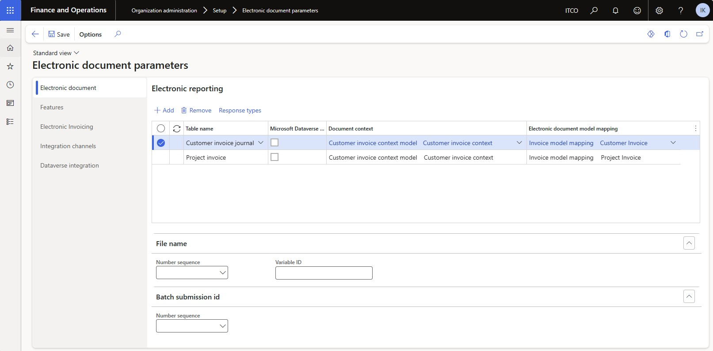
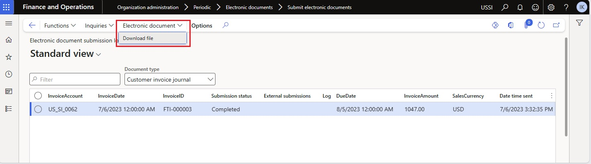

# Get started with Electronic invoicing for Australia and New Zealand

[!include [banner](../includes/banner.md)]

This article provides information that will help you get started with Electronic invoicing for Australia and New Zealand. It guides you through the configuration steps that are country/region-dependent in Regulatory Configuration Service (RCS) and in Microsoft Dynamics 365 Finance or Dynamics 365 Supply Chain Management. These steps complement the steps that are described in [Set up Electronic invoicing](e-invoicing-set-up-overview.md). 

Once configured, the system will allow you to **generate** XML files of electronic invoices in PEPPOL format with Australian and New Zealand extension.

> [!NOTE]
> This article describes electronic invoicing approach implemented using Invoicing service which is applicable only to **cloud** deployments of Microsoft Dynamics 365 Finance or Dynamics 365 Supply Chain Management. For **on-prem** deployments please refer to [Customer electronic invoices in Australia and New Zealand](apac-aus-nzl-e-invoices.md).

## Prerequisites

Before you begin the procedures in this article, complete the following prerequisites:

- Become familiar with Electronic invoicing as it's described in [Electronic invoicing overview](e-invoicing-service-overview.md).
- Sign up for RCS, and set up Electronic invoicing. For more information, see the following articles:

    - [Sign up for and install the Electronic Invoicing service](e-invoicing-sign-up-install.md)
    - [Set up Azure resources for Electronic invoicing](e-invoicing-set-up-azure-resources.md)
    - [Install the add-in for microservices in Lifecycle Services](e-invoicing-install-add-in-microservices-lcs.md)

- Activate the integration between your Finance or Supply Chain Management app and the Electronic Invoicing service as described in [Activate and setup integration with Electronic invoicing](e-invoicing-activate-setup-integration.md).

- Make sure that the following Electronic reporting (ER) format configurations are imported. For more information, see [Import Electronic reporting (ER) configurations](../../fin-ops-core/dev-itpro/analytics/electronic-reporting-import-ger-configurations.md).

    - Peppol Sales Invoice AU-NZ
    - Peppol Sales Credit Note AU-NZ
    - Peppol Project Invoice AU-NZ
    - Peppol Project Credit Note AU-NZ

## Country/region-specific configuration for the Electronic invoicing for Australia and New Zealand feature

Some of the parameters from the **Electronic invoicing for Australia and New Zealand** electronic invoicing feature are published with default values. Before you deploy the electronic invoicing feature to the service environment, review the default values, and update them as required so that they better reflect your business operations.

1. Import the latest version of the **Electronic invoicing for Australia and New Zealand** Globalization feature as described in [Import features from the Global repository](e-invoicing-import-feature-global-repository.md).
2. Create a copy of the imported Globalization feature, and select your configuration provider for it, as described in [Create a Globalization feature](e-invoicing-create-new-globalization-feature.md).

  > [!NOTE]
  > The **Electronic invoicing for Australia and New Zealand** electronic invoicing feature is provided by Microsoft ready to use. No additional configuration required. If you need to apply some changes then refer to the following article for more details how to configure invoicing features [Work with feature setups](e-invoicing-feature-setup.md). For example, you can filter specific legal entities to be processed in applicability rules. By default the feature is applicable to all legal entities with primary addresses in Australia or New Zealand.

3. The copy of the feature is always created as a **Draft** version. You need to complete, publish, and deploy the feature as described in [Complete, publish, and deploy a Globalization feature](e-invoicing-complete-publish-deploy-globalization-feature.md), regardless whether you did some changes or not.

## Finance configuration

Some additional parameters must be configured directly in Finance.

1. Make sure that the country/region-specific Electronic Reporting configurations for Document context and Documents model mapping that are required for Australia or New Zealand are imported. For more information, see [Set up Electronic invoicing parameters](e-invoicing-set-up-parameters.md#set-up-electronic-document-parameters).
  
  > [!NOTE]
  > After importing of the **Electronic invoicing for Australia and New Zealand** electronic invoicing feature, electronic documents are configured by default. If you need to apply changes then do the following steps.

2. Go to **Organization administration** \> **Setup** \> **Electronic document parameters**.
3. In the **Electronic document** section, add records for the **Customer Invoice journal** and **Project invoice** table names.
4. For each table name, set the **Document context** and **Electronic document model mapping** fields in accordance with step 1.

 

5. Save your changes, and close the page.

## Finance business data configuration

### Prerequisites

The primary address of the legal entity must be in Australia or New Zealand.

### Configure legal entity data

Go to **Organization administration** \> **Organizations** \> **Legal entities**, select a legal entity, and configure the following parameters.

1. On the **Addresses** FastTab, add a valid primary address for the legal entity.
2. On the **Tax registration** FastTab, in the **Tax registration number** field, enter a valid tax registration number for the legal entity. 

### Configure customer data

Go to **Accounts receivable** \> **Customers** \> **All customers**, select a customer, and configure the following parameters.

1. On the **Addresses** FastTab, add a valid address for the customer.
2. On the **Invoice and delivery** FastTab, in the **Tax exempt number** field, enter a valid tax registration number for the customer.
3. On the **Sales demographics** FastTab, in the **Primary contact** field, select a person who will be considered the buyer's contact.
    > [!NOTE]
    > All available contact persons must already be defined for this customer.

### Units of measure configuration

1. Go to **Organization administration** \> **Setup** \> **Units** \> **Units**.
2. Select a unit ID in the list, and then select **External codes**.
3. On the **External codes** page, in the **Overview** section, in the **Code** field, enter a code that corresponds to the selected unit ID.
4. In **Value** section, in **Value** field, enter the external code that should be used as the units of measure code for international trade.

### Sales tax codes configuration

1. Go to **Tax** > **Indirect taxes** > **Sales tax** > **Sales tax codes**.
2. Select a sales tax code, and then, on the Action Pane, on the **Sales tax code** tab, in the **Sales tax code** group, select **External codes**.
3. In the **Overview** section, create a line for the selected unit. In the **External code** field, enter the sales tax code you selected in step 2.
4. In the **Value** section, in the **Value** field, enter an external code to use for the selected sales tax code, according to the official codification.

### Customer requisition

When you register free text invoices, invoices that are based on sales orders, or project invoices, you must enter a customer requisition. You can also add an optional customer reference.

#### Free text invoices

1. Go to **Accounts receivable** \> **Invoices** \> **All free text invoices**.
2. Create a new invoice, or select an existing invoice.
3. In the **Header** view, on the **Customer** FastTab, in the **References** section, enter values in the **Customer requisition** and **Customer reference** fields.

#### Sales orders

1. Go to **Accounts receivable** \> **Orders** \> **All sales orders**.
2. Create a new sales order, or select an existing sales order. 
3. In the **Header** view, on the **General** FastTab, in the **References** section, enter values in the **Customer requisition** and **Customer reference** fields.

#### Project invoices

1. Go to **Project management and accounting** \> **Projects** \> **Project contracts**.
2. Create a new project contract, or select an existing project contract.
3. On **Funding sources** FastTab, select or create a funding source of the **Customer** type, and then select **Details**.
4. On the **Funding source details** page, on the **Other** FastTab, in **References** section, in the **Customer requisition** and **Customer reference** fields, enter default values for the contract. 

## Issue electronic invoices

When you've completed all the required configuration steps, you can generate electronic invoices for posted invoices. For more information about how to generate electronic invoices, see [Issue electronic invoices in Finance and Supply chain management](e-invoicing-issuing-electronic-invoices-finance-supply-chain-management.md).

You can inquire about the results of the submission at **Organization administration** \> **Periodic** \> **Electronic documents** \> **Electronic document submission log** and select a required **Document type**.

To download the XML files of electronic invoices for successfully processed invoices got to **Electronic document** > **Download file** menu.

## Additional resources

- [Electronic invoicing overview](e-invoicing-service-overview.md)
- [Get started with Electronic invoicing service administration](e-invoicing-get-started-service-administration.md)
- [Get started with Electronic invoicing](e-invoicing-get-started.md)

[!INCLUDE[footer-include](../../includes/footer-banner.md)]

