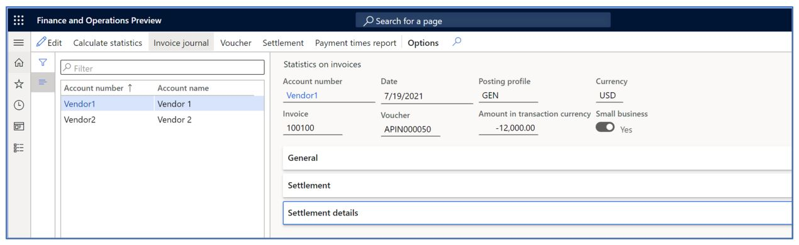
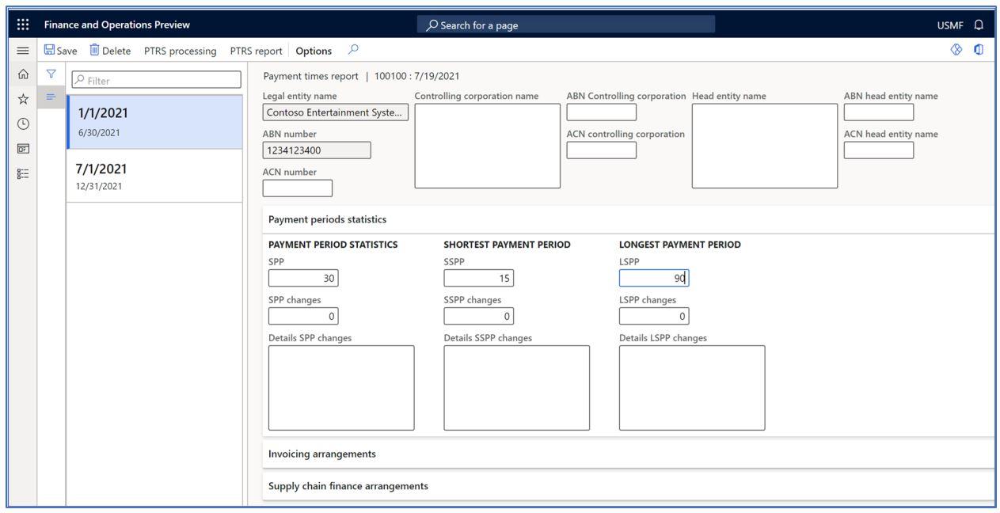

# Payment times reporting schema

[!include [banner](../includes/banner.md)]

This article explains how to set up, create, and generate the Payment times reporting schema (PTRS) that is required for Australian legal entities.

The Australian government established the PTRS to help improve payment times for Australian small businesses. Under the schema, large businesses and government enterprises must report their small business payment terms and times every six months during an income year. In addition, legal entities must include payment information about the goods and services that they procured from small business suppliers under a trade credit arrangement.

## General configuration

Before you generate the report, you must identify vendors as small business suppliers and import the required electronic configurations.

### Identify small business suppliers

Large businesses can use the Small Business Identification (SBI) tool to identify their small business suppliers. The current functionality doesn't include the process of recovering the list of small business suppliers from the SBI tool and then updating Microsoft Dynamics 365 Finance. However, the categorization of this type of suppliers is available in the **Accounts payable** module.

Follow these steps to identify small business suppliers.

1. Go to **Accounts payable** \> **Vendors** \> **All vendors**.
2. Select the required vendor, and then, in the **Vendor profile** section, set the **Small vendor** option to **Yes**.
3. Select **Save**.
4. Repeat steps 2 and 3 to identify each small business supplier that is registered in the legal entity.
5. Close the page.

### Import electronic configurations

In Finance, import the following versions or later of these Electronic reporting (ER) configurations from the Global repository:

- Statistics on invoices version 40
- Payment times bill model mapping version 40.10
- Payment times bill (AU) version 40.20

    This configuration generates an Excel file and .csv files, and packages them in a zip file.

For more information about how to import ER configurations, see [Download Electronic reporting configurations from Lifecycle Services](../../fin-ops-core/dev-itpro/analytics/download-electronic-reporting-configuration-lcs.md).

## Statistics on invoices process

Before you generate the **Payment times** report, run the **Statistics on invoices** process to generate a specific view of the payments history. This process is created for other features and consumed by the **Payment times** report process to get all invoices that have been fully and partially paid. You can run the process in real time, or you can schedule it to run in the background through batch processing.

1. Go to **Accounts payable** \> **Periodic tasks** \> **Statistics on invoices**.
2. Select **Calculate statistics**.
3. Select the "from" and "to" dates. These dates represent the period that should be reported.
4. Select one or more vendor posting profiles. Vendor posting profiles let you easily include vendor transactions for all vendors, a group of vendors, or a single vendor on the report that is generated. To select all available vendors, leave the field blank.
5. Optional: Select the vendor group. The **Vendor group** field lets you introduce an additional transaction filter. To select all available vendors, leave the field blank.
6. Select **OK** to run the process.

> [!NOTE]
> When the **Calculate statistics** command is run based on the selected parameters, it selects all invoices that were fully and partially settled during a specific period for all the selected vendors. Payments for vendors that aren't small business suppliers are also included, because this process is used for another feature. The report includes the amount of all payments for a legal entity. The identification of the small vendor supplier can be found in the header section under the **Small business** slicer.

### Payment times report pre-processing and generation

PTRS processing lets you create or update the booking period, and prepare all the information and metrics that are required on the **Payment times** report. The processing compares and calculates the due dates of the invoices and the receipt date of the payments that are settled to the invoice.

Follow these steps to process and generate the report.

1. On the **Statistics on invoices** page, select **Payment times report**.
2. Select **PTRS processing**, and create the related booking period by specifying the "from" and "to" dates.
3. Select **OK**.
4. Enter the information that is required according to the tax authority's guidelines:

    - The name and Australian Business Number (ABN) of the legal entity

        The **Legal entity name** and **ABN number** fields are automatically filled in from the legal entity information.

    - Information about the controlling corporation and head entity
    - The reporting period
    - Details of the person who submitted the report
    - The approver of the report
    - The principal governing body of the legal entity
    - A declaration by a responsible member
    - Payment period statistics
    - Invoicing arrangements
    - The supply change finance arrangement
    - Notifiable events
    - Report comments
    - Submission and approval details

5. Select **PTRS report** to generate the report and a .csv file that is used to enter the payment information in the tax authority portal.

After the report is generated, the following statistics are included on both reports:

- **Standard payment periods** – The standard payment period, including the shortest and longest standard payment periods, and other changes that the entity offers to its small business suppliers at the beginning of the booking period. The information is gathered in the **Payment period statistics** session. For example, to report the most common standard payment period in calendar days, you must manually specify 30 days in the **SPP** field.
- **Small business invoices paid** – The proportion, which is established by tax authorities. It's determined by the total number and total value of small business invoices that are paid during the booking period for each range of days. This statistic includes only small vendor transactions that are fully settled and paid during the booking period. It doesn't include partial settlements and payments, because the related metric (for example, **<20**, **21-30**, and **31-60**) can't be determined.
- **Small Business procurement** – The total proportion of all invoice payments from small business suppliers during the booking period to all invoices that were paid.
- **Use of supply chain finance** – If the legal entity offers a different type of arrangements, it must report the proportion (by value and number) of small business invoices that were paid under those arrangements during the booking period. In Finance, these invoices are the paid small business invoices that have a cash discount or a payment fee. When a cash discount is defined on the vendor invoice and taken if the invoice is paid by the cash discount date, this transaction is classified as supply chain finance.
		
> [!NOTE]
> The file that has a Word file name extension is used for signatures and associated declarations. It isn't currently supported.

[!INCLUDE[footer-include](../../includes/footer-banner.md)]
