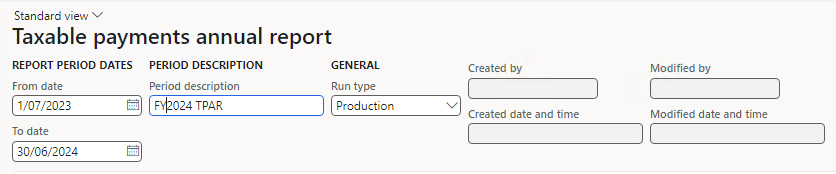
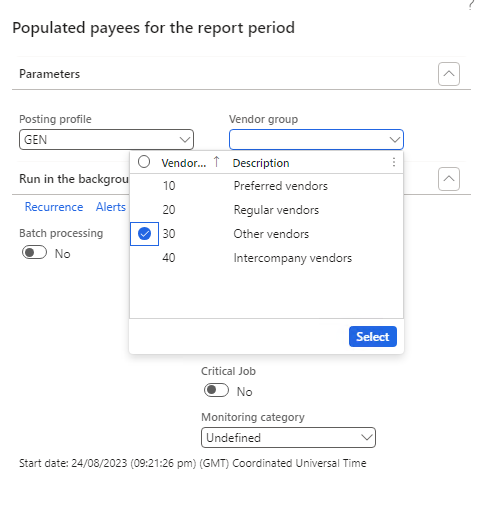
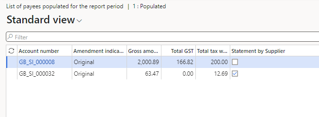

# Taxable Payments Annual Report

This article explains how to set up, create, and generate the Taxable Payments Annual Report (TPAR) that is required by the Australian Tax Office.

The Taxable Payments Annual Report (TPAR) is a report that some businesses and government entities in Australia must lodge with the Australian Taxation Office (ATO) by 28 August each year. The purpose of a TPAR is to report payments made to contractors or subcontractors for certain services, such as building and construction, cleaning, courier, road freight, IT, security, investigation, or surveillance. The ATO uses this information to identify contractors who haven't met their tax obligations, such as not reporting all their income or not registering for GST. A TPAR also helps contractors to verify the income they report in their tax returns. The TPAR report provides information about the total payment amount to a contractor, including any GST, and their details such as name, ABN, address and phone number. You can lodge your TPAR online using the Business Portal.

# General configuration

Before you generate the TPAR report, you must have a complete setup of Legal Entity Company information and Vendor information in areas of company name, address, ABN number and contact person. Additionally, to generate a final report, you must and import the required electronic configurations.

## Create a contact person for your company
The TPAR report requires providing information to company contact person responsible for information in the report. To set up contact information that will be reported in TPAR, follow these steps.

1. Go to **Sales and marketing** > **Relationships** > **Contacts** > **All contacts**.
2. Select **New** to create a new contact for your legal entity. Be sure to select a Legal entity in the **Contact for** field.
3. Check by Party ID value to make sure that you select the legal entity that SAF-T will be reported from.

   

## Import electronic configurations
In Dynamics 365 Finance, import the following components of these Electronic reporting (ER) configurations from the Global repository in the latest available version:

- Payment model
- TPAR model mapping (AU)
- TPAR (AU) report format

For more information about how to import ER configurations, see [Download Electronic reporting configurations from Lifecycle Services](../../fin-ops-core/dev-itpro/analytics/download-electronic-reporting-configuration-lcs.md)

# Prepare the Taxable Payments Annual Report

Before you generate the TPAR report, collect the data that's necessary for the report. This process is created similarly to payment times reporting. The process collects all payments in the reporting period for a specific group of vendors. You can run the process in real time, or you can schedule it to run in the background through batch processing.

1. Go to **Accounts payable** > **Periodic tasks** > **Taxable payments annual report** and select **New**.
3. In the **From date** and **To date** fields, enter values to determine the reporting period.
4. In the **Run type** field, select a value. If you are testing report data, select **Test**. In case you want to generate report got lodging to ATO choose **Production** option. 

   

6. To start collecting data for the report, select **New** in report versions. Then select **Collect data** in **Operations** menu. 

7. In the report provide vendors selection criteria following TPAR reporting requirements. You can decide choosing vendors by dedicated posting profile and/or Vendor group. You can also decide if the process of collecting data should be run as a batch processing. 
8. Once data are collected there will be created a report version. The report version will change status from **New** to **Populated**. Select **Payees** to review collected data.

9. In that view you can review Gross amount paid to vendors with GST and Withholding tax information. 
>[!NOTE]
>Information about “Statement by supplier” should be provided on the TPAR when a contractor does not quote an ABN and provides a valid reason for not doing so. A Statement by supplier is a form that a contractor can complete and give to the payer if they are not required to have an ABN or they are an individual under 18 years of age and the payment does not exceed $350 per week.
9. After all collected data are validated and approved you can choose to either generate testing version of the report to submit to ATO and validate on Business Portal or Production version for final submission. After that select button **TPAR** to start process of preparation the TPAR a text file with data in format ready for submission to ATO. 
10. Once the report is submitted and accepted at ATO online portal, you may reflect that fact by changing status of the report in **Operations** to **Sent**.
11. If you need to make amendments to your report after sending it, due to changes in transactions, you can add a **New** version of the report. This will generate a text file that will be recognized as an amendment by the ATO.
