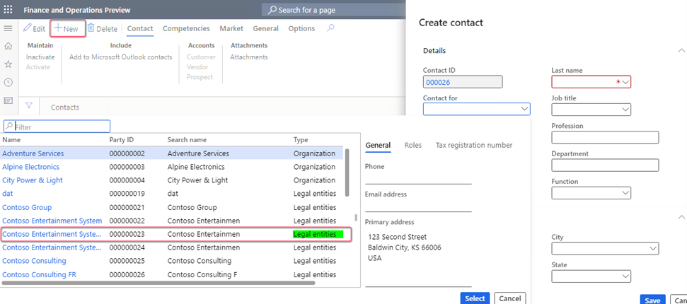

# Taxable Payments Annual Report

This article explains how to set up and generate the Taxable Payments Annual Report (TPAR) that's required by the Australian Taxation Office (ATO).

A TPAR is a report that some businesses and government entities in Australia must provide to the ATO by August 28 each year. The purpose of a TPAR is to report payments that are made to contractors or subcontractors for specific services, such as building and construction, cleaning, courier, road freight, IT, security, investigation, and surveillance services. The ATO uses the information on a TPAR to identify contractors who have failed to meet their tax obligations because, for example, they didn't report all their income or register for goods and services tax (GST). A TPAR also helps contractors verify the income that they report on their tax returns.

A TPAR provides information about the total amount that's paid to a contractor, including any GST. It also provides details such as the contractor's name, Australian Business Number (ABN), address, and telephone number.

You can submit your TPAR online by using the Business Portal.

## General configuration

Before you generate a TPAR, you must have a complete setup of legal entity (company) information and vendor information in terms of the company name, address, ABN, and contact person. Additionally, to generate a final report, you must import the required electronic configurations.

### Create a contact person for your company

A TPAR requires that you provide information to the company contact person who is responsible for information on the report. To set up contact information that will be reported on the TPAR, follow these steps.

1. Go to **Sales and marketing** \> **Relationships** \> **Contacts** \> **All contacts**.
2. Select **New** to create a contact for your legal entity. Be sure to select a legal entity in the **Contact for** field.
3. Check by **Party ID** value to make sure that you select the legal entity that Standard Audit File for Tax (SAF-T) will be reported from.

    

### Import Electronic reporting configurations

In Microsoft Dynamics 365 Finance, import the latest available version of these Electronic reporting (ER) configurations from the Global repository:

- Payment model
- TPAR model mapping (AU)
- TPAR (AU) report format

For more information about how to import ER configurations, see [Download Electronic reporting configurations from Lifecycle Services](../../fin-ops-core/dev-itpro/analytics/download-electronic-reporting-configuration-lcs.md).

## Prepare a TPAR

Before you generate a TPAR, collect the data that's required for the report. This process resembles the process for payment time reporting. The process collects all payments in the reporting period for a specific group of vendors. You can run the process in real time, or you can schedule it to run in the background through batch processing.

1. Go to **Accounts payable** \> **Periodic tasks** \> **Taxable payments annual report**, and select **New**.
2. In the **From date** and **To date** fields, enter values to define the reporting period.
3. In the **Run type** field, select a value. If you're testing report data, select **Test**. To generate a report to send to the ATO, select **Production**.

    

4. In the report versions, select **New** to start to collect data for the report. Then select **Operations** \> **Collect data**.
5. On the report, provide the vendor's selection criteria according to the TPAR reporting requirements. You can select vendors based on their posting profile or vendor group. You can also specify whether the process of collecting data should be run through batch processing.

    After the data is collected, a report version is created. The report version changes the status from **New** to **Populated**.

6. Select **Payees** to review the collected data.

    

    Use this view to review the gross amount that's paid to vendors, together with GST and withholding tax information.

    > [!NOTE]
    > If a contractor doesn't quote an ABN and provides a valid reason for not doing so, **Statement by supplier** information should be provided on the TPAR. A statement by the supplier is a form that a contractor can complete and give to the payer if they aren't required to have an ABN, or if they're an individual under 18 years of age and the payment doesn't exceed $350 per week.

7. After all the collected data is validated and approved, select to generate either a test version of the report to submit to the ATO and validate on the Business Portal, or a production version for final submission.
8. Select **TPAR** to start to prepare the TPAR as a text file that contains data in a format that's ready for submission to the ATO. 
9. After you submit the report and it's accepted in the ATO online portal, the status of the report in **Operations** is updated to **Sent**.
10. To make changes to your report after you send it, you can add a new version of the report. A new version generates a text file that the ATO recognizes as an amendment.
