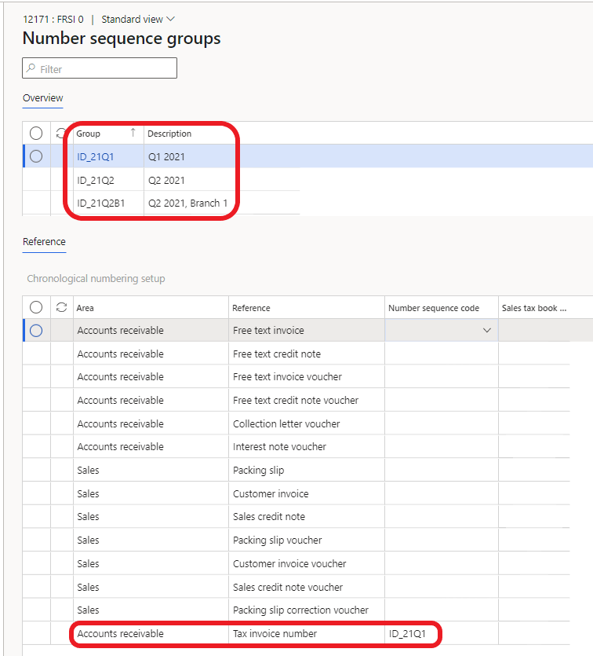
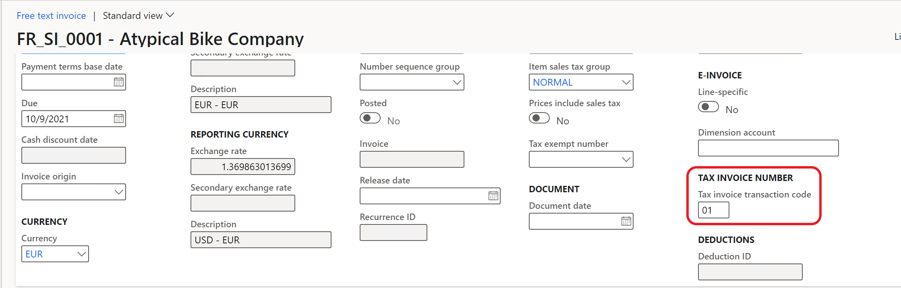
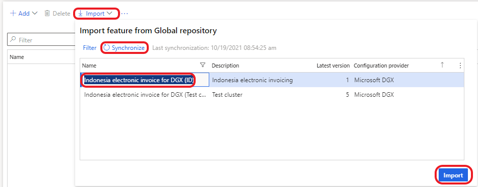
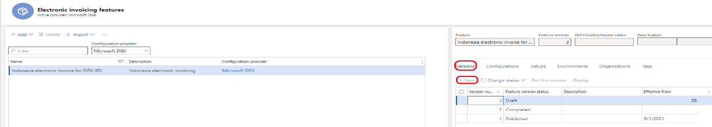
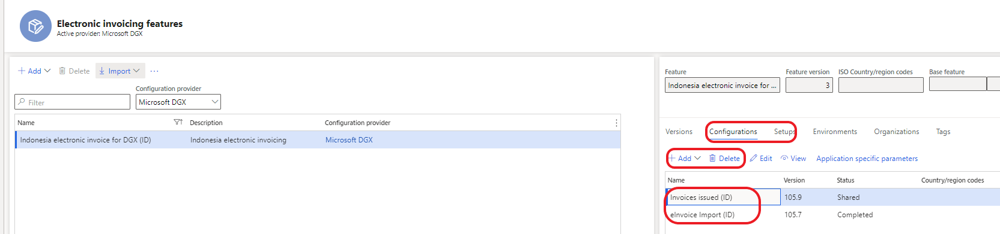
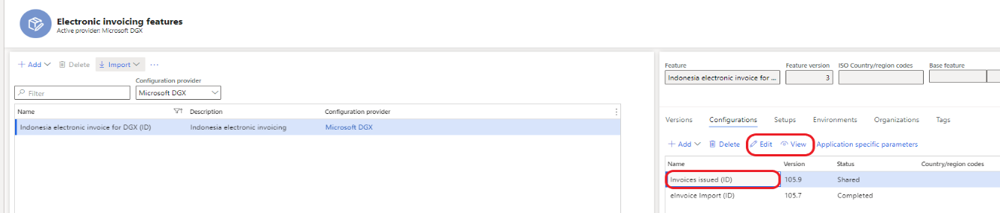
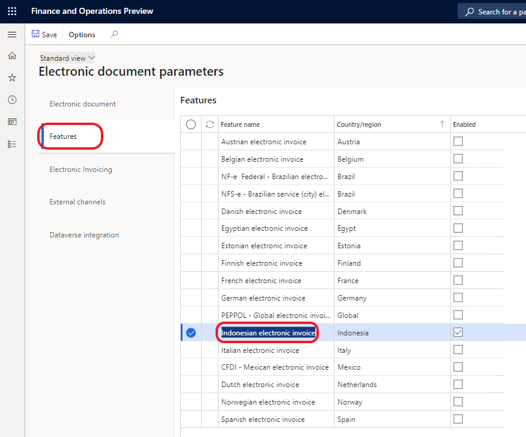
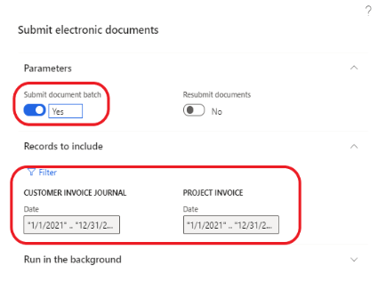
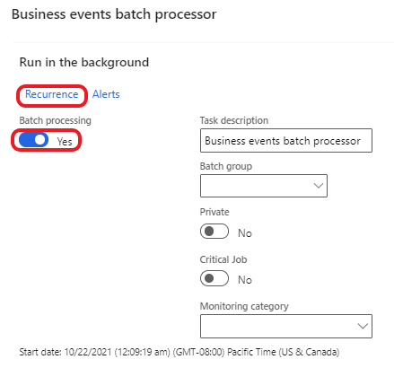
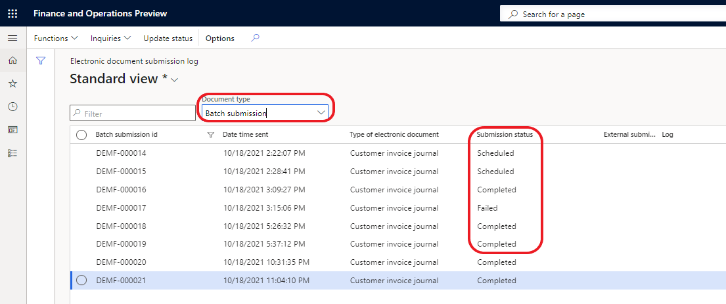

---
# required metadata

title: VAT declaration for Indonesia (ID-00004)
description: This topic explains how to configure tax invoice numbering to configure and run export sales invoices for Indonesia.
author: v-olgaoskina
ms.date: 11/29/2021
ms.topic: article
ms.prod: 
ms.technology: 

# optional metadata

ms.search.form: 
audience: Application User
# ms.devlang: 
ms.reviewer: 
# ms.tgt_pltfrm: 
# ms.custom: 
ms.search.region: Indonesia
# ms.search.industry: 
ms.author: v-olgaoskina
ms.search.validFrom: 
ms.dyn365.ops.version: 10.0.23

---

# VAT declaration for Indonesia (ID-00004)

[!include [banner](../includes/banner.md)]

This topic explains how to configure tax invoice numbering to configure and run export sales invoices and import vendor invoices from files for Indonesia.

Implemented functionality for VAT declaration in Dynamics 365 Finance includes:

- Flexible setup of tax invoice numbers including:

    - Set up tax invoice numbers for user-defined date intervals
    - Set up tax invoice numbers for different branches in one legal entity
    - Allocate tax invoice numbers for customers

- Create replacement invoices and credit notes with a tax invoice number and associate them with the original invoice.
- Export sales invoices and import vendor invoices using the Regulatory Configuration Service (RCS).

## Prerequisites

Before you can use the VAT declaration functionality, the following features must be enabled and configured.

- (Indonesia) Enable generation of tax invoice numbers for invoices
- Chronological numbering
- Credit invoicing layout for sales and project invoice reports
- Enable Electronic Invoicing for Indonesia
- [Configure Electronic invoicing solution in Microsoft Dataverse](e-invoicing-power-platform-plug-in.md)

For information about how to enable features, see [Feature management overview](../../fin-ops-core/fin-ops/get-started/feature-management/feature-management-overview.md).

## Tax invoice numbering

Tax invoice numbers are generated according to the structure of the tax serial numbers that's provided by the **Directorate General of Taxation** (DJP) to taxable entrepreneurs.

These numbers should have a structure of:

- **Transaction code (2 digit)**: Number ranging from 01 to 09
- **Status (1 digit)**: 0 is a normal invoice and 1 is the replacement of an invoice
- **Next digits**: An interval of numbers

    

## Set up tax invoice numbers

Complete the following steps to create invoice numbers for only one period at a time for a company with one branch.

1. Go to **Organization administration** > **Number sequences** > **Number sequences** and create a number sequence for invoice numbering. The number sequences should consist of two segments, constant and alphanumeric, and be continuous. 

    

3. Go to **Accounts receivable** > **Setup** > **Accounts receivable parameters** and create a number sequence group. 
4. Associate the number sequence group with the number sequence, **Tax invoice number**.
    
    

5. Go to **Organization administration** > **Number sequences** > **Chronological number sequence groups** and create the chronological number sequence group, **Period**.
6. Associate the new number sequence group with the number sequence, **Tax invoice number**.

    

7. Repeat steps 1 - 6 to create invoice numbers for additional periods.

If a company has multiple branches and each branch should have its own numeration of tax invoices, complete the following steps. 

1. Go to **Tax** > **Indirect taxes** > **Tax branch** and create the necessary number of branches.
2. Add tax branches to the Ledger account structure.
3. For each branch, repeat steps 1 - 3 for setting up one period, and fill in the Tax branch in the chronological number sequence group.

    

### Allocate a tax invoice number to specific customers
If a company wants to allocate a tax invoice number to specific customers, complete the following steps. 

This procedure uses the following example information.

- A company has serial numbers from 000-21.00000001 to 000-21.00000100.
- The numbers from 000-21.00000010 to 000-21.00000020 are allocated to customer 1.
- The numbers from 000-21.00000030 to 000-21.00000040 are allocated to customer 2

1. Create number sequences for tax number intervals. These number sequences must be created for specific customers and intervals. Exclude the intervals for customer 1 and customer 2. 

  - From 000-21.00000010 to 000-21.00000020 (customer 1)
  - From 000-21.00000030 to 000-21.00000040 (customer 2)
  - From 000-21.00000001 to 000-21.00000009
  - From 000-21.00000021 to 000-21.00000029 
  - From 000-21.00000041 to 000-21.00000100

2. Create number sequence groups for all the number sequences you created and then assign the number sequences you created to the groups.
3. Create additional number sequence groups for each customer that numbers must be allocated to. 
4. Update the customer records with the new number sequence groups. Number sequences aren't required in the customer record. 
5. Create chronological number sequence groups (number of lines for one period is 5: for customer 1 (two records), for customer 2 (two records) and one record for the rest number intervals):

| Group        | Description                                          | Number sequence |
|--------------|------------------------------------------------------|-----------------|
| ID_Cust1     | Customer 1                                           | -               |
| ID_Cust1_Q3  | Customer 1 Q3, 2021 from 10 to 20                    | ID_Cust1Q3      |
| ID_Cust2     | Customer 2                                           | -               |
| ID_Cust2_Q3  | Customer 2 Q3, 2021 from 30 to 40                    | ID_Cust2Q3      |
| ID_21Q3_1    | Q3 2021, First interval. (from 1 to 9)               | ID_21Q3_1       |
| ID_21Q3_2    | Q3 2021, Second interval. (from 21 to 29)            | ID_21Q3_2       |
| ID_21Q3_3    | Q3 2021, Third interval. (from 41 to 100)            | ID_21Q3_3       |
| ID_21Q1      | Customer tax invoice number group 2022               | ID_21Q1         |

Setup for Customers:

Setups for other intervals:

## Generate tax invoice numbers

A tax invoice number is generated for customer  and project invoices if the **einvoice** option is set to **Yes**. The tax invoice number is generated when an invoice is posted. The system automatically adds the first three digits, which are the transaction code and status, to tax invoice number. The transaction code should be validated or updated before posting sales order invoices, free text invoices, and project proposals.

By default, the system fills in the **Tax invoice transaction code** field with **01**.

If you create an invoice replacement, the system fills in the 3rd digit of tax invoice number with a **1**. For information about how to create invoice replacement, see the next section.

## Invoice cancellation, credit notes, and invoice replacement

Before credit notes are created for cancelation because of an error in a posted invoice or invoice replacement, go to **Accounts receivable** > **Setup** > **Customer reason codes** to set up financial reasons.

Create at least two records: one record with a **Cancellation** operation and another with **Replacement**. There may be several records in **Financial reasons**.

- To cancel a posted invoice because of an error, create a credit note and associate it with the original invoice and financial reason that has a **Cancellation** operation. In this situation, the tax invoice number isn't generated.
- To create a credit note for items returns, create a credit note and associate it with the original invoice and financial reason that has a **Blank** operation. In this situation, the tax invoice number is generated.
- To create an invoice replacement:

    - Create a credit note and associate it with the original invoice and financial reason that has a **Cancellation** operation. In this situation, the tax invoice number is not generated.
    - Create a debit note, associate it with the original invoice and financial reason that has a **Replacement** operation. 
- Create debit note, relate it with the original invoice and a financial reason that has a **Replacement** operation. The system fills in the third digit of the tax invoice number with **1**.

We recommend that you create a new sales order when it's needed to create a credit note for cancellation and a debit note for replacement. When you create a replacement invoice, the original invoice should have a tax invoice number. Cancelation which created before replacement and replacement should be related with the same invoice.

To relate a credit or debit note with an original invoice, select **Credit invoicing** on a free text invoice, a sales order, or when you select a project invoice to create a credit note.

## Enable Electronic Invoicing for Indonesia

This topic provides information that will help you get started with Electronic invoicing for Indonesia. This topic guides you through the configuration steps that are country-dependent in Regulatory Configuration Services (RCS) and Dynamics 365 Finance. It also guides you through the steps that you must follow in Finance to export sales invoices through the service and to review the processing results and the status of invoices.

### Prerequisites

Before you complete the steps in this topic, complete the steps in [Get started with Electronic invoicing](e-invoicing-get-started.md).

### RCS setup

During the RCS setup, complete the following tasks:

- Import the Electronic Invoicing feature for processing invoice exports and importing vendor invoices.
- Review the format configurations that are required to generate, export of sales invoices
- Review or configure the actions in the Processing pipeline that support the sales invoice export and import scenarios.
- Publish Electronic Invoicing feature for sales invoices and import vendor invoices.

#### Import the Electronic Invoicing feature

1. Sign in to your RCS account.
2. In the **Globalization features** workspace, in the **Features** section, select the **Electronic Invoicing** tile.
3. On the **Electronic invoicing features** page, click **Import** to import the **Indonesian electronic invoice (ID)** feature from the Global repository published by Microsoft configuration provider.  
 
 > [!NOTE] 
 > If you don't see the feature in the list, select **Synchronize**, and then repeat step 3.

When you import the **Indonesian electronic invoice (ID)** feature from the Global repository, all the feature settings, including configurations and actions of Processing pipeline, are also imported.

### Create a new version of the Indonesian electronic invoice (ID) feature

You can create a new version with your Configuration provider.

On the **Electronic invoicing features** page, on the **Versions** tab, select **New**.

### Update the configuration version

On the **Electronic Invoicing Features** page, on the **Configurations** tab, select **Add** or **Delete** to manage the configuration versions (ER file format configurations).

When you create a new version, all configurations are inherited from the imported version of the Electronic Invoicing feature. To process invoices, the following configurations are required:

1. Invoices issued (ID)
2. eInvoice import (ID)

In the list, select a configuration version, and then click **Edit** or **View** to open the **Format designer** page, where you can edit or view the configuration.

Customers can review the configuration and customize it (if needed). Use the **Format designer** page to edit and view the ER format file configurations. For more information, see [Create electronic document configurations](../../fin-ops-core/dev-itpro/analytics/electronic-reporting-configuration.md).

### Configure the application specific parameters

So that the system can determine which the sales tax code in Dynamics 365 Finance corresponds to the tax code for luxury goods (PPnBM) when exporting invoices, it is necessary to fill in the following application specific parameters for the luxury sales tax:

So that the system can determine which the sales tax group in Dynamics 365 Finance corresponds to the exempt reasons (transaction codes 07 and 08) when exporting invoices, it is necessary to fill in the following application specific parameters for exempt reasons:

### Manage the Electronic Invoicing feature setups

On the **Electronic Invoicing features** page, on the **Setups** tab, click **Add**, **Delete**, or **Edit** to manage the Electronic Invoicing feature setups. 

To generate sales invoice csv file, the Sales invoice feature setup is required.

#### Configure the Sales invoice feature setup

1. On the **Electronic Invoicing features** page, on the **Setups** tab, in the **Feature setup** column, select Invoice issued.
2. Click **Edit** to review or configure the actions, applicability rules, and variables.

#### Configure the Vendor invoice feature setup

1. On the **Electronic Invoicing features** page, on the **Setups** tab, in the **Feature setup** column, select the **Import from share point** record.

   > [!NOTE] 
   > Previously you should create draft version of the feature.

2. Click **Edit** to review or configure the actions, applicability rules, and variables.
3. On the **Feature version setup** page, select the **Data channel** tab and **Parameters** list, in the **Data channel** record fill in **Value** with **\$Context Channel** value from derived configuration and fill in the other parameters. In the **Custom file name** record you can set up filter for vendor invoice file names.
4. On the **Applicability rules** tab, in the record with **Channel** field fill in **Value** with **\$Context Channel** value from derived configuration.
5. On the **Variables** tab create or validate the following record:

**This name** value should be filled in Import sources (Electronic document parameters \> External sources).

### Assign the Draft version to an e-Invoicing environment

1. On the **Electronic Invoicing features** page, on the **Environments** tab, select Enable.
2. In the **Environment** field, select the environment.
3. In the **Effective from** field, select the date when the environment should become effective.
4. Click **Enable**.

### Change the version status

1. On the **Electronic Invoicing features** page, on the **Versions** tab, select the version of the electronic invoicing feature that has a status of Draft.
2. Click Change status \> Complete.
3. And then click **Change status** \> **Publish**.

## Set up Electronic invoicing integration in Dynamics 365 Finance

To set up Electronic invoicing in Dynamics 365 Finance, you will complete this task:

Import the ER data model, the ER data model mapping, and the formats that are required for invoices.

### Import the ER data model, ER data model mapping, and context configurations for invoices

1. Sign in to Dynamics 365 Finance.
2. In the **Electronic reporting** workspace, in the **Configuration providers** section, select the Microsoft title. Make sure that this configuration provider is set to Active. For information about how to set a provider to Active, see [Create configuration providers and mark them as active](../../fin-ops-core/dev-itpro/analytics/tasks/er-configuration-provider-mark-it-active-2016-11.md).
3. Select Repositories.
4. Select Global resource \> Open.
5. Import Invoice model, Vendor invoice Mapping to destination, Vendor invoice import (ID), Vendor invoice import XML (ID).

### Turn on the feature for processing Indonesian electronic invoice

1. Go to Organization administration \> Setup \> Electronic document parameters.
2. On the **Features** tab, select the **Enable** check box in the row for feature **Indonesian electronic invoice**.

    

### Setup of processing Indonesian electronic invoice (export sales and project invoices)

Go to **Electronic document** tab:

1. On the **Electronic document** tab, click **Add**.
2. Enter the customer invoice journal. Then click **Add** and Enter the project invoice journal.
3. Fill in a Number sequence in the **Bach submission id** field group. The selected number sequence should be continuous. This number sequence is used to numeration of invoice batch for export.
4. Select Save.

### Setup of processing Indonesian electronic invoice (import vendor invoices)

1. Go to the **Electronic reporting** workspace and select **Reporting configurations**.
2. Select **Customer invoice context model**, and then select **Create configuration** \> **Derive from Name: Customer invoice context model, Microsoft** to create a derived configuration.
3. On the **Draft** version, select **Designer** and in the **Data model** tree, select **Map model to datasource**.
4. In the **Definitions** tree, select **DataChannel** and then select **Designer**.
5. In the **Data sources** tree, expand the **\$Context_Channel** container. In the **Value** field, select **Edit** and enter the data channel name (less or equal 10 symbols). This is the name of the channel given in the configuration of the data channel for the Electronic invoicing feature in RCS.

> [!NOTE] 
> You can create several derived configurations with different **\$Context** **Channel** value for import vendor invoices from different sources. For
example, if you want to import vendor invoices for different legal entities.

6. Select **Save** and close the page.
7. Close the page.
8. Select the derived configuration you just created from the **Customer invoice context model**, and on the **Versions** FastTab, select **Change Status** \> **Completed**.
9. Go to **External channels** tab to set up import of vendor invoices.
10. On the **Channels**, click **Add** and fill in the **Channel field** (**\$Context Channel** value), Description, Company
11. In the **Document context** field, select the new derived configuration from **Customer invoice context model**. The mapping description should be **Data channel context**.
12. On **Import sources** field group click **Add** and fill in **Name**, **Description**.

 > [!NOTE]
 > In the **Name** field, set the value from Feature version setup \> **Variables** tab. Select one of Data entity name: **Vendor Invoice register header,** if you want importing vendor invoices in Invoice register or **Vendor invoice journal**, if you want importing vendor invoices in pending vendor invoices.

13. Select model mapping **Vendor invoice import (ID)** for import invoice header into Invoice register or for import into pending vendor invoices. And select **Vendor invoice import XML (ID)** for import header and lines in pending vendor invoices.

 > [!NOTE] 
 > You can have only one line for one import source.

 > [!NOTE]
 > Before importing vendor invoices from xml files, it is necessary to set up **External item description** for vendors (vendor record \> Procurement \> Set up). In this case the system can match item name in xml file with line items in sales orders.

    

> [!NOTE] 
> If it is necessary to import vendor invoices, for example, into different legal entity, create a new Channel record with the new document context (derived configuration.

## Process electronic invoices in Dynamics 365 Finance

During the processing of issued invoices or import vendor invoices in Dynamics 365 Finance through Electronic invoicing, you can perform the following tasks:

1. Submit (export) issued invoices/ Import vendor invoices.
2. View the Electronic document submission logs/ Electronic document receipt logs.

### Submit (export) issued invoices

1. Go to Organization administration \> Periodic \> Electronic documents \> Submit electronic documents.
2. For the first submission of any document, always set the **Resubmit documents** option to **No**. If you must resubmit a document through the service, set this option to **Yes**.
3. On the **Records to include** FastTab, click **Filter** to open the Inquiry dialog box, where you can build a query to select documents for export.

    

4. Go to System administration \> Setup \> Business events \> Business events parameters and click **Business events batch job**.

> [!NOTE] 
> This job can be run in batch, if you set up Business event batch processor.

    

### View submission logs

You can view the submission logs for all exported documents.

1. Go to Organization administration \> Periodic \> Electronic documents \> Electronic document submission log.

    

2. Click **Update status** button.
3. On the Action Pane, select Inquiries \> Submission details to view the details of the submission execution logs.

The information in the submission logs is divided among three FastTabs:

-  Processing actions – This FastTab shows the execution log for the actions that are configured in the feature version that was set up in RCS. The Status column shows whether the action was successfully run.
-  Action files – This FastTab shows the intermediate files that were generated during execution of the actions. You can select View to download and view the file.
-  Processing action log – This FastTab shows the results of the submission of Electronic invoices.

4. On the Action Pane, select Inquiries \> Batch submission invoices to view invoices that were submit in one batch.

### Import vendor invoices and view the electronic document receipt log

1. Go to Organization administration \> Periodic \> Electronic documents \> Receive electronic documents.

> [!NOTE] 
> For the first receiving of any document, always set the Re-import documents option to No. If you must re-import a document through the service, set this     option to Yes.
> This job can be run in batch.

2. Go to Organization administration \> Periodic \> Electronic documents \> Electronic document receipt log and on the Action Pane, select Inquiries \> Submission details to view the details of the submission execution logs.

## Privacy notice

Enabling the **Indonesian electronic invoice** feature may require sending limited data, which includes the organization tax registration ID. An administrator can enable and disable the Indonesian electronic invoice feature by navigating to Organization administration \> Setup \> Electronic document parameters. Select the Features tab, select the rows containing the **Indonesian electronic invoice** feature, and then make the appropriate selection. Data imported from these external systems into this Dynamics 365 online service are subject to our [privacy statement](https://go.microsoft.com/fwlink/?LinkId=512132). Consult the Privacy notice sections in country-specific feature documentation for more information.

## Additional resources

- [Electronic invoicing overview](e-invoicing-service-overview.md)
- [Get started with Electronic invoicing](e-invoicing-get-started.md)
- [Set up Electronic invoicing](e-invoicing-setup.md)
        
  [!INCLUDE[footer-include](../../includes/footer-banner.md)]
