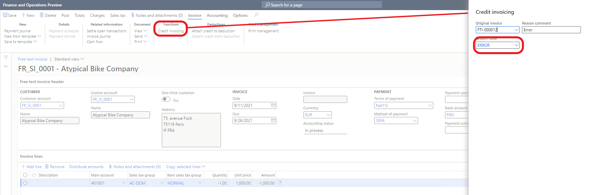
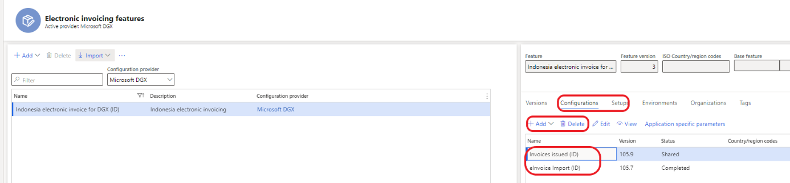
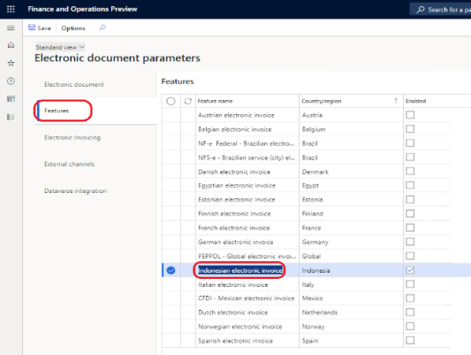

---
# required metadata

title: VAT declaration for Indonesia (ID-00004)
description: This topic explains how to configure tax invoice numbering, to configure and run export sales invoices in the file and import vendor invoices from files for Indonesia.
author: v-olgaoskina
ms.date: 11/19/2021
ms.topic: article
ms.prod: 
ms.technology: 

# optional metadata

ms.search.form: 
audience: Application User
# ms.devlang: 
ms.reviewer: 
# ms.tgt_pltfrm: 
# ms.custom: 
ms.search.region: Indonesia
# ms.search.industry: 
ms.author: v-olgaoskina
ms.search.validFrom: 
ms.dyn365.ops.version: 10.0.23

---

# Invoicing for Indonesia

Implemented functionality includes the following capabilities:

1.  Flexible setup of tax invoice numbers:​

-   To set up tax invoice numbers for user-defined date interval​

-   Set up tax invoice numbers for different branches in one legal entity

-   Allocate tax invoice numbers for customers​

2.  Creation of replacement invoices and credit notes (item returns) with tax
    invoice number and relating them with the original invoice​

3.  Export of sales invoices and import of vendor invoices using Regulatory
    Configuration Service (RCS)

# Prerequisites

1.  Before using this functionality enable the following features:

-   (Indonesia) Enable generation of tax invoice numbers for invoices​

-   Chronological numbering​

-   Credit invoicing layout for sales and project invoice reports​

    See how to enable features in [Feature management overview - Finance &
    Operations \| Dynamics 365
    \|](https://docs.microsoft.com/en-us/dynamics365/fin-ops-core/fin-ops/get-started/feature-management/feature-management-overview)
    [Microsoft
    Docs](https://docs.microsoft.com/en-us/dynamics365/fin-ops-core/fin-ops/get-started/feature-management/feature-management-overview)​.

2.  Enabling Electronic Invoicing for Indonesia (see Enabling Electronic
    Invoicing for **Indonesia** section) and set up application specific
    parameters.
3.  [Configure Electronic invoicing solution in Microsoft Dataverse](e-invoicing-power-platform-plug-in.md)

# Tax invoice numbering

Tax invoice numbers are generated according to the structure of tax serial
number of tax invoices that is given by **Directorate General of Taxation**
(DJP) to taxable entrepreneurs​.

These numbers should have the following structure:

**Transaction code (2 digit):** from 01 to 09 ​

**Status (1 digit):** 0 is a normal invoice, 1 is replacement of invoice​

**Next digits:** interval of numbers

## Setup of tax invoice numbers

To set up tax invoice numbers for one period, if a company does not have
branches, it is necessary to run the following steps:

1.  Create the number sequence for numeration of invoices (Organization
    administration \> Number sequences \> Number sequences)

**Note.** The number sequences should consist of 2 segments (Constant and
Alphanumeric) and be **continuous.**  See example on the screenshot below.

1.  Create **Number sequence group** and relate it with the number sequence
    (Reference **Tax invoice number**). (Accounts receivable \> Setup \>
    Accounts receivable parameters)

    

1.  Create the chronological number sequence group for period and relate it with
    the Number sequence group (Organization administration \> Number sequences
    \> Chronological number sequence groups).

    

Run these steps for every period.

If a company has branches and every branch should have its own numeration of tax
invoice there should be the following steps of setting:

1.  Create branches (Tax \> Indirect taxes \> Tax branch)

2.  Add tax branches to the Ledger account structure

3.  Run steps from 1 to 3 (see set up for one period) for every branch and fill
    in the Tax branch in the chronological number sequence group.

If a company wants to allocate some tax invoice number to specific customers,
then run the steps below.

**Example for one period:**

1.  A company has serial numbers from 000-21.00000001 to 000-21.00000100​

2.  The numbers from 000-21.00000010 to 000-21.00000020 are allocated to
    customer 1

3.  The numbers from 000-21.00000030 to 000-21.00000040 are allocated to
    customer 2

Steps:

1.  Create number sequences for tax number intervals for specific customers and
    intervals excluding intervals for customer 1 and customer 2. ​

    From 000-21.00000010 to 000-21.00000020 (customer 1)

    From 000-21.00000030 to 000-21.00000040 (customer 2)

    From 000-21.00000001 to 000-21.00000009

    From 000-21.00000021 to 000-21.00000029

    From 000-21.00000041 to 000-21.00000100

2.  Create number sequence groups for all number sequences (step1) and relate
    them with the number sequences (**Tax invoice number** reference).

3.  Create additional Number sequence groups for each customer whom necessary to
    allocate numbers to. Relate these groups in the customer records (number
    sequences is not required). 

4.  Create chronological number sequence groups (number of lines for one period
    is 5: for customer 1 (two records), for customer 2 (two records) and one
    record for the rest number intervals):

| Group​    | Description​                                              | Number sequence​ |
|----------|----------------------------------------------------------|-----------------|
| ID_Cust1​    | Customer 1​                                               | -​               |
| ID_Cust1_Q3​ | Customer 1 Q3, 2021 from 10 to 20​                            | ID_Cust1Q3​        |
| ID_Cust2​    | Customer 2​                                               | -​               |
| ID_Cust2_Q3​ | Customer 2 Q3, 2021 from 30 to 40​                            | ID_Cust2Q3​        |
| ID_21Q3_1​ | Q3 2021, First interval. (from 1 to 9)​    | ID_21Q3_1​        |
| ID_21Q3_2​ | Q3 2021, Second interval. (from 21 to 29)​  | ID_21Q3_2​        |
| ID_21Q3_3​ | Q3 2021, Third interval. (from 41 to 100)​ | ID_21Q3_3​        |
| ID_21Q1​  | Customer tax invoice number group 2022​                   | ID_21Q1​          |

Setup for Customers:

Setups for other intervals:

## Generation of Tax invoice number

Tax invoice number is generated for customer invoices/Project invoices if
**einvoice** option is set to **Yes** (Customer record \> Invoice FastTab). Tax
invoice number is generated when posting an invoice. The system automatically
adds first 3 digits (transaction code and status) to tax invoice number.
Transaction code should be validated or updated before posting sales order
invoices, free text invoices and project proposals.

By default, the system fills in the **Tax invoice transaction code** field with
**01**.

If a user create invoice replacement then the system fills in 3rd digit of tax
invoice number with 1. How to create invoice replacement see Invoice
cancelation, Credit note (item returns) and invoice replacement.

Transaction code in FTI header:

 ​

# Invoice cancelation, Credit note (item returns) and invoice replacement

Before creation of credit notes for cancelation due to error in posted invoice
or invoice replacement it is necessary to set up financial reasons (Accounts
receivable \> Setup \> Customer reason codes).

You should create at least two records: one record with **Cancelation**
operation and another with **Replacement** operation. There may be several such
records in **Financial reasons**.

To cancel posted invoice due to an error:

-   Create a credit note and relate it with an original invoice and a financial
    reason which set up with **Cancelation** operation. How to relate a credit
    note with this data, see below.

    [!Note]. The tax invoice number is not generated in this case.

To create a credit note for items returns:

-   Create a credit note and relate it with an original invoice and a financial
    reason with **Blank** operation.

    [!Note]. The tax invoice number is generated in this case.

To create an invoice replacement:

-   Create a credit note and relate it with an original invoice and a financial
    reason which set up with **Cancelation** operation. How to relate a credit
    note with this data, see below.

    [!Note]. The tax invoice number is not generated in this case.

-   Create debit note, relate it with the original invoice and reason with
    **Replacement** operation.

    The system fills in 3rd digit of the tax invoice number with ‘1’.

[!Note]. It is recommended to create a new sales order when it is needed to
create a credit note for cancelation and debit note for replacement.

[!Note]. When you create a replacement of invoice the original invoice should
have tax invoice number. Cancelation which created before replacement and
replacement should be related with the same invoice.

To relate a credit/debit note with original invoice click **Credit invoicing**
button in Free text invoice record (Action pane Invoice \> Function) or in a
Sales order record (Action pane Invoice \> Correction) or when you select an
project invoice for creation of credit not (Project management and accounting \>
Projects \> Project record, Action pane \> Bill Invoice journal, select an
invoice journal and click Function \> Select for credit note, Select an invoice
for crediting and click Credit invoicing).

Example of credit invoicing form that is open from a FTI:

# Enabling Electronic Invoicing for Indonesia

This topic provides information that will help you get started with Electronic
invoicing for Indonesia. It guides you through the configuration steps that are
country-dependent in Regulatory Configuration Services (RCS) and Dynamics 365
Finance. It also guides you through the steps that you must follow in Finance to
export sales invoices through the service, and it explains how to review the
processing results and the status of invoices.

## Prerequisites

Before you complete the steps in this topic, you must complete the steps in [Get
started with Electronic
invoicing](https://docs.microsoft.com/en-us/dynamics365/finance/localizations/e-invoicing-get-started).

## RCS setup

During the RCS setup, you will complete the following tasks:

1. Import the Electronic Invoicing feature for processing export of invoices and import vendor invoices.
2.  Review the format configurations that are required to generate, export of sales invoices
3.  Review or configure the actions in the Processing pipeline that support the sales invoice export and import scenarios.
4.  Publish Electronic Invoicing feature for sales invoices and import vendor invoices.

### Import the Electronic Invoicing feature

1. Sign in to your RCS account.
2. In the **Globalization features** workspace, in the **Features** section, select the **Electronic Invoicing** tile.
3. On the **Electronic invoicing features** page, click **Import** to import the **Indonesian electronic invoice (ID)** feature from the Global repository published by Microsoft configuration provider.  
 
 [!Note] If you don't see the feature in the list, select **Synchronize**, and then repeat step 3.

   When you import the **Indonesian electronic invoice (ID)** feature from the Global repository, all the feature settings, including configurations and actions of Processing pipeline, are also imported.

### Create a new version of the Indonesian electronic invoice (ID) feature

You can create a new version with your Configuration provider.

On the **Electronic invoicing features** page, on the **Versions** tab, select **New**.

### Update the configuration version

On the **Electronic Invoicing Features** page, on the **Configurations** tab, select **Add** or **Delete** to manage the configuration versions (ER file format configurations).

When you create a new version, all configurations are inherited from the imported version of the Electronic Invoicing feature. To process invoices, the following configurations are required:

1.  Invoices issued (ID)

2.  eInvoice import (ID)

In the list, select a configuration version, and then click **Edit** or **View** to open the **Format designer** page, where you can edit or view the configuration.

Customers can review the configuration and customize it (if needed). Use the **Format designer** page to edit and view the ER format file configurations. For more information, see [Create electronic document configurations](https://docs.microsoft.com/en-us/dynamics365/fin-ops-core/dev-itpro/analytics/electronic-reporting-configuration).

### Configure the application specific parameters

So that the system can determine which the sales tax code in Dynamics 365 Finance corresponds to the tax code for luxury goods (PPnBM) when exporting invoices, it is necessary to fill in the following application specific parameters for the luxury sales tax:

So that the system can determine which the sales tax group in Dynamics 365 Finance corresponds to the exempt reasons (transaction codes 07 and 08) when exporting invoices, it is necessary to fill in the following application specific parameters for exempt reasons:

### Manage the Electronic Invoicing feature setups

On the **Electronic Invoicing features** page, on the **Setups** tab, click **Add**, **Delete**, or **Edit** to manage the Electronic Invoicing feature setups. 

To generate sales invoice csv file, the Sales invoice feature setup is required.

#### Configure the Sales invoice feature setup

1.  On the **Electronic Invoicing features** page, on the **Setups** tab, in the **Feature setup** column, select Invoice issued.

2. Click **Edit** to review or configure the actions, applicability rules, and variables.

#### Configure the Vendor invoice feature setup

1.  On the **Electronic Invoicing features** page, on the **Setups** tab, in the **Feature setup** column, select the **Import from share point** record.

    [!Note] Previously you should create draft version of the feature (see Create a new version of the Indonesian electronic invoice (ID) feature).

2.  Click **Edit** to review or configure the actions, applicability rules, and variables.

3.  On the **Feature version setup** page, select the **Data channel** tab and **Parameters** list, in the **Data channel** record fill in **Value** with **\$Context Channel** value from derived configuration (see Setup of processing Indonesian electronic invoice (import vendor invoices)) and fill in the other parameters. In the **Custom file name** record you can set up filter for vendor invoice file names.

4.  On the **Applicability rules** tab, in the record with **Channel** field fill in **Value** with **\$Context Channel** value from derived configuration.

5.  On the **Variables** tab create or validate the following record:

**This name** value should be filled in Import sources (Electronic document parameters \> External sources).

### Assign the Draft version to an e-Invoicing environment

1.  On the **Electronic Invoicing features** page, on the **Environments** tab, select Enable.

2.  In the **Environment** field, select the environment.

3.  In the **Effective from** field, select the date when the environment
        should become effective.

4.  Click **Enable**.

### Change the version status

1.  On the **Electronic Invoicing features** page, on the **Versions** tab, select the version of the electronic invoicing feature that has a status of Draft.

2.  Click Change status \> Complete.

3.  And then click **Change status** \> **Publish**.

## Set up Electronic invoicing integration in Dynamics 365 Finance

To set up Electronic invoicing in Dynamics 365 Finance, you will complete this task:

Import the ER data model, the ER data model mapping, and the formats that are
required for invoices.

### Import the ER data model, ER data model mapping, and context configurations for invoices

1.  Sign in to Dynamics 365 Finance.

2.  In the **Electronic reporting** workspace, in the **Configuration
    providers** section, select the Microsoft title. Make sure that this
    configuration provider is set to Active. For information about how to set a
    provider to Active, see [Create configuration providers and mark them as
    active](https://docs.microsoft.com/en-us/dynamics365/fin-ops-core/dev-itpro/analytics/tasks/er-configuration-provider-mark-it-active-2016-11).

3.  Select Repositories.

4.  Select Global resource \> Open.

5.  Import Invoice model, Vendor invoice Mapping to destination, Vendor invoice
    import (ID), Vendor invoice import XML (ID).

### Turn on the feature for processing Indonesian electronic invoice

1.  Go to Organization administration \> Setup \> Electronic document
    parameters.

2.  On the **Features** tab, select the **Enable** check box in the row for
    feature **Indonesian electronic invoice**.

    

### Setup of processing Indonesian electronic invoice (export sales and project invoices)

Go to **Electronic document** tab:

1.  On the **Electronic document** tab, click **Add**.
2.  Enter the customer invoice journal.
    Then click **Add** and Enter the project invoice journal.
3.  Fill in a Number sequence in the **Bach submission id** field group. The
    selected number sequence should be continuous. This number sequence is used
    to numeration of invoice batch for export.
4.  Select Save.

### Setup of processing Indonesian electronic invoice (import vendor invoices)

1.  Go to the **Electronic reporting** workspace and select **Reporting
    configurations**.

2.  Select **Customer invoice context model**, and then select **Create
    configuration** \> **Derive from Name: Customer invoice context model,
    Microsoft** to create a derived configuration.

3.  On the **Draft** version, select **Designer** and in the **Data model**
    tree, select **Map model to datasource**.

4.  In the **Definitions** tree, select **DataChannel** and then select
    **Designer**.

5.  In the **Data sources** tree, expand the **\$Context_Channel** container. In
    the **Value** field, select **Edit** and enter the data channel name (less
    or equal 10 symbols). This is the name of the channel given in the
    configuration of the data channel for the Electronic invoicing feature in
    RCS.

[!Note]. You can create several derived configurations with different **\$Context**
**Channel** value for import vendor invoices from different sources. For
example, if you want to import vendor invoices for different legal entities.

6.  Select **Save** and close the page.
7.  Close the page.
8.  Select the derived configuration you just created from the **Customer
    invoice context model**, and on the **Versions** FastTab, select **Change
    Status** \> **Completed**.
9.  Go to **External channels** tab to set up import of vendor invoices.
10.  On the **Channels**, click **Add** and fill in the **Channel field**
    (**\$Context Channel** value), Description, Company
11.  In the **Document context** field, select the new derived configuration from
    **Customer invoice context model**. The mapping description should be **Data
    channel context**.
12.  On **Import sources** field group click **Add** and fill in **Name**,
    **Description**.

    [!Note]. In the **Name** field, set the value from Feature version setup \>
    **Variables** tab (see Configure the Vendor invoice feature setup).Select
    one of Data entity name: **Vendor Invoice register header,** if you want
    importing vendor invoices in Invoice register or **Vendor invoice journal,**
    if you want importing vendor invoices in pending vendor invoices.

13.  Select model mapping **Vendor invoice import (ID)** for import invoice
    header into Invoice register or for import into pending vendor invoices. And
    select **Vendor invoice import XML (ID)** for import header and lines in
    pending vendor invoices.

    [!Note 1]. You can have only one line for one import source.

    [!Note 2]. Before importing vendor invoices from xml files, it is necessary to
set up **External item description** for vendors (vendor record \> Procurement
\> Set up). In this case the system can match item name in xml file with line
items in sales orders.

[!Note]. If it is necessary to import vendor invoices, for example, into
different legal entity, create a new Channel record with the new document
context (derived configuration, see Setup of processing Indonesian electronic
invoice (import vendor invoices).

## Process electronic invoices in Dynamics 365 Finance

During the processing of issued invoices or import vendor invoices in Dynamics
365 Finance through Electronic invoicing, you can perform the following tasks:

1.  Submit (export) issued invoices/ Import vendor invoices.
2.  View the Electronic document submission logs/ Electronic document receipt
    logs.

### Submit (export) issued invoices

1.  Go to Organization administration \> Periodic \> Electronic documents \>
    Submit electronic documents.
2.  For the first submission of any document, always set the **Resubmit
    documents** option to **No**. If you must resubmit a document through the
    service, set this option to **Yes**.
3.  On the **Records to include** FastTab, click **Filter** to open the Inquiry
    dialog box, where you can build a query to select documents for export.

4.  Go to System administration \> Setup \> Business events \> Business events
    parameters and click **Business events batch job**.

[!Note] This job can be run in batch, if you set up Business event batch
processor.

### View submission logs

You can view the submission logs for all exported documents.

1.  Go to Organization administration \> Periodic \> Electronic documents \>
    Electronic document submission log.

2.  Click **Update status** button.

3.  On the Action Pane, select Inquiries \> Submission details to view the
    details of the submission execution logs.

    The information in the submission logs is divided among three FastTabs:

    -   Processing actions – This FastTab shows the execution log for the
        actions that are configured in the feature version that was set up in
        RCS. The Status column shows whether the action was successfully run.

    -   Action files – This FastTab shows the intermediate files that were
        generated during execution of the actions. You can select View to
        download and view the file.

    -   Processing action log – This FastTab shows the results of the submission
        of Electronic invoices.

4.  On the Action Pane, select Inquiries \> Batch submission invoices to view
    invoices that were submit in one batch.

### Receive (import) vendor invoices and view Electronic document receipt log

1.  Go to Organization administration \> Periodic \> Electronic documents \>
    Receive electronic documents.

    [!Note]. 
-   For the first receiving of any document, always set the Re-import documents
    option to No. If you must re-import a document through the service, set this
    option to Yes.
-   This job can be run in batch.

2.  Go to Organization administration \> Periodic \> Electronic documents \>
    Electronic document receipt log and on the Action Pane, select Inquiries \>
    Submission details to view the details of the submission execution logs.

## Privacy notice

Enabling the **Indonesian electronic invoice** feature may require sending
limited data, which includes the organization tax registration ID. An
administrator can enable and disable the Indonesian electronic invoice feature
by navigating to Organization administration \> Setup \> Electronic document
parameters. Select the Features tab, select the rows containing the **Indonesian
electronic invoice** feature, and then make the appropriate selection. Data
imported from these external systems into this Dynamics 365 online service are
subject to our [privacy
statement](https://go.microsoft.com/fwlink/?LinkId=512132). Consult the Privacy
notice sections in country-specific feature documentation for more information.

## Additional resources

-   [Electronic invoicing
    overview](https://docs.microsoft.com/en-us/dynamics365/finance/localizations/e-invoicing-service-overview)

    -   [Get started with Electronic
        invoicing](https://docs.microsoft.com/en-us/dynamics365/finance/localizations/e-invoicing-get-started)

    -   [Set up Electronic
        invoicing](https://docs.microsoft.com/en-us/dynamics365/finance/localizations/e-invoicing-setup)
        
  [!INCLUDE[footer-include](../../includes/footer-banner.md)]
