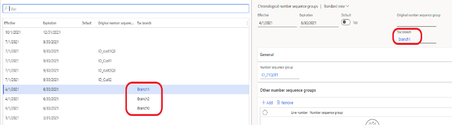
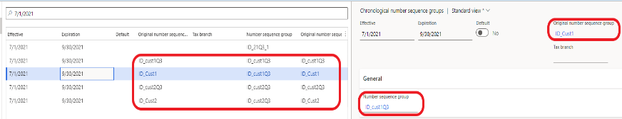

# Tax invoice numbering for Indonesia 

[!include [banner](../includes/banner.md)]

This article explains how to configure and use tax invoice numbering for Indonesia.

Microsoft Dynamics 365 Finance includes the following functionality that has been implemented for value-added tax (VAT) declarations:

- Flexibly set up tax invoice numbers. Here are some examples:

    - Set up tax invoice numbers for user-defined date intervals.
    - Set up tax invoice numbers for different branches in one legal entity.
    - Allocate tax invoice numbers for customers.

- Create replacement invoices and credit notes that have a tax invoice number, and associate them with the original invoice.

## Prerequisites

Before you use the invoicing functionality, the following prerequisites must be met:

- Enable and configure the following features:

    - (Indonesia) Enable generation of tax invoice numbers for invoices
    - Chronological numbering
    - Credit invoicing layout for sales and project invoice reports
    
    For information about how to enable features, see [Feature management overview](../../fin-ops-core/fin-ops/get-started/feature-management/feature-management-overview.md).

## Tax invoice numbering

Tax invoice numbers are generated according to the structure of the tax serial numbers that the Directorate General of Taxation (DJP) provides to taxable entrepreneurs. These numbers have the following structure:

- **First two digits:** The transaction code, which is a two-digit number from 01 through 09.
- **Next digit:** A status code. A code of **0** (zero) indicates a normal invoice, and a code of **1** indicates a replacement invoice.
- **Next digits:** The Tax Invoice Serial Number (Nomor seri FP), which is a sequence of numbers.

### Set up tax invoice numbers

Follow these steps to create invoice numbers for one period at a time for a company that has only one branch.

1. Go to **Organization administration** \> **Number sequences** \> **Number sequences**, and create a number sequence for the **Tax invoice number** reference. The number sequence should consist of two segments, **Constant** and **Alphanumeric**, and it should be continuous.

    

2. Go to **Accounts receivable** \> **Setup** \> **Accounts receivable parameters**, and create a number sequence group.
3. Associate the number sequence group with the number sequence that you created in step 1.
4. Go to **Organization administration** \> **Number sequences** \> **Chronological number sequence groups**, create a chronological number sequence group for the period, and associate it with the **Tax invoice number** field.

    

5. Repeat steps 1 through 4 to create invoice numbers for additional periods.

If a company has multiple branches, and each branch should have its own numeration of tax invoices, follow these steps.

1. Go to **Tax** \> **Indirect taxes** \> **Tax branch**, and create the required number of branches.
2. Add tax branches to the ledger account structure. For more information, see [Create account structure](../general-ledger/tasks/create-account-structures.md).
3. For each branch, repeat steps 1 through 4 of the previous procedure for setting up one period, and enter the tax branch in the chronological number sequence group.

    

### Allocate a tax invoice number to specific customers

This procedure uses the following information as an example:

- The company has serial numbers from 000-21.00000001 through 000-21.00000100.
- The numbers from 000-21.00000010 through 000-21.00000020 are allocated to customer 1.
- The numbers from 000-21.00000030 through 000-21.00000040 are allocated to customer 2.

Follow these steps to allocate a tax invoice number to specific customers.

1. Create number sequences for tax number intervals. These number sequences must be created for specific customers and intervals. Exclude the intervals for customer 1 and customer 2.

    - From 000-21.00000010 through 000-21.00000020 (customer 1)
    - From 000-21.00000030 through 000-21.00000040 (customer 2)
    - From 000-21.00000001 through 000-21.00000009
    - From 000-21.00000021 through 000-21.00000029
    - From 000-21.00000041 through 000-21.00000100

2. Create number sequence groups for all the number sequences that you just created, and assign those number sequences to the groups.
3. Create additional number sequence groups for each customer that the numbers must be allocated to.
4. Update the customer records with the new number sequence groups. Number sequences aren't required in the customer record.
5. Create chronological number sequence groups. For the period (Q3 2021 in this example), there are five lines (records): two for customer 1, two for customer 2, and one for the remaining number intervals.

    | Group         | Description                              | Number sequence |
    |---------------|------------------------------------------|-----------------|
    | ID\_Cust1     | Customer 1                               | Not applicable  |
    | ID\_Cust1\_Q3 | Customer 1, Q3 2021, from 10 through 20        | ID\_Cust1Q3     |
    | ID\_Cust2     | Customer 2                               | Not applicable  |
    | ID\_Cust2\_Q3 | Customer 2, Q3 2021, from 30 through 40        | ID\_Cust2Q3     |
    | ID\_21Q3\_1   | Q3 2021, first interval (from 1 through 9)    | ID\_21Q3\_1     |
    | ID\_21Q3\_2   | Q3 2021, second interval (from 21 through 29) | ID\_21Q3\_2     |
    | ID\_21Q3\_3   | Q3 2021, third interval (from 41 through 100) | ID\_21Q3\_3     |
    | ID\_21Q1      | Customer tax invoice number group 2022   | ID\_21Q1        |

    In the first record for the customer, in the **Original number sequence group** field, enter the number sequence group for the customer 1 record (**ID\_Cust1**). In the second record for the customer, in the **Original number sequence group** field, enter the number sequences as they are entered in the **Number sequence group** field (**ID\_Cust1\_Q3**). The following illustration shows the setup of chronological number sequence groups for customers.

    

6. In the **Number sequence group** field, specify the number sequence group for the first number sequence (from 000-21.00000001 through 000-21.00000009). Then, in the **Other number sequence** grid, create two lines for the second number sequence (from 000-21.00000021 through 000-21.00000029) and for the third number sequence (from 000-21.00000041 through 000-21.00000100). The following illustration shows the setup of the chronological number sequence group for other intervals.

    

> [!NOTE]
> To generate tax invoice numbers, the system first uses a group from the **Number sequence group** field, then a group from the first line of the **Other number sequence** grid, and finally a group from the second line.

## Generate tax invoice numbers

A tax invoice number is generated for customer and project invoices if the **einvoice** option is set to **Yes**. The tax invoice number is generated when an invoice is posted. The system automatically adds the first three digits (the transaction code and status code) to the tax invoice number. The transaction code should be validated or updated before you post sales order invoices, free text invoices, or project proposals.

By default, the system sets the **Tax invoice transaction code** field to **01**.

If you create a replacement invoice, the system sets the third digit (the status code) of the tax invoice number to **1**. For information about how to create replacement invoices, see the next section.

## Invoice cancellation, credit notes, and replacement invoices

Before credit notes are created for cancellation because of an error in a posted invoice or a replacement invoice, go to **Accounts receivable** \> **Setup** \> **Customer reason codes** to set up financial reasons.

Create at least two records: one that has a **Cancellation** operation and one that has a **Replacement** operation. There can be several records on the **Financial reasons** page. You can configure as many reasons that have a **Blank** operation as you require. These reasons can be used, for example, when a credit note is created for the item return.

- To cancel a posted invoice because of an error, create a credit note, and associate it with the original invoice and a financial reason that has a **Cancellation** operation. In this situation, no tax invoice number is generated.
- To create a credit note for items returns, create a credit note, and associate it with the original invoice and a financial reason that has a **Blank** operation. In this situation, a tax invoice number is generated.
- To create a replacement invoice, follow these steps:

    1. Create a credit note, and associate it with the original invoice and a financial reason that has a **Cancellation** operation. In this situation, no tax invoice number is generated.
    2. Create a debit note, and associate it with the original invoice and a financial reason that has a **Replacement** operation. The system sets the third digit (the status code) of the tax invoice number to **1**.

When you must create a credit note for cancellation and a debit note for replacement, we recommend that you create a new sales order. When you create a replacement invoice, the original invoice should have a tax invoice number. The credit note that has the **Cancellation** reason and that was created before replacement, and the debit note that has the **Replacement** reason, should be associated with the same invoice.

To associate a credit or debit note with an original invoice, select **Credit invoicing** on a free text invoice or a sales order, or when you select a project invoice to create a credit note.

## Additional resources

- [Get started with Electronic invoicing for Indonesia](e-invoicing-id-get-started.md)

[!INCLUDE[footer-include](../../includes/footer-banner.md)]
