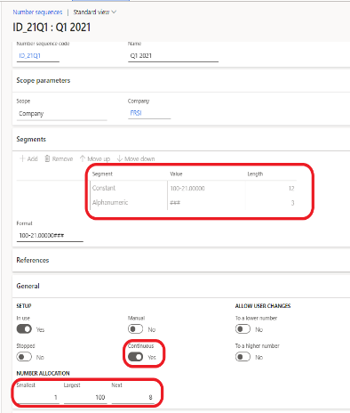

# Invoicing for Indonesia (ID-00002)

[!include [banner](../includes/banner.md)]

This article explains how to configure tax invoice numbering so that you can configure and run export sales invoices and import vendor invoices for Indonesia.

Microsoft Dynamics 365 Finance includes the following functionality that has been implemented for value-added tax (VAT) declarations:

- Flexibly set up tax invoice numbers. Here are some examples:

    - Set up tax invoice numbers for user-defined date intervals.
    - Set up tax invoice numbers for different branches in one legal entity.
    - Allocate tax invoice numbers for customers.

- Create replacement invoices and credit notes that have a tax invoice number, and associate them with the original invoice.
- Use Regulatory Configuration Service (RCS) to export sales invoices and import vendor invoices.

## Prerequisites

Before you use the invoicing functionality, the following prerequisites must be met:

- Enable and configure the following features:

    - (Indonesia) Enable generation of tax invoice numbers for invoices
    - Chronological numbering
    - Credit invoicing layout for sales and project invoice reports
    - Electronic Invoicing integration using Microsoft Dataverse

    For information about how to enable features, see [Feature management overview](../../fin-ops-core/fin-ops/get-started/feature-management/feature-management-overview.md).

- [Configure the Electronic invoicing solution in Dataverse](e-invoicing-power-platform-plug-in.md).
  > [!NOTE]
  > In the scope of Indonesian electronic invoicing reengineering, [Microsoft Dynamics 365 Electronic Invoicing connector for Microsoft Dataverse](https://appsource.microsoft.com/product/dynamics-crm/mscrm.electronic-invoicing) will be removed from AppSource. In case it is required to obtain Dataverse solution for Electronic invoicing during this period please send your request to this dedicated electronic mail address **DataverseEnvoicing@microsoft.com** to get the Dataverse solution individually. In case you need further assistance, please create a support ticket. For more information about support tickets please refer to [Get support for finance and operations apps or Lifecycle Services](https://learn.microsoft.com/en-us/dynamics365/fin-ops-core/dev-itpro/lifecycle-services/lcs-support).
- Enable Electronic invoicing for Indonesia

## Tax invoice numbering

Tax invoice numbers are generated according to the structure of the tax serial numbers that the Directorate General of Taxation (DJP) provides to taxable entrepreneurs. These numbers have the following structure:

- **First two digits:** The transaction code, which is a two-digit number from 01 through 09.
- **Next digit:** A status code. A code of **0** (zero) indicates a normal invoice, and a code of **1** indicates a replacement invoice.
- **Next digits:** The Tax Invoice Serial Number (Nomor seri FP), which is a sequence of numbers.

### Set up tax invoice numbers

Follow these steps to create invoice numbers for one period at a time for a company that has only one branch.

1. Go to **Organization administration** \> **Number sequences** \> **Number sequences**, and create a number sequence for the **Tax invoice number** reference. The number sequence should consist of two segments, **Constant** and **Alphanumeric**, and it should be continuous.

    

2. Go to **Accounts receivable** \> **Setup** \> **Accounts receivable parameters**, and create a number sequence group.
3. Associate the number sequence group with the number sequence that you created in step 1.
4. Go to **Organization administration** \> **Number sequences** \> **Chronological number sequence groups**, create a chronological number sequence group for the period, and associate it with the **Tax invoice number** field.

    

5. Repeat steps 1 through 4 to create invoice numbers for additional periods.

If a company has multiple branches, and each branch should have its own numeration of tax invoices, follow these steps.

1. Go to **Tax** \> **Indirect taxes** \> **Tax branch**, and create the required number of branches.
2. Add tax branches to the ledger account structure. For more information, see [Create account structure](../general-ledger/tasks/create-account-structures.md).
3. For each branch, repeat steps 1 through 4 of the previous procedure for setting up one period, and enter the tax branch in the chronological number sequence group.

    

### Allocate a tax invoice number to specific customers

This procedure uses the following information as an example:

- The company has serial numbers from 000-21.00000001 through 000-21.00000100.
- The numbers from 000-21.00000010 through 000-21.00000020 are allocated to customer 1.
- The numbers from 000-21.00000030 through 000-21.00000040 are allocated to customer 2.

Follow these steps to allocate a tax invoice number to specific customers.

1. Create number sequences for tax number intervals. These number sequences must be created for specific customers and intervals. Exclude the intervals for customer 1 and customer 2.

    - From 000-21.00000010 through 000-21.00000020 (customer 1)
    - From 000-21.00000030 through 000-21.00000040 (customer 2)
    - From 000-21.00000001 through 000-21.00000009
    - From 000-21.00000021 through 000-21.00000029
    - From 000-21.00000041 through 000-21.00000100

2. Create number sequence groups for all the number sequences that you just created, and assign those number sequences to the groups.
3. Create additional number sequence groups for each customer that the numbers must be allocated to.
4. Update the customer records with the new number sequence groups. Number sequences aren't required in the customer record.
5. Create chronological number sequence groups. For the period (Q3 2021 in this example), there are five lines (records): two for customer 1, two for customer 2, and one for the remaining number intervals.

    | Group         | Description                              | Number sequence |
    |---------------|------------------------------------------|-----------------|
    | ID\_Cust1     | Customer 1                               | Not applicable  |
    | ID\_Cust1\_Q3 | Customer 1, Q3 2021, from 10 through 20        | ID\_Cust1Q3     |
    | ID\_Cust2     | Customer 2                               | Not applicable  |
    | ID\_Cust2\_Q3 | Customer 2, Q3 2021, from 30 through 40        | ID\_Cust2Q3     |
    | ID\_21Q3\_1   | Q3 2021, first interval (from 1 through 9)    | ID\_21Q3\_1     |
    | ID\_21Q3\_2   | Q3 2021, second interval (from 21 through 29) | ID\_21Q3\_2     |
    | ID\_21Q3\_3   | Q3 2021, third interval (from 41 through 100) | ID\_21Q3\_3     |
    | ID\_21Q1      | Customer tax invoice number group 2022   | ID\_21Q1        |

    In the first record for the customer, in the **Original number sequence group** field, enter the number sequence group for the customer 1 record (**ID\_Cust1**). In the second record for the customer, in the **Original number sequence group** field, enter the number sequences as they are entered in the **Number sequence group** field (**ID\_Cust1\_Q3**). The following illustration shows the setup of chronological number sequence groups for customers.

    

6. In the **Number sequence group** field, specify the number sequence group for the first number sequence (from 000-21.00000001 through 000-21.00000009). Then, in the **Other number sequence** grid, create two lines for the second number sequence (from 000-21.00000021 through 000-21.00000029) and for the third number sequence (from 000-21.00000041 through 000-21.00000100). The following illustration shows the setup of the chronological number sequence group for other intervals.

    

> [!NOTE]
> To generate tax invoice numbers, the system first uses a group from the **Number sequence group** field, then a group from the first line of the **Other number sequence** grid, and finally a group from the second line.

## Generate tax invoice numbers

A tax invoice number is generated for customer and project invoices if the **einvoice** option is set to **Yes**. The tax invoice number is generated when an invoice is posted. The system automatically adds the first three digits (the transaction code and status code) to the tax invoice number. The transaction code should be validated or updated before you post sales order invoices, free text invoices, or project proposals.

By default, the system sets the **Tax invoice transaction code** field to **01**.

If you create a replacement invoice, the system sets the third digit (the status code) of the tax invoice number to **1**. For information about how to create replacement invoices, see the next section.

## Invoice cancellation, credit notes, and replacement invoices

Before credit notes are created for cancellation because of an error in a posted invoice or a replacement invoice, go to **Accounts receivable** \> **Setup** \> **Customer reason codes** to set up financial reasons.

Create at least two records: one that has a **Cancellation** operation and one that has a **Replacement** operation. There can be several records on the **Financial reasons** page. You can configure as many reasons that have a **Blank** operation as you require. These reasons can be used, for example, when a credit note is created for the item return.

- To cancel a posted invoice because of an error, create a credit note, and associate it with the original invoice and a financial reason that has a **Cancellation** operation. In this situation, no tax invoice number is generated.
- To create a credit note for items returns, create a credit note, and associate it with the original invoice and a financial reason that has a **Blank** operation. In this situation, a tax invoice number is generated.
- To create a replacement invoice, follow these steps:

    1. Create a credit note, and associate it with the original invoice and a financial reason that has a **Cancellation** operation. In this situation, no tax invoice number is generated.
    2. Create a debit note, and associate it with the original invoice and a financial reason that has a **Replacement** operation. The system sets the third digit (the status code) of the tax invoice number to **1**.

When you must create a credit note for cancellation and a debit note for replacement, we recommend that you create a new sales order. When you create a replacement invoice, the original invoice should have a tax invoice number. The credit note that has the **Cancellation** reason and that was created before replacement, and the debit note that has the **Replacement** reason, should be associated with the same invoice.

To associate a credit or debit note with an original invoice, select **Credit invoicing** on a free text invoice or a sales order, or when you select a project invoice to create a credit note.

## Enable Electronic invoicing for Indonesia

The information in this section will help you get started with Electronic invoicing for Indonesia. This section provides the configuration steps that are country/region-dependent in RCS and Finance. You're also guided through the steps that you must follow in Finance to export sales invoices through the service, and to review the processing results and the status of invoices.

### Prerequisites

Before you complete the procedures in this section, follow the steps in [Get started with Electronic invoicing](e-invoicing-get-started.md).

### RCS setup

During RCS setup, complete the following tasks.

1. Enable the **Electronic reporting Microsoft Dataverse datasources support** feature in the **Feature management** workspace.
2. Import the Electronic Invoicing feature to process invoice exports and importing vendor invoices.
3. Review the format configurations that are required to generate and export sales invoices.
4. Review or configure the actions in the processing pipeline that support the sales invoice export and import scenarios.
5. Publish the Electronic Invoicing feature for export sales invoices, and import vendor invoices.
6. Import the **Invoices communication Dataverse mapping** configuration.
7. Create a connected application to Dataverse.

#### Import the Electronic Invoicing feature

1. Sign in to your RCS account.
2. In the **Globalization features** workspace, in the **Features** section, select the **Electronic Invoicing** tile.
3. On the **Electronic Invoicing features** page, select **Import** to import, from the Global repository, the **Indonesian electronic invoice (ID)** feature that is published by the Microsoft configuration provider.

    > [!NOTE]
    > If you don't see the feature in the list, select **Synchronize**, and then repeat step 3.

When you import the **Indonesian electronic invoice (ID)** feature from the Global repository, all the feature settings are imported. These settings include the configurations and actions of the processing pipeline.

#### Create a new version of the Indonesian electronic invoice (ID) feature

You can create a new feature version by using your configuration provider.

1. In the **Globalization features** workspace, select the **Electronic Invoicing** tile.
2. On the **Electronic Invoicing features** page, on the **Versions** tab, select **New**.

#### Update the configuration version

1. In the **Globalization features** workspace, select the **Electronic Invoicing** tile.
2. On the **Electronic Invoicing features** page, on the **Configurations** tab, select **Add** or **Delete** to manage the configuration versions.

When you create a new version, all configurations are inherited from the imported version of the Electronic Invoicing feature. The following configurations are required to process invoices:

- Invoices issued (ID)
- eInvoice import (ID)

In the list, select a configuration version, and then select **Edit** or **View** to open the **Format designer** page, where you can edit or view the configuration.

You can review the configuration and customize it as you require. Use the **Format designer** page to edit and view the Electronic reporting (ER) format file configurations. For more information, see [Create electronic document configurations](../../fin-ops-core/dev-itpro/analytics/electronic-reporting-configuration.md).

#### Import the Invoices communication Dataverse mapping configuration

1. Sign in to your RCS account.
1. On the RCS home page, and select **Electronic reporting**.
2. Select **Repositories**, and then find and import the **Invoices communication Dataverse mapping** configuration.

#### Create a connected application for Dataverse

1. Sign in to your RCS account.
2. On the RCS home page, select **Electronic reporting**.
3. On the **Related links** FastTab, select **Connected application**.
4. Select **New** to create a connected application, and set the following fields:

    - **Name** – Enter the name of the Dataverse instance. For example, enter **UAT Dataverse**.
    - **Type** – Select **Dataverse**.
    - **Application** – Enter the Dataverse endpoint URL. You can find this URL on the customers Microsoft Dynamics Lifecycle Services (LCS) application page.
    - **Tenant** – Enter the customer tenant.
    - **Custom URL** – Enter the Dataverse endpoint URL followed by **api/data/v9.1/**. For example, enter `https://operations-dgxtest-uat.crm.dynamics.com/api/data/v9.1/`.

5. Select **Save**.
6. On the Action Pane, select **Check connection** to test the connection with the environment. Then close the page.

### Configure the application-specific parameters

> [!NOTE]
> When you set up application-specific parameters, check the connection on the **Connected applications** page. Go to the RCS home page, and select **Electronic reporting**. At the bottom of the page, select **Connected application** \> **Check connection**.

To enable the system to determine which sales tax code in Finance corresponds to the tax code for luxury goods (PPnBM) when invoices are exported, follow these steps to set the application-specific parameters for the luxury sales tax.

1. In the **Lookups** grid, select the row for **TaxTypeLookup**.
2. In the **Conditions** grid, on the first line, set the **Lookup result** field to **PPnBM** and the **Sales tax code (TaxCode)** field to the sales tax code that is used for luxury tax in Finance.

    > [!NOTE]
    > You can set up several sales tax codes for PPnBM and have several lines for them in the **Conditions** grid.

3. On the last line, set the **Lookup result** field to **Other** and the **Sales tax code (TaxCode)** field to **\*Not blank\***. These settings specify that all other sales tax codes should not be considered luxury tax by the system.

    

To enable the system to determine which sales tax group in Finance corresponds to VAT-free reasons (transaction code 07, reasons 1 through 8) or VAT-exempt reasons (transaction code 08, reasons 1 through 5) when invoices are exported, follow these steps to set the application specific parameters for those reasons.

1. In the **Lookups** grid, select the row for **VATFreeInfoLookup**.
2. In the **Conditions** grid, on the first line, set the **Lookup result** field from **1** through **8** for transaction code **07** and from **1** through **5** for transaction code **08**.
3. Set the **Tax group (TaxGroup)** field to the sales group that is used for exemption operations in Finance.
4. On the last line, set the **Lookup result** field to **Other** and the **Tax group (TaxGroup)** field to **\*Not blank\***. These settings specify that all other sales tax groups should not be considered exemption groups by the system.

    

### Manage the Electronic Invoicing feature setup

1. In the **Globalization features** workspace, select the **Electronic Invoicing** tile.
2. On the **Electronic Invoicing features** page, on the **Setups** tab, select **Add**, **Delete**, or **Edit** to manage the Electronic Invoicing feature setup.

#### Configure the Sales invoice feature setup

To generate the comma-separated values (CSV) file for a sales invoice, you must set up the Sales invoice feature.

1. On the **Electronic Invoicing features** page, on the **Setups** tab, in the **Feature setup** column, select **Invoice issued**.
2. Select **Edit** to review or configure the actions, applicability rules, and variables.

    

#### Configure the Vendor invoice feature setup

To configure the Vendor invoice feature setup, you should already have created a draft version of the feature that you will work with for this procedure.

1. On the **Electronic Invoicing features** page, on the **Setups** tab, in the **Feature setup** column, select the **Import from share point** record.
2. Select **Edit** to review or configure the actions, applicability rules, and variables.
3. On the **Feature version setup** page, on the **Data channel** tab, in the **Parameters** list, in the **Data channel** record, in the **Value** field, enter **\$Context Channel** from the derived configuration.
4. Set the other parameters for SharePoint.
5. In the **Custom file name** record, set up a filter for the file names of vendor invoices.
6. On the **Applicability rules** tab, in the record that has a **Channel** field, in the **Value** field, enter **\$Context Channel** from the derived configuration.
7. On the **Variables** tab, create or validate the record.

    

### Assign the draft version to an e-Invoicing environment

1. On the **Electronic Invoicing features** page, on the **Environments** tab, select **Enable**.
2. In the **Environment** field, select the environment.
3. In the **Effective from** field, select the date when the environment should become effective.
4. Select **Enable**.

### Change the version status

1. On the **Electronic Invoicing features** page, on the **Versions** tab, select the version of the Electronic Invoicing feature that has a status of **Draft**.
2. Select **Change status** \> **Complete**.
3. Select **Change status** \> **Publish**.

## Set up Electronic invoicing integration in Finance

### Import the ER data model, ER data model mapping, and context configurations for invoices

1. Sign in to your Finance environment.
2. In the **Electronic reporting** workspace, in the **Configuration providers** section, select the **Microsoft** tile. Make sure that this configuration provider is set to **Active**. For information about how to mark a provider as active, see [Create configuration providers and mark them as active](../../fin-ops-core/dev-itpro/analytics/tasks/er-configuration-provider-mark-it-active-2016-11.md).
3. Select **Repositories**.
4. Select **Global resource** \> **Open**.
5. Import the following configurations:

    - Customer invoice context model
    - Invoice model
    - Vendor invoice Mapping to destination
    - Vendor invoice import (ID), Vendor invoice import XML (ID)

### Turn on the feature for processing Indonesian electronic invoices

1. Go to **Organization administration** \> **Setup** \> **Electronic document parameters**.
2. On the **Features** tab, in the row for the **Indonesian electronic invoice** feature, select the **Enable** checkbox.

### Set up the processing for Indonesian electronic sales invoices

1. Go to **Organization administration** \> **Setup**\ > **Electronic document parameters**.
2. On the **Electronic document** tab, select **Add**, and enter the customer invoice journal.
3. Optional: Select **Add** again, and enter the project invoice journal.
4. In the **Batch submission ID** section, add a number sequence. The selected number sequence should be continuous. This number sequence is used to number the invoice batches when the system exports them.
5. Select **Save**.

    

### Set up the processing for Indonesian electronic vendor invoices

1. In the **Electronic reporting** workspace, select **Reporting configurations**.
2. Select **Customer invoice context model**, and then select **Create configuration**.
3. Select **Derive from Name: Customer invoice context model, Microsoft** to create a derived configuration.
4. In the **Draft** version, select **Designer**.
5. In the **Data model** tree, select **Map model to datasource**.
6. In the **Definitions** tree, select **DataChannel**, and then select **Designer**.
7. In the **Data sources** tree, expand the **\$Context\_Channel** container.
8. In the **Value** field, select **Edit**, and enter the name of the data channel. The name should have a maximum of 10 characters. It's the name of the channel that is given in the configuration of the data channel for the Electronic Invoicing feature in RCS.
9. Select **Save**, and close the page.
10. Close the page.
11. Select the derived configuration that you just created from **Customer invoice context model**, and then, on the **Versions** FastTab, select **Change Status** \> **Completed**.

> [!NOTE] 
> You can create several derived configurations that have different **\$Context Channel** values. In this way, you can import vendor invoices from different sources. For example, you might want to import vendor invoices for different legal entities.

1. Go to **Organization administration** \> **Setup** \> **Electronic document parameters**.
2. On the **External channels** tab, set up the import of vendor invoices.
3. On the **Channels** FastTab, select **Add**.
4. In the **Channel** field, enter **\$Context Channel**.
5. Enter a value in the **Description** and **Company** fields.
6. In the **Document context** field, select the new configuration that you derived from **Customer invoice context model**. The mapping description should be **Data channel context**.
7. On the **Import sources** FastTab, select **Add**.
8. In the **Name** field, enter the value from the **Variables** tab on the **Feature version setup** page.
9. Enter a value in the **Description** field.
10. In **Data entity name** field, select **Vendor Invoice register header** if you want to import vendor invoices into the Invoice register. If you want to import them into pending vendor invoices, select **Vendor invoice journal**. You can have only one import source, **Vendor Invoice register header** or **Vendor invoice journal**.
11. In the **Model mapping** field, select **Vendor invoice import (ID)** to import the invoice header into the Invoice register or pending vendor invoices. Select **Vendor invoice import XML (ID)** to import the invoice header and lines into pending vendor invoices.

    > [!NOTE]
    > Before you import vendor invoices from XML files, you must set up an external item description for vendors. The system can then match an item name in the XML file with line items in sales orders.

    

If you must import vendor invoices into, for example, a different legal entity, create a new channel record that has the new document context.

## Process electronic invoices in Finance

When issued invoices or imported vendor invoices are processed through Electronic invoicing, you can complete the following tasks:

- Submit or export issued invoices, and import vendor invoices.
- View the electronic document submission and receipt logs.

### Submit or export issued invoices

1. Go to **Organization administration** \> **Periodic** \> **Electronic documents** \> **Submit electronic documents**.
2. Set the **Submit document batch** option to **Yes** to export invoices in batch. Otherwise, each invoice is exported separately. The first time that you submit a document, always set the **Resubmit documents** option to **No**. If you must resubmit a document through the service, set this option to **Yes**.
3. On the **Records to include** FastTab, select **Filter** to open the **Inquiry** dialog box, where you can build a query to select documents for export.
4. Go to **System administration** \> **Setup** \> **Business events** \> **Business events parameters**, and then select **Business events batch job**. If you set up the Business event batch processor, this job can be run in batch mode.

### View submission logs

You can view the submission logs for all exported documents.

1. Go to **Organization administration** \> **Periodic** \> **Electronic documents**\ > **Electronic document submission log**.
2. Select **Update status**. An invoice batch can have the following statuses:

    - Scheduled
    - Completed
    - Failed

3. On the Action Pane, select **Inquiries** \> **Submission details** to view the details of the submission execution logs. The information in the logs is divided among three FastTabs:

    - **Processing actions** – This FastTab shows the execution log for the actions that are configured in the feature version that was set up in RCS. The **Status** column shows whether the action was successfully run.
    - **Action files** – This FastTab shows the intermediate files that were generated during execution of the actions. Select **View** to download and view the file.
    - **Processing action log** – This FastTab shows the results of the submission of electronic invoices.

4. On the Action Pane, select **Inquiries** \> **Batch submission invoices** to view invoices that were submitted in one batch.

### Import vendor invoices and view the electronic document receipt log

1. Go to **Organization administration** \> **Periodic** \> **Electronic documents** \> **Receive electronic documents**.

    > [!NOTE]
    > For the first receipt of any document, always set the **Re-import documents** option to **No**. If you must re-import a document through the service, set this option to **Yes**. This job can be run in batch mode.

2. Go to **Organization administration** \> **Periodic** \> **Electronic documents** \> **Electronic document receipt log**.
3. On the Action Pane, select **Inquiries** \> **Submission details** to view the details of the submission execution logs.

## Privacy notice

Enabling the **Indonesian electronic invoice** feature might require that limited data be sent. This data includes the organization's tax registration ID. An administrator can enable or turn off the **Indonesian electronic invoice** feature by going to **Organization administration** \> **Setup** \> **Electronic document parameters**, and then, on the **Features** tab, selecting the rows that contain the **Indonesian electronic invoice** feature and making the appropriate selection. Data that is imported from these external systems into this Dynamics 365 online service are subject to our [privacy statement](https://go.microsoft.com/fwlink/?LinkId=512132). For more information, see the "Privacy notice" section in country/region-specific feature documentation.

## Additional resources

- [Electronic invoicing overview](e-invoicing-service-overview.md)
- [Get started with Electronic invoicing](e-invoicing-get-started.md)
- [Set up Electronic invoicing](e-invoicing-setup.md)

[!INCLUDE[footer-include](../../includes/footer-banner.md)]
