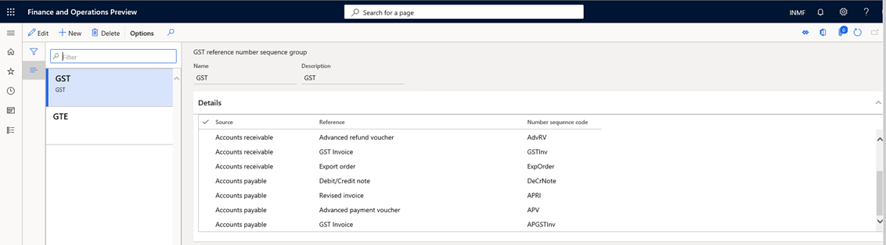
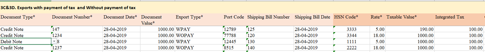

---
# required metadata

title: Create a business vertical
description: This topic explains how to create a business vertical. This task is part of the master data setup that is required to make the India localization solution for Goods and Services Tax (GST) available.
author: prabhatb
manager: EricWang
ms.date: 10/11/2020
ms.topic: article
ms.prod: 
ms.service: dynamics-365-applications
ms.technology: 

# optional metadata

# ms.search.form: 
audience: Application User
# ms.devlang: 
ms.reviewer: kfend
ms.search.scope: Core, Operations
# ms.tgt_pltfrm: 
# ms.custom: 
ms.search.region: India
# ms.search.industry: 
ms.author: kfend
ms.search.validFrom: 2020-09-01
ms.dyn365.ops.version: 10.0.13

---

# Credit or Debit Note against an export order

Currently, credit note and debit notes can’t be posted against a posted export Invoice. With the release of this feature,  you will be allowed to post credit notes against an export order similar to the way you post a sales order. 

As per proposed new GSTR return, ANX-1 inserted information related to Credit and Debit note issue against Export order.   

When a credit or debit note is posted against export order that already has a posted shipping bill: 
  - The credit note will display the Shipping Bill Number" and the Shipping bill date. 
  -	The debit note will display “Shipping Bill Number” and Shipping bill date.

In the Credit/Debit note for Tax document under the header,> setup > New field shipping bill number and shipping bill date has been added and posting this information will default from posted export invoice.   

Export orders can be posted with one of two options: 
  - Export with payment of tax 
  -	Export without payment of tax 
 
If the credit or debit note is posted against an export invoice, the same option is available. 
 
   -  If the export order is posted with payment of tax, the credit note automatically defaults With the payment of Tax = Yes. 
   -	If the export order is posted without payment of tax, the credit note automatically defaults With the payment of Tax = No. 

If the notes are posted against an export order that was posted With the payment of tax, the following additional option is enabled: 
  -	Would you claim refund = Yes or No
 
When a credit note is created against posted export order, the same option will display in the note. 

There are three transaction types you can use to post a credit or debit note against an export order: 
  - Export order invoice. 
  -	Free text invoice with a negative value 
  - General journal 

## Set up a credit or debit note against an export invoice.
** Enable feature through Feature management**
    1.	Go to Workspaces > Feature Management.
    2.	In the list, locate and select the feature (India) Enable Credit/Debit note against an export invoice, and then select Enable. 
    
 
 
## Set up a number sequence in the GST reference number sequence group 
    To maintain a GST transaction ID for credit notes against an export invoice, you can set up a number sequence in the GST reference number sequence group. 
    1.	Go to Tax > Setup > GST reference number sequence group  . 

## Post transactions 
Posting a credit note with a GST payment using an export sales order   

When a credit note is posted against a posted export Invoice, the following fields from the export invoice default to the Tax information page:
 
** With Payment of Tax - Yes/No ** 

If With the payment of tax = Yes, Would you claim a refund? the field will be displayed.
 
If, in the posted export invoice, the Would you claim refund field is set to Yes, it will default to Yes in credit note. Otherwise, the field will be set to No. 
 
For example, if you create a credit note for five items, with the following information, the export invoice will post as shown in the following tables.

1	Export order line
2	Other fields in originally posted Export order: 
  -	With the payment of tax - Yes 
  -	Would you claim Refund - Yes
 

 Cost of Item 4,000 

 IGST calculation:
 
| Sales value  	| GST @10% 	|
|--------------	|----------	|
| 5000         	| 500      	|

Voucher transaction:

|      Account                 	|     Debit      	|     Credit    	|
|------------------------------	|----------------	|---------------	|
|     Customer1                	|     5000       	|               	|
|     IGST Payable             	|                	|      500      	|
|     Export order revenue     	|                	|     5000      	|
|     Refundable account       	|        500     	|               	| 

When Credit note is posted against posted export invoice: 

|      Account                                  	|     Debit    	|     Credit       	|
|-----------------------------------------------	|--------------	|------------------	|
|     Export order revenue                      	|      5000    	|                  	|
|     Customer `                                	|              	|          5000    	|
|     IGST Payable                              	|      500     	|                  	|
|     Refundable account                        	|              	|     500          	|
|     Export Inventory issue (cost of item)     	|              	|      4000        	|
|     Sale of goods (Cost of item)              	|      4000    	|                  	|

When export order is posted with the following information select, the export invoice will be posted as shown in the following tables. 

-	With payment of tax - Yes 
-	Would you claim Refund - Yes

Voucher transaction:

|      Account                 	|     Debit      	|     Credit    	|
|------------------------------	|----------------	|---------------	|
|     Customer1                	|     5000       	|               	|
|     IGST Payable             	|                	|      500      	|
|     Export order revenue     	|                	|     5000      	|
|     Export Expenses          	|        500     	|               	|
 

When Credit note is posted against posted export invoice: 

|      Account                                  	|     Debit       	|     Credit       	|
|-----------------------------------------------	|-----------------	|------------------	|
|     Export order revenue                      	|      5000       	|                  	|
|     Customer `                                	|                 	|          5000    	|
|     IGST Payable                              	|          500    	|                  	|
|     Export Expenses                           	|                 	|       500        	|
|     Export Inventory issue (cost of item)     	|                 	|      4000        	|
|     Sale of goods (Cost of the item)          	|     4000        	|                  	|

In the credit note form if the user checks “Tax document”  header information user will see the original export invoice ID and shipping bill number and shipping bill date. 
** Export Invoice Credit Note > Tax Document > Header >Shipping bill Number and Shipping bill date **   
 
 
 
After posting credit note against export invoice user can run monthly ANX-1 offline tool to see the display of credit note transaction. 
** Go to Tax>>Inquiries and reports>>Tax reports>>ANX-1 Report**   

###Credit note against export can also be viewed in New GSTR-1 return report as well : 

The credit note posted against an export invoice is shown in a generated report. 

** New GSTR -1 ** 
 

### Debit/Credit note issued against Export order is also displayed in ANX-1 offline tool report as below : 

** ANX-1 Report** 
 

