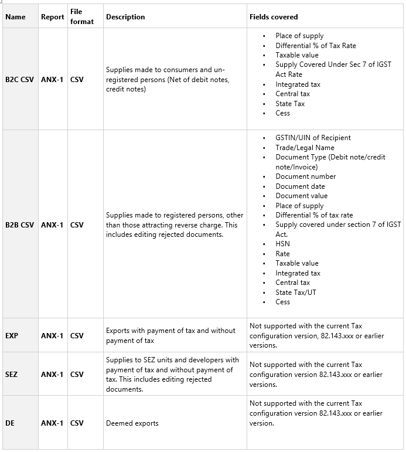
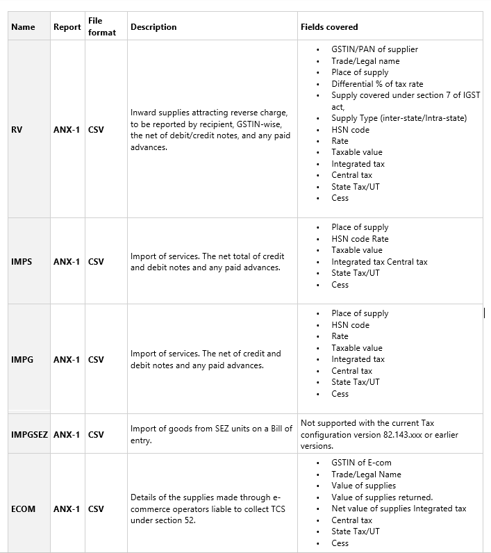
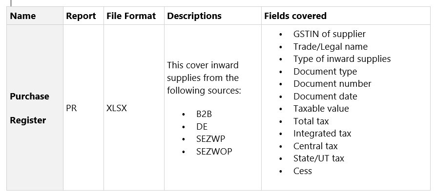
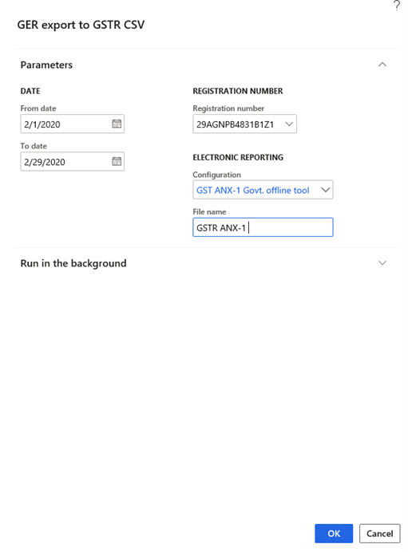

---
# required metadata

title: Create a business vertical
description: This topic explains how to create a business vertical. This task is part of the master data setup that is required to make the India localization solution for Goods and Services Tax (GST) available.
author: prabhatb
manager: EricWang
ms.date: 10/11/2020
ms.topic: article
ms.prod: 
ms.service: dynamics-365-applications
ms.technology: 

# optional metadata

# ms.search.form: 
audience: Application User
# ms.devlang: 
ms.reviewer: kfend
ms.search.scope: Core, Operations
# ms.tgt_pltfrm: 
# ms.custom: 
ms.search.region: India
# ms.search.industry: 
ms.author: kfend
ms.search.validFrom: 2020-09-01
ms.dyn365.ops.version: 10.0.13

---

# New GSTR Offline Tool for ANX 1 and Purchase Register : 

In the newly proposed system of GST Return filing, a taxpayer would have to file FORM GST RET-1 (Normal), FORM GST RET-2 (Sahaj), or FORM GST RET-3 (Sugam), on either a monthly or quarterly basis. Annexure of Supplies (GST ANX-1) and Annexure of Inward Supplies (GST ANX-2) is filed as part of these returns.
All the outward and inward supplies liable to tax on a reverse charge basis, including imports and inward supply of goods from SEZ, are detailed in GST ANX-1. GST ANX-2 contains details of inward supplies that are auto-populated mainly from the suppliers’ GST ANX-1. The GST ANX-1 also contain details that are auto-populated from Form GSTR-5 and Form GSTR-6.
The taxpayer is required to provide details about the inward supplies listed in Form GST ANX-2, by accepting or rejecting the entries. The taxpayer can also keep the documents pending by marking the documents accordingly.
Based on the details uploaded in GST ANX-1 and the actions taken in GST ANX-2 by the taxpayer, the relevant fields on Form GST RET-1 will be auto-drafted. Taxpayers can now view and enter details in the relevant column, save it the information, and download a copy of the form pdf format.
GSTN has released a trial version of the New Returns Offline Tool of Form GST ANX-1, Form GST ANX-2 (with Matching Tool built in), and a template for Purchase Register. Purchase register  can be used to import data of the purchase register to match with ANX-2.
  
This topic provides information about how to set up and work with Dynamics 365 Finance to generate CSV files using the new offline tool. 
The report is supported in following or later versions of Finance:

|     Dynamics   365 Finance version    	|     Build   number    	|
|---------------------------------------	|-----------------------	|
|     10.0.13                           	|  10.0.569.10002       	|

The solution to support the reporting of the GSTR offline tool is based on electronic reporting functionality. This functionality provides a flexible approach for setting up and supporting reporting processes.

This topic contains the following section:

-	Import the configuration.
-	Generate the ANX-1 
-	Generate the Purchase Register

## Set up

The following tasks will prepare Finance for reporting ANX-1:
-	Import and set up Electronic reporting (ER) configurations.
-	Map the reporting configuration in Tax setup.
-	Provide report data for report generation.
  -	ANX-1
  -	Generate ANX-1 (10 CSV) files
-	Provide report data for report generation.
  -	Purchase Register 
  -	Generate Purchase Register excel file.

### Import tax configuration.

- Taxable Document.version.82
- Taxable Document (India). version 82.155
- Tax (India GST). version.82.155.300  

## Import and set up Electronic reporting (ER) configurations
To prepare Finance for GSTR Return reporting, you must import the following or higher versions of ER configurations in the sequence provided below:

|     ER configuration name              	|     Type                   	|     Format     	|     Version    	|
|----------------------------------------	|----------------------------	|----------------	|----------------	|
|     GST returns model                  	|     Model                  	|      XML       	|     16         	|
|     GST returns model mapping          	|     Model                  	|      XML       	|     16.7       	|
|     GSTR-1 for old return              	|     Model                  	|      XML       	|     16.32      	|
|     GSTR-1 for new return              	|     Model                  	|      XML       	|     16.41      	|
|     GSTR-2 for old return              	|     Model                  	|      XML       	|     16.36      	|
|     GSTR-2 for new return              	|     Model                  	|      XML       	|     16.40      	|
|     GST Returns govt. model mapping    	|     Model                  	|      XML       	|     19.10      	|
|     GST Returns govt. model            	|     Model                  	|      XML       	|     19.0       	|
|     GST Returns govt. model mapping    	|     Model                  	|      XML       	|     19.12      	|
|     GST ANX-1 Govt. offline tool       	|     Model                  	|      XML       	|     19.22      	|
|     Purchase Register                  	|     Model                  	|      XML       	|     19.7       	|
|     ANX-1                              	|     Format (exporting)     	|      CSV       	|                	|
|     Purchase Register                  	|     Format (exporting)     	|     Excel      	|                	|
|     GSTR-1 (new)                       	|     Format (exporting)     	|      CSV       	|                	|
|     GSTR-2 (new)                       	|     Format (exporting)     	|      CSV       	|                	|

Import the latest versions of these configurations. The version description usually includes the changes that were introduced in the configuration version.
**Note:** After all the ER configurations from the preceding table are imported, you must map the Report configuration in the Tax setup.

|     Name                             	|     Version    	|     Report controller               	|     Description (Pl)                                                 	|
|--------------------------------------	|----------------	|-------------------------------------	|----------------------------------------------------------------------	|
|     GST ANX-1 Govt. Offline Tool     	|     19.22      	|     GST ANX-1 Govt. offline Tool    	|     New GSTR return applicable from 1.4.2020 onward                  	|
|     GSTR-1 CSV (old)                 	|     16.32      	|     GSTR-1 (old)                    	|     Existing GSTR-1 format                                           	|
|     GSTR-1 Govt. Offline Tool CSV    	|     19.10      	|     GSTR-1 Govt. Offline Tool       	|     Existing GSTR-1 offline tool. (Ineffective from 1.4.2020)        	|
|     GSTR-2 CSV (old)                 	|     16.36      	|     GSTR-2 (old)                    	|     Existing GSTR-2 format                                           	|
|     Purchase register                	|     19.7       	|     Purchase Register               	|     New register for inward transaction applicable from 1.4.2020     	|

## Important transactions for ANX-1

## Important transactions for Purchase Register 

## Process to generate data in .CSV file. 
### Load Report configuration in the workspaces 
Complete the following steps to load the report configuration into workspaces. 
1.	Go to Workspaces > Electronic reporting > Reporting configurations > Exchange.
2.	 Load the following configurations:
    - GSTReturnsGovt.version.19
    -	GST Returns govt. model mapping. version.19.12
    -	GST ANX-1 Govt. offline tool. version.19.22
    -	GSTR1GovtCSV.version.19.10
    -	Purchase Register.version.19.7
3.	Import the configuration files in the same order that you loaded them in step 2.

## Map the report configuration in the Tax setup.
Complete the following steps to map the report configuration.
1. Go to Tax > Setup > Tax configuration > Tax setup > Configurations > Report configurations, and then select the report configuration. 
2. On the Configurations page, on the Reporting configurations tab, mark the Select check box.

3.	Select the value in Report data provider field and then select Close.

**Note:** If the user does not select any report in the Report controller field, the report will not be available to generate under Sales tax reports. 

## Generate the ANX-1 report and Purchase Register
### (1)	ANX-1 Govt. Offline tool report data 
1.	Go to Tax > Sales Tax reports > India > GER export to GSTR CSV.
2.	In the From date and To date fields, enter the duration of time to include in the generated report.
3.	Select GSTIN Registration number.
4.	Select Configuration ‘GST ANX-1 Govt. Offline Tool”. 
5.	Name the file to save the report in CSV format.  

6.	Select OK.

The **ANX-1** report will generate. 
Generated report will be in CSV format. 
Total 10 sheets will generate as below: -
(i) B2C (ii) B2B (iii) EXP (iv) SEZ (v) DE   (vi) REV  (vii) IMPG  (viii) IMPGSEZ  (ix) ECOM
For Example, in B2B sheet user can view: 
GSTIN/UIN of recipient , Trade legal name, Document type , Document number, Document date, Document value , Place of supply, Differential % of Tax rate, Supply covered under section 7 of IGST Act, HSN code etc. 

### (2) Purchase Register report data.
1.	Go to Tax > Sales Tax reports > India > GER export to GSTR CSV.
2.	In the Financial year field, select the financial year for which you are generating the report. 
3.	In the Tax period field, select the tax period.
4.	Select GSTIN Registration number, and in the Configuration field, select Purchase Register.
5.	Name to file to save the report in CSV format.

6.	Select OK.

The Purchase Register report will be generated.
This report will display following information: 
GSTIN of supplier, Trade/legal name, Type of inward supply, Document type, document date, Taxable value, Total tax, Integrated tax , Central tax, State/UT tax, Cess

