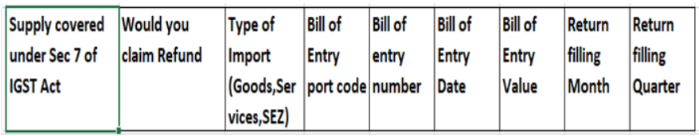

---
# required metadata

title: Create a business vertical
description: This topic explains how to create a business vertical. This task is part of the master data setup that is required to make the India localization solution for Goods and Services Tax (GST) available.
author: prabhatb
manager: EricWang
ms.date: 10/11/2020
ms.topic: article
ms.prod: 
ms.service: dynamics-365-applications
ms.technology: 

# optional metadata

# ms.search.form: 
audience: Application User
# ms.devlang: 
ms.reviewer: kfend
ms.search.scope: Core, Operations
# ms.tgt_pltfrm: 
# ms.custom: 
ms.search.region: India
# ms.search.industry: 
ms.author: kfend
ms.search.validFrom: 2020-09-01
ms.dyn365.ops.version: 10.0.13

---

# New GSTR1 and GSTR2 Return formats 

The format of the GSTR -1 and GSTR-2 Return has been updated following the new format updated by the GSP ClearTax. 

### The following CSV Files have been deprecated: 
 
### GSTR-1 
-	GSTR1 Adjust multiple Advance receipt for invoice. 
-	GSTR1 Advance receipt format 
-	GSTR 1 Refund voucher 
 
### GSTR-2: 
-	GSTR2 Adjust multiple Advance payment for invoice. 
-	GSTR2 Advance payment format 
-	GSTR2 Refund voucher 

### The following files have been updated: 
 
### GSTR1 
-	GSTR1 Invoice and Bill of Supply 
-	GSTR1 Credit debit note 

### GSTR-2 
-	GSTR2 Invoice and bill of supply 
-	GSTR2 Credit debit note 

### Changes in the new return format 

### GSTR-1 Return 

The following columns have been added in below file:

**Sales invoice and Bill of supply** 

**Sales credit and debit note file**

### GSTR-2 Return 

The following additional columns have been added: 

**Purchase invoice and bill of supply file** 

**Purchase credit and debit note file** 

### Set up Finance to report ANX-1

The following tasks must be completed to prepare Finance to report ANX-1.
- Import and set up Electronic reporting (ER) configurations.
-	Map the reporting configuration under Tax setup.
-	Provide report data for report generation.
    -	ANX-1
    -	Generate ANX-1 (10 CSV) files
-	Provide report data for report generation.
    - Purchase Register 
    - Generate Purchase Register excel file.

### Import tax configuration.
  -	Taxable Document.version.82
  -	Taxable Document (India). version 82.155
  -	Tax (India GST). version.82.155.300
  
 ## Import and set up Electronic reporting (ER) configurations. 
 To prepare Finance for GSTR Return reporting, you must import the following or higher versions of ER configurations following the sequence provided below.
 
 |     ER configuration name              	|     Type                   	|     Format     	|     Version    	|
|----------------------------------------	|----------------------------	|----------------	|----------------	|
|     GST Returns model                  	|     Model                  	|      XML       	|     16         	|
|     GST Returns model mapping          	|     Model                  	|      XML       	|     16.7       	|
|     GSTR-1 for Old Return              	|     Model                  	|      XML       	|     16.32      	|
|     GSTR-1 for new Return              	|     Model                  	|      XML       	|     16.41      	|
|     GSTR-2 for Old Return              	|     Model                  	|      XML       	|     16.36      	|
|     GSTR-2 for new Return              	|     Model                  	|      XML       	|     16.40      	|
|     GST Returns govt. model mapping    	|     Model                  	|      XML       	|     19.10      	|
|     GST Returns govt. model            	|     Model                  	|      XML       	|     19.0       	|
|     GST Returns govt. model mapping    	|     Model                  	|      XML       	|     19.12      	|
|     GST ANX-1 Govt. offline tool       	|     Model                  	|      XML       	|     19.22      	|
|     Purchase Register                  	|     Model                  	|      XML       	|     19.7       	|
|     ANX-1                              	|     Format (exporting)     	|      CSV       	|                	|
|     Purchase Register                  	|     Format (exporting)     	|     Excel      	|                	|
|     GSTR-1 (new)                       	|     Format (exporting)     	|      CSV       	|                	|
|     GSTR-2 (new)                       	|     Format (exporting)     	|      CSV       	|                	|

Import the latest versions of these configurations. The version description usually includes the changes that were introduced in the configuration version.
**Note**: After all the ER configurations from the preceding table are imported, you need to map the Report configuration under Tax setup.

|     Name                             	|     Version    	|     Report controller               	|     Description (Pl)                                                 	|
|--------------------------------------	|----------------	|-------------------------------------	|----------------------------------------------------------------------	|
|     GST ANX-1 Govt. Offline Tool     	|     19.22      	|     GST ANX-1 Govt. offline Tool    	|     New GSTR return applicable from 1.4.2020 onward                  	|
|     GSTR-1 CSV (old)                 	|     16.32      	|     GSTR-1 (old)                    	|     Existing GSTR-1 format                                           	|
|     GSTR-1 Govt. Offline Tool CSV    	|     19.10      	|     GSTR-1 Govt. Offline Tool       	|     Existing GSTR-1 offline tool. (Ineffective from 1.4.2020)        	|
|     GSTR-2 CSV (old)                 	|     16.36      	|     GSTR-2 (old)                    	|     Existing GSTR-2 format                                           	|
|     Purchase register                	|     19.7       	|     Purchase Register               	|     New Register for inward transaction applicable from 1.4.2020     	|
|     GSTR-1 CSV (new)                 	|     16.41      	|     GSTR-1 (new)                    	|     New GSTR-1 format                                                	|
|     GSTR-2 CSV (new)                 	|     16.40      	|      GSTR-2 (new)                   	|     New GSTR-2 format                                                	|

## Important columns added in New GSTR-1  

|     Name       	|     Report                               	|     File format    	|     Column title                           	|     Description                                                                                                                                                                                                                                       	|                                                                                                                                                                                              	|
|----------------	|------------------------------------------	|--------------------	|--------------------------------------------	|-------------------------------------------------------------------------------------------------------------------------------------------------------------------------------------------------------------------------------------------------------	|----------------------------------------------------------------------------------------------------------------------------------------------------------------------------------------------	|
|     GSTR-1     	|     Sales Invoice and Bill of supply     	|     CSV            	|     Differential % of tax rate             	|     If the supply is eligible to be taxed at a lower percentage of   the existing tax rate, select define%. For example, if normal tax rate   is 12% and the differential percentage of tax rate is 65%, the applicable tax   rate would be 7.8%.     	|                                                                                                                                                                                              	|
| GSTR-1         	| Sales Invoice and Bill of supply         	| CSV                	| Supply covered under Section 7 of IGST Act 	| If the supply is covered under section 7 of the IGST act, select Yes from dropdown. Otherwise, leave the field blank. Supply is covered covered under Section 7.                                                                                      	|                                                                                                                                                                                              	|
|     GSTR-1     	|     Sales Invoice and Bill of supply     	|     CSV            	|     Would you claim refund?                	|     If you want to claim a refund, select Yes. Otherwise, select   No from the drop-down. If the supplies are without the payment of tax, select No from the drop-down list.                                                                          	| Two different States                                                                                                                                                                         	|
|     GSTR-1     	|     Sales Invoice and Bill of supply     	|     CSV            	|     Return filling month                   	|     The system will select from the period range defined in the GSTR   report dialog box.                                                                                                                                                             	| Two different Union territories                                                                                                                                                              	|
|     GSTR-1     	|     Sales Invoice and Bill of supply     	|     CSV            	|     Return filling quarter                 	|     The system will select from the period range defined in the GSTR   report dialog box.                                                                                                                                                             	| A State and a Union territory shall be treated as a supply of goods during inter-state trade or commerce.                                                                                    	|
|     GSTR-1     	|     Sales credit Debit note              	|     CSV            	|     Applicable % of tax rate               	|     If the supply is eligible to be taxed at a lower percentage of   the existing rate of tax, select define% from the dropdown. Otherwise,   leave the field blank.                                                                                  	| Supply of goods imported into the territory of India. Until the goods cross the customs frontiers of India, they shall be treated as a supply of goods during inter-State trade or commerce. 	|
|     GSTR-1     	|     Sales credit Debit note              	|     CSV            	|     Supply covered U/s 7 of IGST act       	|     If place of supply of Invoice address and place of supply of   shipping address are in different location including export /SEZ/DE                                                                                                                	|                                                                                                                                                                                              	|
|     GSTR-1     	|     Sales credit Debit note              	|     CSV            	|     Would you claim refund                 	|     If the GST payment type is WOPAY (Without payment), select No.   Otherwise, select Yes.                                                                                                                                                           	|                                                                                                                                                                                              	|
|     GSTR-1     	|     Sales credit Debit note              	|     CSV            	|     Type of export                         	| Provide one of the value (1)Export with payment (2)Export without payment (3) Deemed Export (4) SEZ                                                                                                                                                   	|                                                                                                                                                                                              	|
|     GSTR-1     	|     Sales credit Debit note              	|     CSV            	|     Shipping port code – export            	|     Shipping port code will come from the shipping bill.                                                                                                                                                                                              	|                                                                                                                                                                                              	|
|     GSTR-1     	|     Sales credit Debit note              	|     CSV            	|     Shipping Bill number -export           	|     The shipping bill number information flow from the posted   shipping bill order.                                                                                                                                                                  	|                                                                                                                                                                                              	|
|     GSTR-1     	|     Sales credit Debit note              	|     CSV            	|     Shipping bill date-export              	|     The shipping bill number information flow from the posted   shipping bill order.                                                                                                                                                                  	|                                                                                                                                                                                              	|
|     GSTR-1     	|     Sales credit Debit note              	|     CSV            	|     Return filling month                   	|     The month for which the transactions report is generated.                                                                                                                                                                                         	|                                                                                                                                                                                              	|
|     GSTR-1     	|     Sales credit Debit note              	|     CSV            	|     Return filling quarter                 	|     The system will select from the period range defined in the GSTR   report dialog box.                                                                                                                                                             	|                                                                                                                                                                                              	|
|     GSTR-1     	|     Sales credit Debit note              	|                    	|     GSTN of e-commerce marketplace         	|     GSTIN of e-commerce operator from the e-commerce operator tax information.                                                                                                                                                                        	|                                                                                                                                                                                              	|
