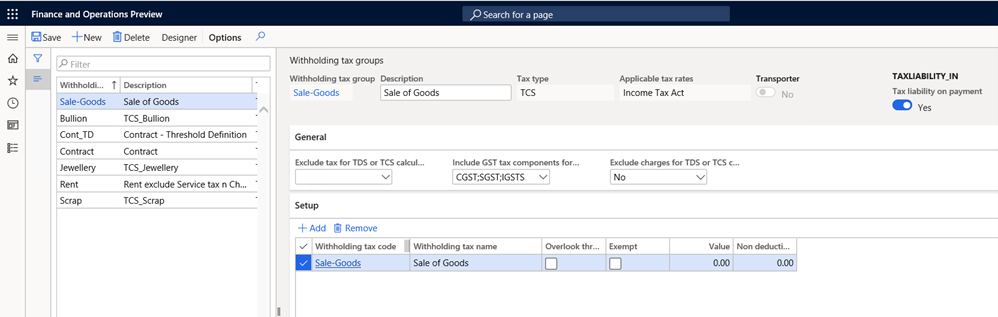
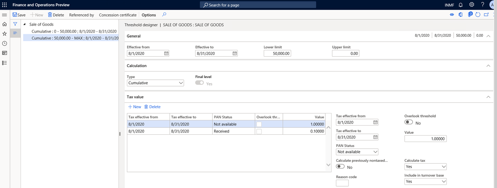
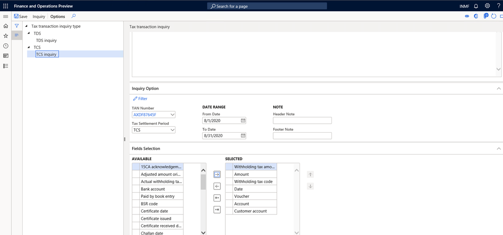

---
# required metadata

title: TCS on sales of goods under section 206C (1H)
description: This topic provides information about how to post Tax Collection at Source (TCS) on sales of goods in Microsoft Dynamics 365.
author: prabhatb
manager: EricWang
ms.date: 10/11/2020
ms.topic: article
ms.prod: 
ms.service: dynamics-365-applications
ms.technology: 

# optional metadata

# ms.search.form: 
audience: Application User
# ms.devlang: 
ms.reviewer: kfend
ms.search.scope: Core, Operations
# ms.tgt_pltfrm: 
# ms.custom: 
ms.search.region: India
# ms.search.industry: 
ms.author: kfend
ms.search.validFrom: 2020-09-01
ms.dyn365.ops.version: 10.0.13

---

# TCS on sales of goods under section 206C (1H)

[!include [banner](../includes/banner.md)]

This topic provides information about the functionality for Tax Collection at Source (TCS) on sales of goods. For example, it describes how to do the basic setup for TCS deduction on sale of goods transaction, how to calculate TCS on transactions from customers or on groups of customers, and how to calculate TCS on transactions when customers don't have a permanent account number (PAN).

Per section 206C (1H), TCS should be collected when payment is received from a customer. Therefore, interim accounting is introduced for this feature. The TCS amount will be posted to an interim account and added to the invoice value when the invoice is issued. The liability for TCS will then be recorded in the books when payment is received.

Another important aspect of this feature is that if multiple customers have the same PAN number, the transaction amount will be accumulated and compared with a threshold to determine whether the transaction is eligible for TCS deduction.

The following illustration shows the process flow for this feature.

## Base amount for TCS deduction

Because the Central Board of Direct Taxes (CBDT) has issued no specific provision, circular, or clarification about the base amount for TCS deduction on sales of goods, it's unclear whether TCS will be levied on Goods and Services Tax (GST) that is charged on an invoice.

There are two views about whether TCS on the sales value includes or excludes GST. Both views are supported by analysis. However, until the CBDT issues a clarification, it will be more appropriate for GST to be included in TCS that is collected on the sales value.

## PAN-based accumulation of transactions for multiple customers

In the case of TCS on sales of goods, TCS will deducted based on PANs. If multiple customers have the same PAN, all transactions by those customers will be accumulated and compared against the threshold that is prescribed by the government. You can also accumulate the purchase threshold based on the PANs of vendors.

However, the accumulation will be based on vendors or customers in one legal entity. Accumulation among multiple legal entities is out of scope.

## The point of collection of tax

According to the interpretation of TCS on sales of goods under section 206C (1H), tax should be collected "at the time of receipt." The law clarifies that TCS on sales of goods will be collected when actual payment is received by the seller.

However, to collect TCS on sales of goods, the seller must increase the amount of the sale invoice so that it includes the amount of TCS. The seller must also account for the amount in the books as a TCS liability, even though it isn't actually payable. Although the TCS amount is debited to the buyer, under section 206C (1H), the liability doesn't arise until the amount is collected. To accommodate this requirement, a new **Tax liability on payment** option is added for the withholding tax group.

When this option is selected, the **Interim account** field for the withholding tax code becomes available. When a sale of goods is posted, the tax amount on the invoice is posted to the interim TCS payable account and debited to the customer account. When payment is received from the buyer, the system generates a related voucher for the posted invoice transaction to accrue the TCS liability on the payment.

## TCS on advance receipt of payment

Under section 206C (1H), every time that part of the sale consideration is received in advance, the seller is required to deduct TCS. However, a difficulty arises in the calculation of the amount when TCS is deducted on multiple advance payment transactions and when payments transactions are adjusted against the invoice amount. Currently, users must manually adjust the TCS amount that was calculated on invoice transactions in the system, to ensure that the TCS amount on the invoice equals the TCS amount on the payment.

## Feature support

The feature is supported in following versions of Microsoft Dynamics 365 Finance, or later versions:

- 10.0.12
- 10.0.13

## Set up TCS on sales of goods

> [!IMPORTANT]
> To enable deduction of TCS on sales of goods, you must turn on the **Advance threshold** feature.

## Create a new withholding tax code for sales of goods

1. Go to **Tax \> Setup \> Withholding tax code**.
2. In the left pane, select **Sale of Goods**.

    When you attach a withholding tax component of the **TCS** type, the new **Interim account** field on the **General** FastTab becomes available.

    > [!IMPORTANT]
    > Don't select an interim account yet. You will select it after you set the **Tax liability on payment** option to **Yes** for the withholding tax group in the next procedure.

3. Set the **Enable threshold hierarchy** option to **Yes**. The **PAN based accumulation** option become available.
4. If multiple customers have the same PAN, set the **PAN based accumulation** option to **Yes**.

## Create a new withholding tax group for sales of goods

1. Go to **Tax \> Setup \> Withholding tax group**.
2. In the left pane, select **Sale of Goods**.
3. Create a withholding tax group that has the **TCS** tax type, and set the **Tax liability on payment** option to **Yes**.
4. Go to **Tax \> Setup \> Withholding tax code**.
5. On the **Withholding tax codes** page, in the **Interim account** field, select **Interim TCS payable account**. This account was created in the chart of account and has the **India withholding tax (TCS)** posting type.
6. Return to the **Withholding tax groups** page.
7. In the **Include GST tax component for TDS or TCS calculation** field, include the GST tax component if it's part of the calculation of the TCS base amount.
8. If charges aren't part of the TCS calculation, in the **Exclude charges for TDS or TCS calculation** field, select **Yes**.
9. On the Action Pane, select **Designer**, and define the formula for TCS calculation.

## Define threshold definitions

1. Go to **Tax \> Setup \> Threshold definitions**.
2. Define a threshold definition for sales of goods.
3. Define two threshold slabs:

    - 0-Max
    - Max-0

## Set up the TCS threshold for sales of goods

TCS on sales of goods applies to either a single customer or multiple customers that have the same PAN.

If the customer PAN isn't available, a higher tax rate will be applied after the exempted turnover amount is passed. If the customer PAN is available, the lower tax rate will be applied.

1. Define threshold references for customers.

    

2. Select **Threshold designer**.
3. Define two threshold slabs that have the following options:

    - With PAN number
    - Without PAN number

4. Define a separate TCS rate for each option.
5. Define the calculation basis for each slab:

    - For the exempted slab, set the following values:

        - **Calculate tax:** No

            Alternatively, set the **Calculate tax** option to **Yes**, and set the value to **0** (zero).

        - **Calculate previous non-tax transactions:** No
        - **Include in turnover base:** Yes

    - For the taxable slab, set the following values:

        - **Calculate tax:** Yes
        - **Calculate previous non-tax transactions:** No
        - **Include in turnover base:** Yes

## Activate the calculation of TCS for customers

- Go to **Accounts receivable \> Customers \> All customers**.

## Invoice posting

When an invoice is posted, if the accumulated transaction passes the threshold limit, the following accounting entry is posted.

| Item | Qty | Unit price | Net amt. | Tax group | IGST     | Tax rate | Threshold value |
|------|-----|------------|----------|-----------|----------|----------|-----------------|
| A    | 6   | 10,000     | 60,000   | Cust1     | IGST @10 | 10       | 50,000          |

If the customer PAN is available, the TCS rate is 0.1 percent.

> [!NOTE]
> From October 1, 2019, through March 31, 2020, the TCS rate is 0.0750 percent.

The invoice is posted as shown here.

| Account                                       | Debit  | Credit |
|-----------------------------------------------|--------|--------|
| Customer A/C (Invoice amount)                 | 66,016 |        |
| Ledger A/C (Sales A/C)                        |        | 60,000 |
| GST Payable                                   |        | 6,000  |
| Interim TCS Payable A/C (0.1% on 66000-50000) |        | 16     |

## TCS liability that arises when payment is collected

When payment is received, and the invoice is attached to the payment transaction, the TCS amount is calculated based on the full payment amount and reversed through a related voucher. However, another related voucher is generated together with the invoice. This related vouched shows tax liability recognition in books for the eligible amount only.

| Account             | Debit  | Credit |
|---------------------|--------|--------|
| Bank                | 66,016 |        |
| Customer            |        | 66,016 |
| Interim TCS Payable | 65.95  |        |
| TCS Payable         |        | 65.95  |

The related voucher is generated as shown here.

| Account             | Debit | Credit |
|---------------------|-------|--------|
| Interim TCS payable |       | 65.95  |
| TCS Payable         | 65.95 |        |

> [!IMPORTANT]
> Another related voucher will be generated together with the posted sales invoice to book the actual TCS liability.

Go to the posted sales invoice voucher, and check the related voucher entry.

| Account             | Debit | Credit |
|---------------------|-------|--------|
| Interim TCS payable | 16.00 |        |
| TCS Payable         |       | 16.00  |

> [!NOTE]
> In the case of a purchase transaction where the vendor is deducting TCS, you must create a new TCS withholding group.

## TCS that vendors deduct on purchases of goods

If the selling vendor deducts TCS against the organization, you must create a separate **TCS on purchase of goods** withholding tax group. On the **Withholding tax group** page, in the **Apply threshold** section, set the **PAN based accumulation** option to **Yes**. You must define a threshold definition for the vendor and attach the withholding tax group to the vendor. When the purchase order is posted, the TCS amount that the vendor deducted will be posted to the TCS recoverable account.

Every organization will claim a credit for the TCS deduction after the deduction is reconciled by using Form 26AS.

1. Go to **Tax \> Inquiries and reports \> TDS/TCS inquiry**.
2. Select the required column fields to generate the report.

