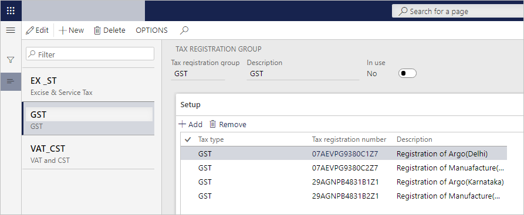

---
# required metadata

title: Attach the GSTIN to a tax registration group
description: This topic explains how to attach the Goods and Services Tax Identification Number (GSTIN) to a tax registration group. This task is part of the master data setup that is required to make the India localization solution for GST available.
author: EricWangChen
ms.date: 06/04/2019
ms.topic: article
ms.prod: 
ms.technology: 

# optional metadata

# ms.search.form: 
audience: Application User
# ms.devlang: 
ms.reviewer: kfend
# ms.tgt_pltfrm: 
# ms.custom: 
ms.search.region: India
# ms.search.industry: 
ms.author: wangchen
ms.search.validFrom: 2019-06-01
ms.dyn365.ops.version: 10.0.4

---

# Attach the GSTIN to a tax registration group

[!include [banner](../includes/banner.md)]

To make the India localization solution for Goods and Services Tax (GST) in Microsoft Dynamics 365 Finance available, you must complete the following master data setup:

- Define a business vertical.
- Update the state code and union territory.
- Create a Goods and Services Tax Identification Number (GSTIN) master.
- Define GSTINs for the legal entity, warehouse, vendor, or customer masters.
- Define Harmonized System of Nomenclature (HSN) codes and Service Accounting Codes (SACs).
- Create main accounts for the GST posting type.
- Create a tax settlement period.
- Attach the GSTIN to a tax registration group.

To attach the GSTIN to a tax registration group, go to **Tax** \> **Setup** \> **Sales tax** \> **Tax registration group**, create a group, and define the required GSTIN.

[!INCLUDE[footer-include](../../includes/footer-banner.md)]
