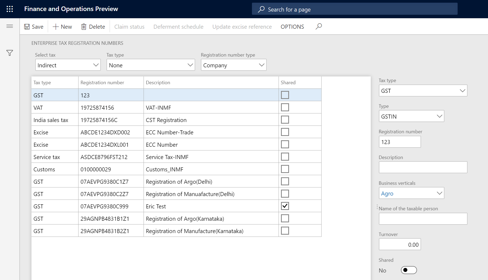
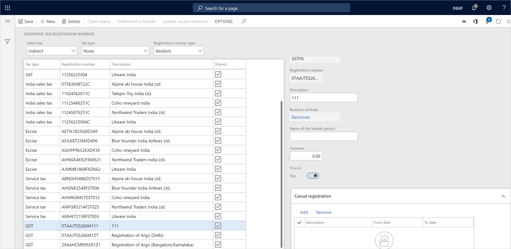
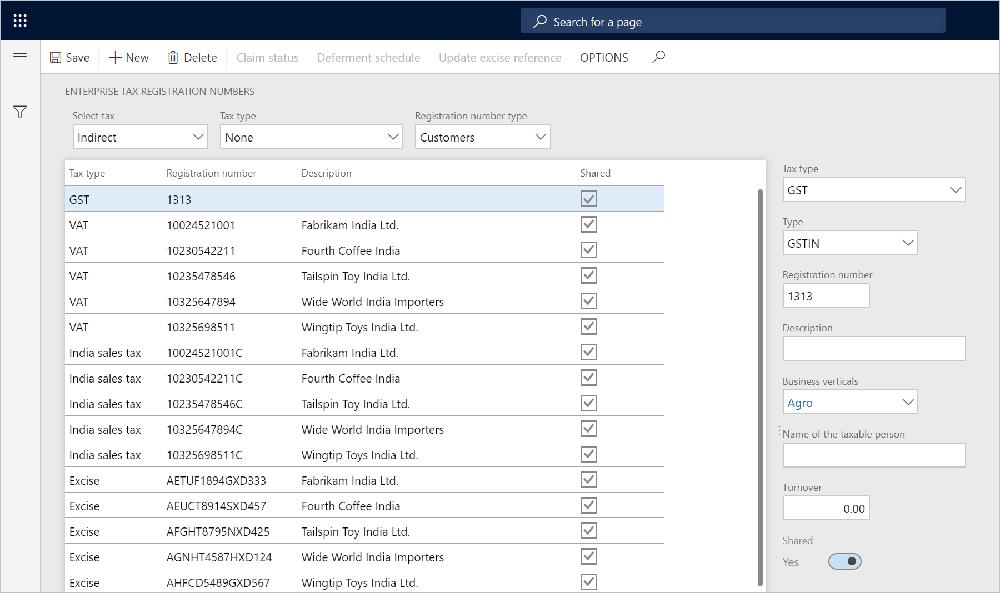

---
# required metadata

title: Create a GSTIN master
description: This topic explains how to create a Goods and Services Tax Identification Number (GSTIN) master. This task is part of the master data setup that is required to make the India localization solution for GST available.
author: EricWangChen
ms.date: 06/04/2019
ms.topic: article
ms.prod: 
ms.technology: 

# optional metadata

# ms.search.form: 
audience: Application User
# ms.devlang: 
ms.reviewer: kfend
# ms.tgt_pltfrm: 
# ms.custom: 
ms.search.region: India
# ms.search.industry: 
ms.author: wangchen
ms.search.validFrom: 2019-06-01
ms.dyn365.ops.version: 10.0.4

---

# Create a GSTIN master

[!include [banner](../includes/banner.md)]

To make the India localization solution for Goods and Services Tax (GST) in Microsoft Dynamics 365 Finance available, you must complete the following master data setup:

- Define a business vertical.
- Update the state code and union territory.
- Create a Goods and Services Tax Identification Number (GSTIN) master.
- Define GSTINs for the legal entity, warehouse, vendor, or customer masters.
- Define Harmonized System of Nomenclature (HSN) codes and Service Accounting Codes (SACs).
- Create main accounts for the GST posting type.
- Create a tax settlement period.
- Attach the GSTIN to a tax registration group.

## Define company registration numbers for the GST tax type

1. Go to **Tax** \> **Setup** \> **Sales Tax** \> **Enterprise tax registration numbers**.
2. Create a record.
3. In the **Tax type** field, select **GST**.
4. In the **Registration number type** field, select **Company** to create state-wide company registration numbers.
5. In the **Type** field, verify that **GSTIN**, **GDI**, and **UID** appear in the list, and then select a value.
6. In the **Registration number** field, enter a value.
7. In the **Description** field, enter a value.
8. In the **Business vertical** field, select a value.

    

9. On the **Casual registration** FastTab, select **Add**.
10. In the **From date** and **To date** fields, define the valid period for the casual registration number.
11. In the **Description** field, enter a value.
12. On the **Number sequences** FastTab, define number sequences for the **GST invoice** and **Bill of supply** references.

    - The **GST invoice** number sequence will be used when customer sales that have GST transactions are posted.
    - The **Bill of supply** number sequence will be used when customer sales that have non-GST transactions are posted.

## Define vendor registration numbers for the GST tax type

1. In the **Registration number type** field, select **Vendors** to create state-wide vendor registration numbers.
2. Select **New** to create a record.
3. In the **Tax type** field, select **GST**.
4. In the **Registration number field**, enter a value.
5. In the **Description** field, enter a value.
6. In the **Business vertical** field, select a value.

## Define customer registration numbers for the GST tax type

1. In the **Registration number type** field, select **Customers** to create state-wide customer registration numbers.
2. Select **New** to create a record.
3. In the **Tax type** field, select **GST**.
4. In the **Registration number field**, enter a value.
5. In the **Description** field, enter a value.
6. In the **Business vertical** field, select a value.

[!INCLUDE[footer-include](../../includes/footer-banner.md)]
