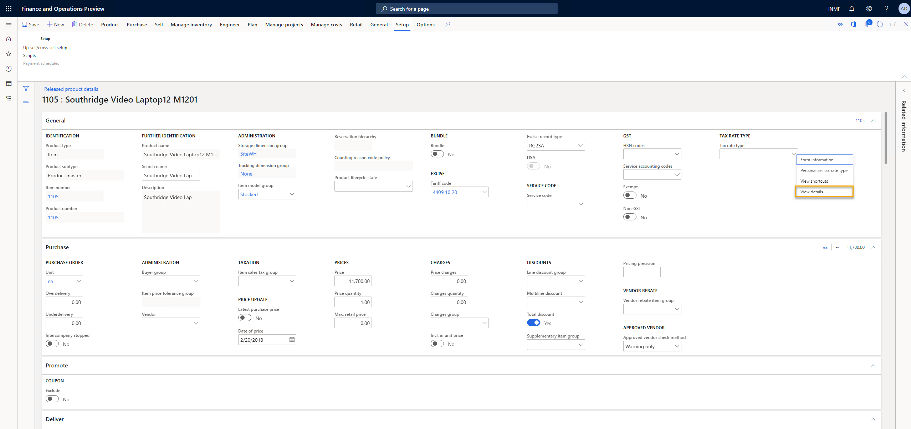

---
# required metadata

title: Define a tax rate type and assign it to relevant master data  
description: This topic explains how to define the tax rate type and assign it to the relevant master data. 
author: EricWangChen 
ms.date: 03/18/2020
ms.topic: article
ms.prod: 
ms.technology: 

# optional metadata

# ms.search.form: 
audience: Application User
# ms.devlang: 
ms.reviewer: kfend
# ms.tgt_pltfrm: 
# ms.custom: 
ms.search.region: India
# ms.search.industry: 
ms.author: wangchen
ms.search.validFrom: 2019-10-01
ms.dyn365.ops.version: 10.0.5

---

# Define tax rate type

[!include [banner](../includes/banner.md)]

This topic explains how to define the tax rate type and assign it to the relevant master data. This task is part of the master data setup that is required to make the India localization solution for Goods and Services Tax (GST) available.

To make the India localization solution GST available in Dynamics 365 Finance, you must complete the following master data setup:

- Define a business vertical
- Update the state code and union territory
- Create a Goods and Services Tax Identification Number (GSTIN) master
- Define GSTINs for the legal entity, warehouse, vendor, or customer masters
- Define Harmonized System of Nomenclature (HSN) codes and Service Accounting Codes (SACs)
- Define tax rate type
- Create main accounts for the GST posting type
- Create a tax settlement period
- Attach the GSTIN to a tax registration group

## Tax rate type

In most taxation systems, there is the concept of a tax rate type, such as standard tax rate, reduced tax rate and super reduced tax rate. In India GST, there are five types as shown in the following table:

| Rates | Type      | Products                                                                                                                                                     |
| ----- | --------- | ------------------------------------------------------------------------------------------------------------------------------------------------------------ |
| 0%    | Nil       | Basic foods, including fish, meat, dairy, vegetables, bread, and salt. Postal services. Books and newspapers. Accommodation below Rs 999 per night.           |
| 5%    | Low       | Household necessities, such as consumable oil, sugar, spices, tea, and coffee (except instant). Coal, Mmishti/mithai (Indian sweets), and life-saving drugs. |
| 12%   | Standard1 | Computers and processed food.                                                                                                                                |
| 18%   | Standard2 | Hair oil, toothpaste and soaps. Capital goods. Industrial intermediaries.                                                                                    |
| 28%   | High      | Luxury items, such as small cars, consumer durables like AC and refrigerators, premium cars, cigarettes, carbonated beverages, and high-end motorcycles.     |

## When to use tax rate type

It's not mandatory to set up the tax rate type. In the standard GST configuration, HSN codes and SACs are used to determine the GST rate. For users who maintain multiple [HSN codes and SACs](apac-ind-GST-hsn-service-accounting-codes.md), it's time consuming to complete the [tax setup](apac-ind-GST-set-up-rate-percentage-tables.md), and it also takes longer for the tax engine to pick up the tax rate.

With the tax rate type, the tax setup for the GST rate can be simplified with just a few records, however, there will be more records if you consider the scenarios such as tax exemptions and reverse charges.

| Tax rate type | Rate |
| ------------- | ---- |
| Nil           | 0%   |
| Low           | 5%   |
| Standard1     | 12%  |
| Standard2     | 18%  |
| High          | 28%  |

> [!NOTE]
> When using the tax rate type, HSN and SAC definitions are required for GSTR. 

## Define a tax rate type

1. Go to **Product information management** \> **Products** \> **Released products**.
2. Select and open a released product. 
3. On the **General** FastTab, find the **Tax rate type** field.
4. Right-click in the field and select **View details**.
5. Enter the name and description of the tax rate type you want to add.

    

You can also import the tax rate type by using its data entity, **Tax rate type**.

## Assign a tax rate type to relevant taxable master data

You can associate the tax rate type to the following taxable master data where it will be supported by a data entity. With it attached, when you create taxable transactions with the master data, like a sales order or sales invoice, the attached tax rate type will be defaulted in the transaction and be used for the determined rate.

- Released product
- Procurement/Sales categories
- Charge code

[!INCLUDE[footer-include](../../includes/footer-banner.md)]
