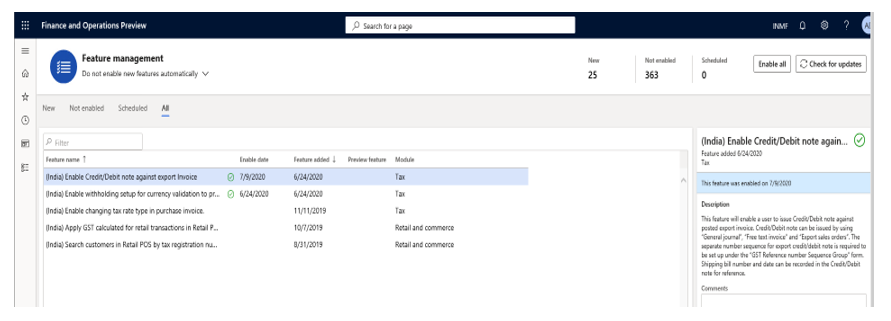
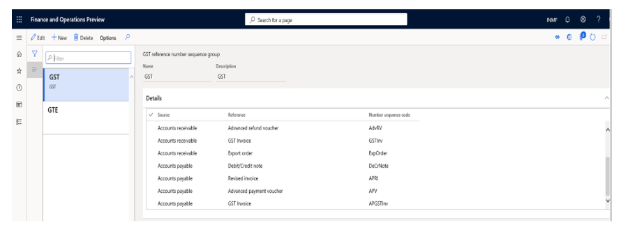
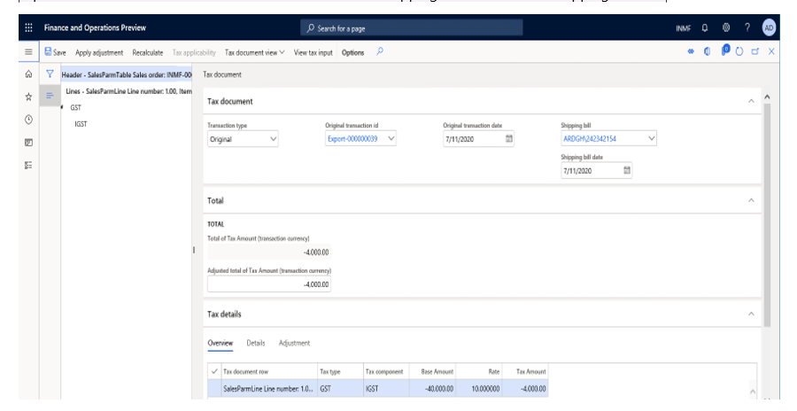
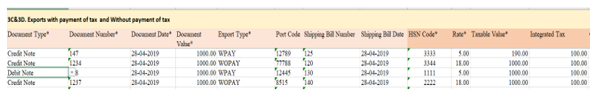
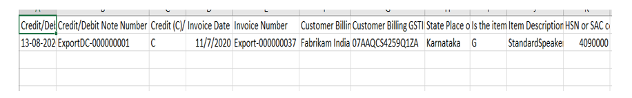

---
# required metadata

title: Credit or debit note against an export order
description: This topic provides information about how to post a credit note against an export invoice in Microsoft Dynamics 365 transactions.
author: prabhatb
ms.date: 03/02/2021
ms.topic: article
ms.prod: 
ms.technology: 

# optional metadata

# ms.search.form: 
audience: Application User
# ms.devlang: 
ms.reviewer: kfend
ms.search.scope: Core, Operations
# ms.tgt_pltfrm: 
# ms.custom: 
ms.search.region: India
# ms.search.industry: 
ms.author: kfend
ms.search.validFrom: 2020-09-01
ms.dyn365.ops.version: 10.0.13

---

# Credit or debit note against an export order

[!include [banner](../includes/banner.md)]

Currently, credit notes and debit notes can't be posted against an export invoice that has been posted. However, this feature lets you post credit notes against an export order, similarly to the way that you post a sales order.

Per the proposed new Goods and Services Tax Return (GSTR), ANX-1 inserts information that is related to credit and debit notes that are issued against an export order.

When a credit note or a debit note is posted against an export order that already has a posted shipping bill, it shows the following information:

- Shipping bill number
- Shipping bill date

When the credit or debit note is posted, these fields will automatically be set, based on the posted export order.

Export orders can be posted in the following ways:

- Export that includes payment of tax
- Export that excludes payment of tax

If the credit or debit note is posted against an export invoice, the same options are available:

- If the export order is posted with payment of tax, the **With the payment of Tax** field for the credit note is set to **Yes** by default.
- If the export order is posted without payment of tax, the **With the payment of Tax** field for the credit note is set to **No** by default.

If the credit or debit note is posted against an export order that is posted with payment of tax, the **Would you claim refund?** field is also available, and can be set to **Yes** or **No**.

When a credit note is created against a posted export order, the same field is available in the credit note.

You can use the following three transaction types to post a credit or debit note against an export order:

- Export order invoice
- Free text invoice with a negative value
- General journal

## Set up a credit or debit note against an export invoice

### Turn on the feature in Feature management

1. Go to **Workspaces \> Feature management**.
2. In the list, find and select the feature that is named **(India) Enable Credit/Debit note against an export invoice**, and then select **Enable**.

### Set up a number sequence in the GST reference number sequence group

To maintain a Goods and Services Tax (GST) transaction ID for credit notes against an export invoice, you can set up a number sequence in the GST reference number sequence group.

- Go to **Tax \> Setup \> GST reference number sequence group**.

## Post transactions

This section shows how to post a credit note that has a GST payment by using an export sales order.

When a credit note is posted against a posted export invoice, the value of the **With payment of tax** field in the export invoice defaults to the **Tax information** page. If the **With the payment of tax** option is set to **Yes**, the **Would you claim refund?** field is shown.

By default, if the **Would you claim refund?** field in the posted export invoice is set to **Yes**, the **Would you claim refund?** field in the credit note will be set to **Yes**. Otherwise, the field in the credit note will be set to **No**.

For example, you create a credit note for five items that has the following information:

- Export order line
- In the originally posted export order, the following values are set:

    - **With payment of tax** = **Yes**
    - **Would you claim refund?** = **Yes**

| Item | Qty | Unit  | Net amt. | Tax group | IGST     | Tax rate |
|------|-----|-------|----------|-----------|----------|----------|
| A    | 5   | 1,000 | 5,000    | Cust1     | IGST @10 | 10       |

The cost of the item is 4,000.

The following tables show how the export invoice will be posted.

**IGST calculation**
 
| Sales value | GST @10% |
|-------------|----------|
| 5,000       | 500      |

**Voucher transaction**

| Account              | Debit | Credit |
|----------------------|-------|--------|
| Customer1            | 5,000 |        |
| IGST Payable         |       | 500    |
| Export order revenue |       | 5,000  |
| Refundable account   | 500   |        | 

**Result when the credit note is posted against the posted export invoice**

| Account                               | Debit | Credit |
|---------------------------------------|-------|--------|
| Export order revenue                  | 5,000 |        |
| Customer `                            |       | 5,000  |
| IGST Payable                          | 500   |        |
| Refundable account                    |       | 500    |
| Export Inventory issue (cost of item) |       | 4,000  |
| Sale of goods (cost of item)          | 4,000 |        |

When the export order is posted, the following values are set:

- **With payment of tax** = **Yes**
- **Would you claim refund?** = **Yes**

The following tables show how the export invoice will be posted.

**Voucher transaction**

| Account              | Debit | Credit |
|----------------------|-------|--------|
| Customer1            | 5,000 |        |
| IGST Payable         |       | 500    |
| Export order revenue |       | 5,000  |
| Export Expenses      | 500   |        |

**Result when the credit note is posted against the posted export invoice**

| Account                               | Debit | Credit |
|---------------------------------------|-------|--------|
| Export order revenue                  | 5,000 |        |
| Customer `                            |       | 5,000  |
| IGST Payable                          | 500   |        |
| Export Expenses                       |       | 500    |
| Export Inventory issue (cost of item) |       | 4,000  |
| Sale of goods (cost of item)          | 4,000 |        |

If you review the header information on the **Tax document** page for the credit note, you will see the original export invoice ID, and the shipping bill number and shipping bill date.

After you post the credit note against the export invoice, you can run the monthly ANX-1 offline tool to view the credit note transaction. Go to **Tax \> Inquiries and reports \> Tax reports \> ANX-1 report**. The following illustration shows an example of an ANX-1 report where a credit/debit note was posted against an export invoice.

A credit/debit note that is issued against an export order can also be viewed in the new GSTR-1 report. The following illustration shows an example of a GSTR-1 report where a credit/debit note was posted against an export invoice.

