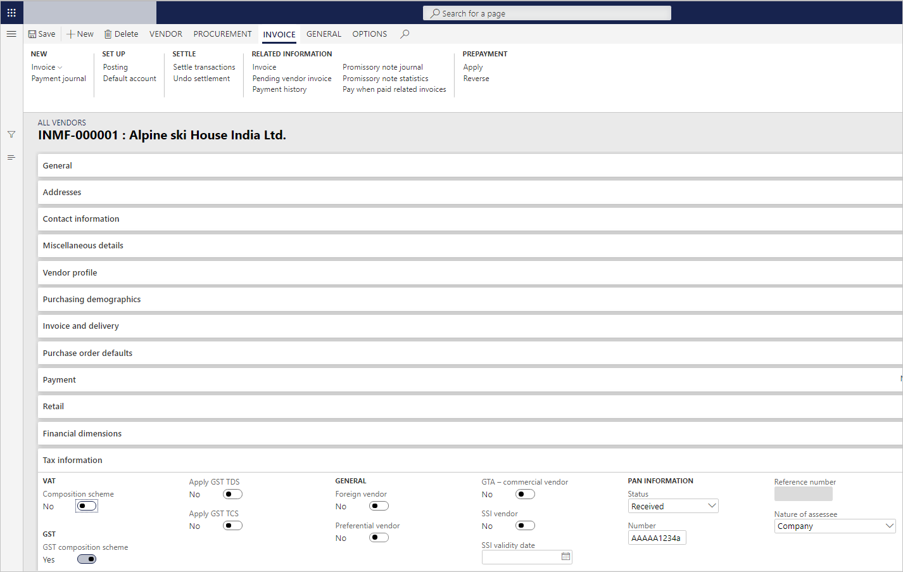
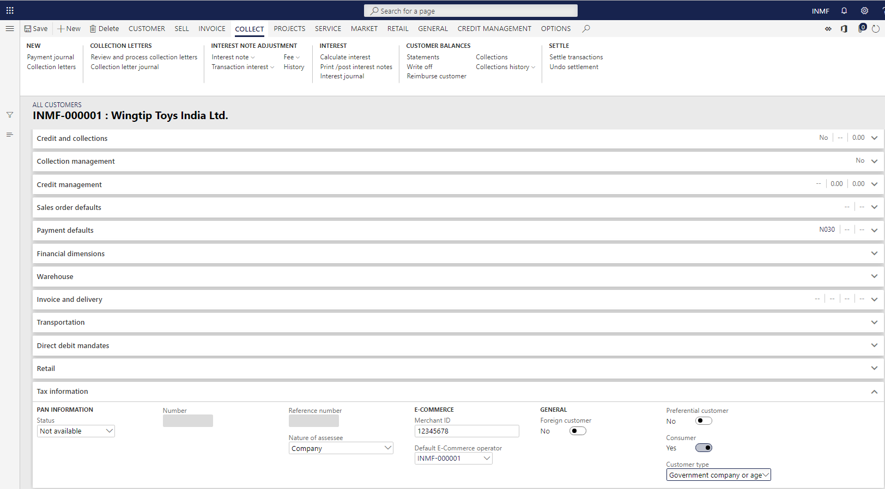

---
# required metadata

title: Define GSTINs and reference number sequences
description: This topic explains how to define Goods and Services Tax Identification Numbers (GSTINs) and reference number sequences for legal entity, warehouse, vendor, and customer masters. This task is part of the master data setup that is required to make the India localization solution for GST available.
author: EricWangChen
ms.date: 06/04/2019
ms.topic: article
ms.prod: 
ms.technology: 

# optional metadata

# ms.search.form: 
audience: Application User
# ms.devlang: 
ms.reviewer: kfend
# ms.tgt_pltfrm: 
# ms.custom: 
ms.search.region: India
# ms.search.industry: 
ms.author: wangchen
ms.search.validFrom: 2019-06-01
ms.dyn365.ops.version: 10.0.4

---

# Define GSTINs and reference number sequences

[!include [banner](../includes/banner.md)]

To make the India localization solution for Goods and Services Tax (GST) in Microsoft Dynamics 365 Finance available, you must complete the following master data setup:

- Define a business vertical.
- Update the state code and union territory.
- Create a Goods and Services Tax Identification Number (GSTIN) master.
- Define GSTINs for the legal entity, warehouse, vendor, or customer masters.
- Define Harmonized System of Nomenclature (HSN) codes and Service Accounting Codes (SACs).
- Create main accounts for the GST posting type.
- Create a tax settlement period.
- Attach the GSTIN to a tax registration group.

## Define GSTINs and number sequences for legal entities

1. Go to **Organization administration** \> **Organizations** \> **Legal entities**.
2. On the **Addresses** FastTab, select **More options** \> **Advanced**.
3. On the **Tax information** FastTab, select **Add**.
4. In the **Name or description** field, enter a value.
5. On the **GST** FastTab, in the **GSTIN/GDI/UID** field, select a value.
6. In the **Reference number sequence group** field, select a value.
7. Set the **Primary** option to **Yes**, and then select **Yes** to acknowledge the message that you receive.
8. Save the record, and then select **Close**.
9. Repeat steps 3 through 8 for all the other required addresses for the legal entity.

## Define GSTINs and number sequences for warehouses

1. Go to **Inventory management** \> **Setup** \> **Inventory breakdown** \> **Warehouses**.
2. On the **Addresses** FastTab, select **Advanced**.
2. On the **Tax information** FastTab, select **Add**.
3. In the **Name or description** field, enter a value.
4. On the **GST** FastTab, in the **GSTIN/GDI/UID** field, select a value.
5. Set the **Primary** option to **Yes**, and then select **Yes** to acknowledge the message that you receive.
6. Save the record, and then select **Close**.

## Define GSTINs for vendors

1. Go to **Accounts payable** \> **Vendors** \> **All vendors**.
2. On the **Addresses** FastTab, select **More options** \> **Advanced**.
3. On the **Tax information** FastTab, select **Add**.
4. In the **Name or description** field, enter a value.
5. On the **GST** FastTab, in the **GSTIN/GDI/UID** field, select a value.
6. Set the **Primary** option to **Yes**, and then select **Yes** to acknowledge the message that you receive.
7. Save the record, and then select **Close**.
8. On the **Tax information** FastTab, set the **GST composition scheme** option to **Yes** if a composition scheme is used to purchase from the dealer.

    

## Define GSTINs for customers

1. Go to **Accounts receivable** \> **Customers** \> **All customers**.
2. On the **Addresses** FastTab, select **More options** \> **Advanced**.
3. On the **Tax information** FastTab, select **Add**.
4. In the **Name or description** field, enter a value.
5. On the **GST** FastTab, in the **GSTIN/GDI/UID** field, select a value.
6. Set the **Primary** option to **Yes**, and then select **Yes** to acknowledge the message that you receive.
7. Save the record, and then select **Close**.
8. On the **Tax information** FastTab, set the **Consumer** option to **Yes** to identify the customer as a consumer.
9. For customer sales through an e-Commerce operator, enter a value in the **Merchant ID** field, and select a value in the **Default E-Commerce operator** field.
10. For sales with government companies or other agencies, in the **Customer type** field, select **Govt company or other agencies**.

    

[!INCLUDE[footer-include](../../includes/footer-banner.md)]
