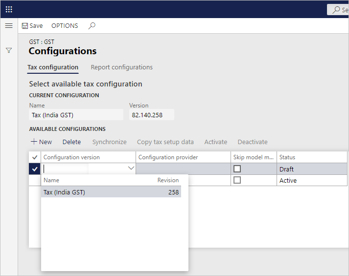
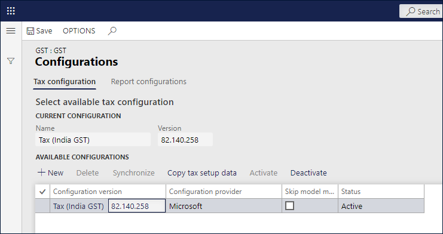
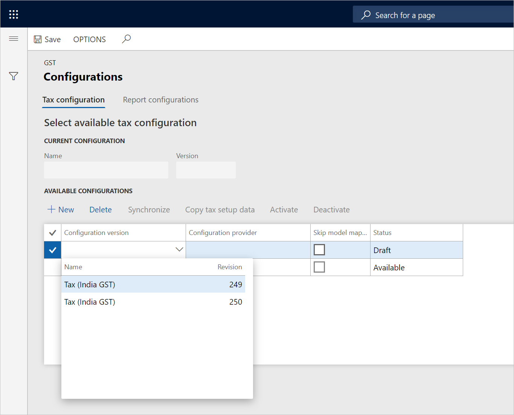
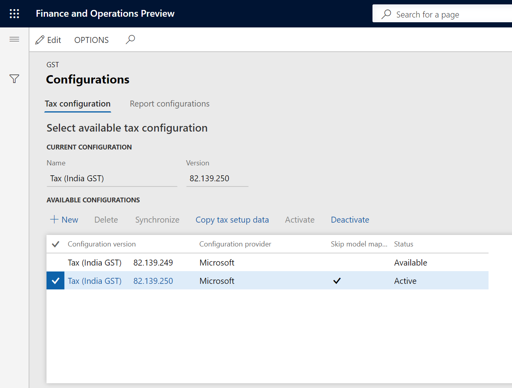

---
# required metadata

title: Define a tax configuration and deploy it to legal entities
description: This topic explains how to define a tax configuration, and then deploy it to one or more legal entities. 
author: EricWangChen
ms.date: 06/05/2019
ms.topic: article
ms.prod: 
ms.technology: 

# optional metadata

# ms.search.form: 
audience: Application User
# ms.devlang: 
ms.reviewer: kfend
# ms.tgt_pltfrm: 
# ms.custom: 
ms.search.region: India
# ms.search.industry: 
ms.author: wangchen
ms.search.validFrom: 2019-06-01
ms.dyn365.ops.version: 10.0.4

---

# Define a tax configuration and deploy it to legal entities

[!include [banner](../includes/banner.md)]

1. Go to **Tax** \> **Setup** \> **Tax Configuration** \> **Tax Setup**.
2. Select **New**.
3. In the **Tax Setup** field, enter a value.
4. In the **Description** field, enter a value, and then select **Save**.
5. Select **Configurations**.
6. On the **Tax configuration** tab, in the **Available configurations** section, select **New**.
7. In the **Configuration version** field, select a value.

    The new tax configuration is listed in the **Available configurations** grid.

    

8. Select **Save**, and then select **Synchronize**.
9. Select **Activate**.

    

    The configuration that you activated is updated as the current configuration. 
    > [NOTE]
    > It's suggested to mark **Skip model mapping** if the configuration is the standard configuration (which is provided by Microsoft), or extended configuration without adding/modifying model mapping.

10. Select the **Report configurations** tab.

    The **Available configurations** grid lists the configurations that are related to the report.

11. Select the **Select** check box.
12. In the **Report controller** field, select a value.
13. Select **Save**, and then select **Close**.
14. On the **Companies** FastTab, create a record.
15. In the **Companies** field, select a value.

    > [!NOTE]
    > Only one legal entity can be assigned to each tax configuration.

16. Save the record.
17. Select **Activate** to activate the configuration for the company.

    

## Update the configuration version

1. Select **Deactivate**.
2. Select **Configurations**.
3. On the **Tax configuration** tab, in the **Available configurations** section, select **New**.
4. In the **Configurations** field, select a value. 

    The new tax configuration is listed in the **Available configurations** grid.

    

5. Select **Save**.
6. Select the record, and then select **Synchronize**.
7. Select **Activate**.

    The configuration that you activated is updated as the current configuration.

8. Select **Save**, and then select **Close**.

    

[!INCLUDE[footer-include](../../includes/footer-banner.md)]
