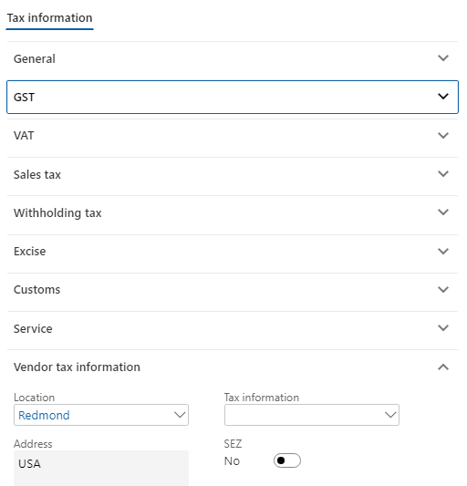
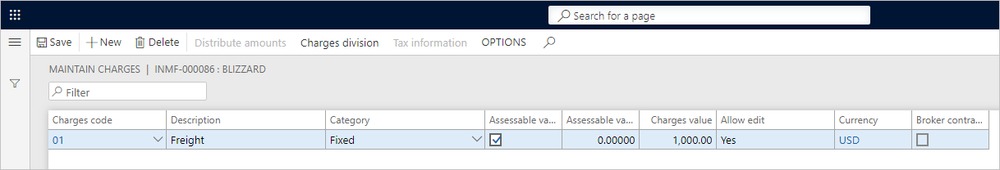

---
# required metadata

title: Import goods that have GST
description:  This topic explains how to import goods that have Goods and Services Tax (GST).
author: EricWangChen
ms.date: 06/04/2019
ms.topic: article
ms.prod: 
ms.technology: 

# optional metadata

# ms.search.form: 
audience: Application User
# ms.devlang: 
ms.reviewer: kfend
# ms.tgt_pltfrm: 
# ms.custom: 
ms.search.region: India
# ms.search.industry: 
ms.author: wangchen
ms.search.validFrom: 2019-06-01
ms.dyn365.ops.version: 10.0.4

---

# Import goods that have GST

[!include [banner](../includes/banner.md)]

Complete the procedures in this topic to import goods that have Goods and Services Tax (GST).

1. Go to **Accounts payable** \> **Purchase orders** \> **All purchase orders**.
2. Create a purchase order for a foreign vendor account, and save the record.
3. Select **Tax information**.

    

4. Select the **GST** FastTab.
5. Select the **Customs** FastTab.

    

6. Select the **Vendor tax information** FastTab.

    

7. Select **OK**.
8. Select **Functions** \> **Maintain charges**.
9. In the **Charges code** field, select a charges code.
10. Select the **Assessable value** check box.
11. In the **Charges value** field, enter a value.

    

12. Save the record, and then select **Close**.

    
> [!NOTE]
> The assessable value is calculated as Net amount + Miscellaneous charges + 1 percent of the landing charges that are defined in Accounts payable parameters.

### Validate the tax details

1. On the **Purchase orders** page, on the Action Pane, on the **Purchase** tab, in the **Tax** group, select **Tax document**.
2. On the **Tax details** FastTab, review the tax calculation.

    Here is an example:

    - **BCD:** 10 percent
    - **LOI:** 100 percent
    - **IGST:** 20 percent
    - **Import exchange rate:** 1 USD = 52 INR

    > [!NOTE]
    > By extending the configuration, you can have Integrated Goods and Services Tax (IGST) calculated on Assessable value + Basic Custom Duty (BCD) tax amount.

3. Select **Close**.
4. Select **Confirm**.

### Update the invoice registration

1. On the **Purchase orders** page, on the Action Pane, on the **Customs** tab, in the **Maintain** group, select **Invoice registration**.
2. In the **Import invoice number** field, select a value.
3. Select **Update**.

### Post the bill of entry

1. On the **Purchase orders** page, on the Action Pane, on the **Customs** tab, in the **Generate** group, select **Bill of entry**.
2. In the **Import invoice number** field, select a value.
3. In the **Bill of entry number** field, select a value.
4. On the **Lines** tab, in the **Quantity** field, enter a value.
6. Close the message that you receive.
7. Select **Tax document**.
8. Select **Close**.
9. Select **OK**.

### Post the product receipt

1. On the **Purchase orders** page, on the Action Pane, on the **Receive** tab, in the **Generate** group, select **Product receipt**.
2. In the **Quantity** field, select **Bill of entry quantity**.
3. In the **Product receipt** field, enter the product receipt.
4. Select **OK**.

The following illustration shows an example of a journal entry for an import purchase order that has GST.

[!INCLUDE[footer-include](../../includes/footer-banner.md)]
