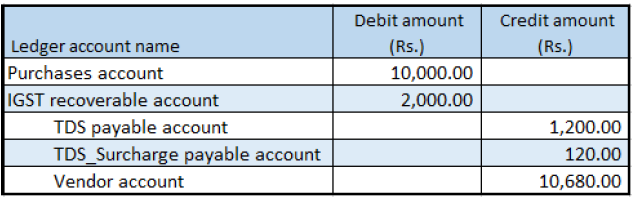

---
# required metadata

title: Include GST when calculating tax deductions
description: This topic explains how to include Goods and Services Tax (GST) on a calculated tax deduction.
author: EricWangChen
ms.date: 06/04/2019
ms.topic: article
ms.prod: 
ms.technology: 

# optional metadata

# ms.search.form: 
audience: Application User
# ms.devlang: 
ms.reviewer: kfend
# ms.tgt_pltfrm: 
# ms.custom: 
ms.search.region: India
# ms.search.industry: 
ms.author: wangchen
ms.search.validFrom: 2019-06-01
ms.dyn365.ops.version: 10.0.4

---

# Include GST when calculating tax deductions

[!include [banner](../includes/banner.md)]

## Set up GST requirements

1. Go to **Tax** \> **Indirect Tax** \> **Withholding tax** \> **Withholding tax groups**.
2. Select a withholding tax group.
3. On the **General** FastTab, in the **Include GST tax components for TDS or TCS calculation** field, select the required Goods and Services Tax (GST) components.
4. Select **Close**.

## Create a purchase order

1. Go to **Accounts payable** \> **Purchase orders** \> **All purchase orders**.
2. Create a purchase order.
3. Select **OK**.

## Validate the tax details

1. On the Action Pane, on the **Purchase** tab, in the **Tax** group, select **Tax document** to review the calculated taxes.

    Here is an example of what you should see:

    - **Taxable value:** 10,000.00
    - **IGST:** 20 percent

2. Select **Close**.
3. Select **Withholding tax**.
4. Select **Close**.
5. Select **Confirm**.

## Post the purchase invoice

1. On the Action Pane, on the **Invoice** tab, in the **Generate** group, select **Invoice**.
2. In the **Default quantity for lines** field, select **Ordered quantity**.
3. Enter the invoice number.
4. On the Action Pane, on the **Vendor invoice** tab, in the **Actions** group, select **Post** \> **Post**.
5. On the Action Pane, on the **Invoice** tab, in the **Journals** group, select **Invoice**.
6. On the **Overview** tab, select **Voucher**.

[!INCLUDE[footer-include](../../includes/footer-banner.md)]
