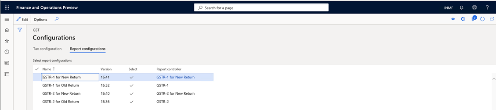
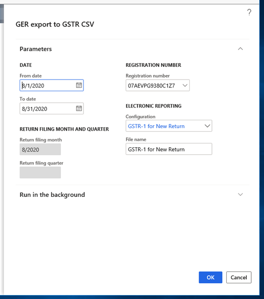

---
# required metadata

title: New GSTR-1 and GSTR-2 return formats
description: This topic provides information about how to generate GSTR-1 and GSTR-2 reports in Microsoft Dynamics 365 according to the new format that was released by Goods and Services Tax (GST) Suvidha Providers, or GSPs.
author: prabhatb
ms.date: 03/16/2021
ms.topic: article
ms.prod: 
ms.technology: 

# optional metadata

# ms.search.form: 
audience: Application User
# ms.devlang: 
ms.reviewer: kfend
ms.search.scope: Core, Operations
# ms.tgt_pltfrm: 
# ms.custom: 
ms.search.region: India
# ms.search.industry: 
ms.author: kfend
ms.search.validFrom: 2020-09-01
ms.dyn365.ops.version: 10.0.13

---

# New GSTR-1 and GSTR-2 return formats

[!include [banner](../includes/banner.md)]

The format of the GSTR-1 and GSTR-2 returns has been updated in response to the new format that was updated by the ClearTax Goods and Services Tax (GST) Suvidha Provider, or GSP.

The following comma-separated values (CSV) files have been made obsolete (deprecated):

- **GSTR-1:**

    - GSTR1 Adjust multiple Advance receipt for invoice
    - GSTR1 Advance receipt format
    - GSTR1 Refund voucher

- **GSTR-2:**

    - GSTR2 Adjust multiple Advance payment for invoice
    - GSTR2 Advance payment format
    - GSTR2 Refund voucher

The following files have been updated:

- **GSTR-1:**

    - GSTR1 Invoice and Bill of Supply
    - GSTR1 Credit debit note

- **GSTR-2:**

    - GSTR2 Invoice and bill of supply
    - GSTR2 Credit debit note

## Changes in the new return format

### GSTR-1

The following columns have been added in these files:

- **Sales Invoice and Bill of supply file:**

    - Differential % of Tax Rate
    - Supply covered Under Sec.7 of IGST Act
    - Would you claim Refund?
    - Return Filing month
    - Return Filing Quarter

- **Sales credit Debit note file:**

    - Applicable % of tax Rate
    - Supply covered under Sec. 7 of IGST Act
    - Would you claim Refund?
    - Type of Export
    - Shipping Port code - Export
    - Shipping Bill number - Export
    - Shipping Bill date - Export
    - Return Filling Month
    - Return filing quarter
    - GSTN of E-commerce market place

### GSTR-2

The following columns have been added in these files:

- **Purchase Invoice and Bill of Supply file:**

    - Supply covered under section 7 of IGST Act
    - Would you claim Refund
    - Return Filing Month
    - Return Filing Quarter

- **Purchase Credit Debit Note file:**

    - Supply covered under Sec 7 of IGST Act
    - Would you claim Refund
    - Type of Import (Goods, Services, SEZ)
    - Bill of Entry port code
    - Bill of entry number
    - Bill of Entry Date
    - Bill of Entry Value
    - Return filling Month
    - Return filling Quarter

### Set up Dynamics 365 Finance to report ANX-1

You must complete the following tasks to prepare Microsoft Dynamics 365 Finance to report ANX-1:

1. Import and set up Electronic reporting (ER) configurations.
2. Map the reporting configuration in the tax setup.
3. Provide report data for report generation.

    - Generate a new ANX-1 report: ANX-1 files will generate 10 CSV files.

4. Provide report data for report generation.

    - Generate the Purchase Register Excel file.

## Import tax configuration

- Taxable Document.version.82
- Taxable Document (India).version 82.155
- Tax (India GST).version.82.155.300

## Import and set up ER configurations

To prepare Finance for GSTR reporting, you must import the following versions of ER configurations, or later versions, in the order that they are listed in.

| ER configuration name           | Type               | Format | Version |
|---------------------------------|--------------------|--------|---------|
| GST Returns model               | Model              | XML    | 16      |
| GST Returns model mapping       | Model              | XML    | 16.7    |
| GSTR-1 for Old Return           | Model              | XML    | 16.32   |
| GSTR-1 for new Return           | Model              | XML    | 16.41   |
| GSTR-2 for Old Return           | Model              | XML    | 16.36   |
| GSTR-2 for new Return           | Model              | XML    | 16.40   |
| GST Returns govt. model mapping | Model              | XML    | 19.10   |
| GST Returns govt. model         | Model              | XML    | 19.0    |
| GST Returns govt. model mapping | Model              | XML    | 19.12   |
| GST ANX-1 Govt. offline tool    | Model              | XML    | 19.22   |
| Purchase Register               | Model              | XML    | 19.7    |
| ANX-1                           | Format (exporting) | CSV    |  N/A    |
| Purchase Register               | Format (exporting) | Excel  |  N/A    |
| GSTR-1 (new)                    | Format (exporting) | CSV    |  N/A    |
| GSTR-2 (new)                    | Format (exporting) | CSV    |  N/A    |

Import the latest versions of these configurations. The description of each configuration version usually includes information about the changes that were introduced in that version.

> [!NOTE]
> After all the ER configurations from the preceding table are imported, you must map the report configuration in the tax setup.

| Name                          | Version | Report controller            | Description (Pl)                                             |
|-------------------------------|---------|------------------------------|--------------------------------------------------------------|
| GST ANX-1 Govt. Offline Tool  | 19.22   | GST ANX-1 Govt. offline Tool | New GSTR return applicable from 1.4.2020 onward              |
| GSTR-1 CSV (old)              | 16.32   | GSTR-1 (old)                 | Existing GSTR-1 format                                       |
| GSTR-1 Govt. Offline Tool CSV | 19.10   | GSTR-1 Govt. Offline Tool    | Existing GSTR-1 offline tool. (Ineffective from 1.4.2020)    |
| GSTR-2 CSV (old)              | 16.36   | GSTR-2 (old)                 | Existing GSTR-2 format                                       |
| Purchase register             | 19.7    | Purchase Register            | New Register for inward transaction applicable from 1.4.2020 |
| GSTR-1 CSV (new)              | 16.41   | GSTR-1 (new)                 | New GSTR-1 format                                            |
| GSTR-2 CSV (new)              | 16.40   | GSTR-2 (new)                 | New GSTR-2 format                                            |

## Important columns that were added in the new GSTR-1

| Report                           | File format | Column title                            | Description |
|----------------------------------|-------------|-----------------------------------------|-------------|
| Sales Invoice and Bill of supply | CSV         | Differential % of Tax Rate              | If the supply is eligible to be taxed at a lower percentage of the existing tax rate, select **define%**. For example, if the regular tax rate is 12 percent, and the differential percentage of the tax rate is 65 percent, the applicable tax rate will be 7.8 percent. |
| Sales Invoice and Bill of supply | CSV         | Supply covered Under Sec. 7 of IGST Act | If the supply is covered under section 7 of the Integrated GST (IGST) Act, select **Yes**. Otherwise, leave the field blank. |
| Sales Invoice and Bill of supply | CSV         | Would you claim Refund?                 | If you want to claim a refund, select **Yes**. Otherwise, select **No**. If the supplies exclude the payment of tax, select **No**. |
| Sales Invoice and Bill of supply | CSV         | Return Filing month                     | The system will select a month from the period that is defined in the **GSTR report** dialog box. |
| Sales Invoice and Bill of supply | CSV         | Return Filing Quarter                   | The system will select a quarter from the period that is defined in the **GSTR report** dialog box. |
| Sales credit Debit note          | CSV         | Applicable % of tax Rate                | If the supply is eligible to be taxed at a lower percentage of the existing tax rate, select **define%**. Otherwise, leave the field blank. |
| Sales credit Debit note          | CSV         | Supply covered under Sec. 7 of IGST Act | If the place of supply of the invoice address and the place of supply of the shipping address are in different locations, include the **/SEZ/DE** export. |
| Sales credit Debit note          | CSV         | Would you claim Refund?                 | If the GST payment type is **WOPAY** ("without payment"), select **No**. Otherwise, select **Yes**. |
| Sales credit Debit note          | CSV         | Type of Export                          | Provide one of the following four values:<ul><li>Export with Payment of GST</li><li>Export without Payment of GST</li><li>SEZ</li><li>Deemed Export</li></ul> |
| Sales credit Debit note          | CSV         | Shipping Port code - Export             | The shipping port code will come from the shipping bill. |
| Sales credit Debit note          | CSV         | Shipping Bill number - Export           | Information about the shipping bill number will come from the posted shipping bill order. |
| Sales credit Debit note          | CSV         | Shipping Bill date - Export             | Information about the shipping bill date will come from the posted shipping bill order. |
| Sales credit Debit note          | CSV         | Return Filling Month                    | The month that the transaction report is generated for. |
| Sales credit Debit note          | CSV         | Return filing quarter                   | The system will select a quarter from the period that is defined in the **GSTR report** dialog box. |
| Sales credit Debit note          |   CSV       | GSTN of E-commerce market place         | The GST Identification Number (GSTIN) of the e-commerce operator, from the e-commerce operator's tax information. |

## Important columns that were added in the new GSTR-2

| Report                              | File format | Column title                               | Information description |
|-------------------------------------|-------------|--------------------------------------------|-------------------------|
| Purchase Invoice and Bill of Supply | CSV         | Differential % of Tax Rate                 | If the supply is eligible to be taxed at a lower percentage of the existing tax rate, select **define%**. Otherwise, leave the field blank. In the rate setup for the tax component, select **Applicable percentage of rate**. |
| Purchase Invoice and Bill of Supply | CSV         | Supply covered under section 7 of IGST Act | If the place of supply of the invoice address and the place of supply of the shipping address are in different locations, include the **/SEZ/DE** export. |
| Purchase Invoice and Bill of Supply | CSV         | Would you claim Refund                     | If you want to claim a refund, select **Yes**. Otherwise, select **No**. If supplies exclude payment of tax, select **No**. |
| Purchase Invoice and Bill of Supply | CSV         | Return Filing Month                        | The system will select a month from the period that is defined in the **GSTR report** dialog box. |
| Purchase Invoice and Bill of Supply | CSV         | Return Filing Quarter                      | The system will select a quarter from the period that is defined in the **GSTR report** dialog box. |
| Purchase Credit Debit Note          | CSV         | Supply covered under Sec 7 of IGST Act     | If the **Inter-state** field in the tax document is set to **Yes**, this field will be set to **Yes**. |
| Purchase Credit Debit Note          | CSV         | Would you claim Refund                     | If you want to claim a refund, select **Yes**. Otherwise, select **No**. If supplies exclude payment of tax, select **No**. |
| Purchase Credit Debit Note          | CSV         | Type of Import (Goods, Services, SEZ)      | Provide one of the following four values:<ul><li>Import WT</li><li>Import WOT</li><li>SEZ</li><li>Deemed Export</li></ul> |
| Purchase Credit Debit Note          | CSV         | Bill of Entry port code                    | The bill of entry code will come from the bill of entry. |
| Purchase Credit Debit Note          | CSV         | Bill of entry number                       | Information about the bill of entry number will come from the posted bill of entry. |
| Purchase Credit Debit Note          | CSV         | Bill of Entry Date                         | Information about the bill of entry date will come from the posted bill of entry. |
| Purchase Credit Debit Note          | CSV         | Bill of Entry Value                        | This field is set to the assessable value that is shown on the **Bill of entry** page. |
| Purchase Credit Debit Note          | CSV         | Return filling Month                       | The system will select a month from the period that is defined in the **GSTR report** dialog box. |
| Purchase Credit Debit Note          | CSV         | Return filling Quarter                     | The system will select a quarter from the period that is defined in the **GSTR report** dialog box. |

## Generate data in a CSV file

### Load the report configuration into workspaces

Follow these steps to load the report configuration into workspaces.

1. Go to **Workspaces \> Electronic reporting**, and select the **Reporting configurations** tile.
2. On the **Configurations** page, select **Exchange \> Load from XML file**, and import the configuration files in the order that is provided in the first table in the [Import and set up ER configurations](#import-and-set-up-er-configurations) section, earlier in this topic.

### Map the report configuration in the tax setup

1. Go to **Tax \> Setup \> Tax configuration \> Tax setup**, and select **Configurations**.
2. On the **Configurations** page, on the **Reporting configurations** tab, follow these steps for each file that you imported:

    1. Select the **Select** check box.
    2. Select a value in **Report data provider** field.

    

3. Select the **Close** button.

> [!NOTE]
> If you don't select a report in the **Report controller** field, the report won't be available for selection under **Sales tax reports \> India** in step 1 of the procedures in the next section.

## Generate the new GSTR-1 and GSTR-2 reports

### GSTR-1 report

Follow these steps to generate a GSTR-1 report in the new format.

1. Go to **Tax \> Sales tax reports \> India \> GER export to GSTR CSV**.
2. In the **GER export to GSTR CSV** dialog box, in the **From date** field, select the start date of the reporting period for the report.
3. In the **To date** field, select the end date of the reporting period for the report.
4. In the **Registration number** field, select the registration number.
5. In the **Configuration** field, select **GSTR-1 for New Return**.
6. In the **File name** field, enter **GSTR-1 for New Return**.

    

7. Select **OK** to save the report.

### GSTR-2 report

Follow these steps to generate a GSTR-2 report in the new format.

1. Go to **Tax \> Sales Tax reports \> India \> GER export to GSTR CSV**.
2. In the **GER export to GSTR CSV** dialog box, in the **From date** field, select the start date of the reporting period for the report.
3. In the **To date** field, select the end date of the reporting period for the report.
4. In the **Registration number** field, select the registration number.
5. In the **Configuration** field, select **GSTR-2 for New Return**.
6. In the **File name** field, enter **GSTR-2 for New Return**.

    

7. Select **OK** to save the report.
