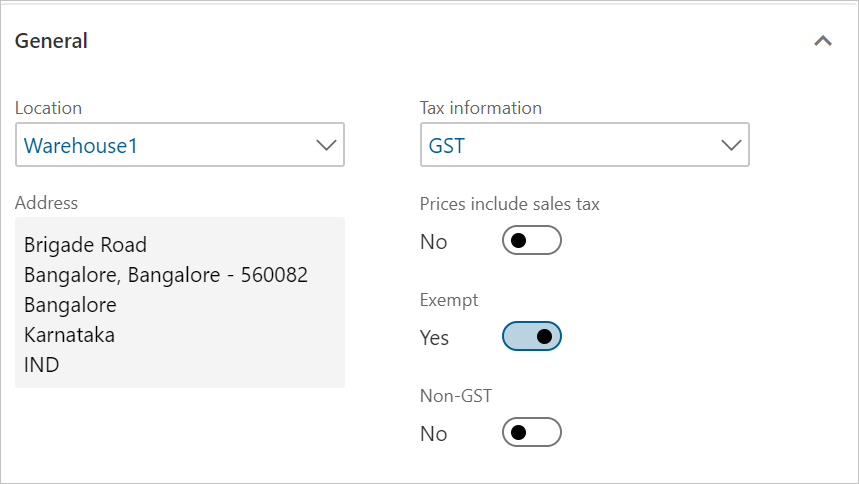
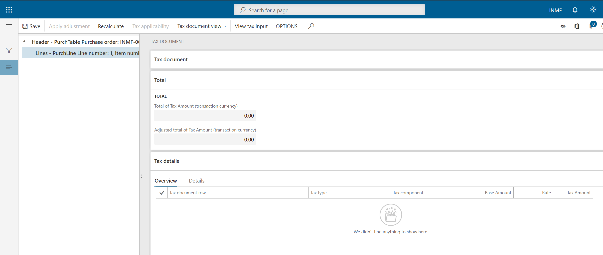

---
# required metadata

title: Purchase of exempted goods
description: This topic provides information about the purchase of exempted goods.
author: EricWangChen
ms.date: 06/04/2019
ms.topic: article
ms.prod: 
ms.technology: 

# optional metadata

# ms.search.form: 
audience: Application User
# ms.devlang: 
ms.reviewer: kfend
# ms.tgt_pltfrm: 
# ms.custom: 
ms.search.region: India
# ms.search.industry: 
ms.author: wangchen
ms.search.validFrom: 2019-06-01
ms.dyn365.ops.version: 10.0.4

---

# Purchase of exempted goods

[!include [banner](../includes/banner.md)]

1. Go to **Accounts payable** \> **Purchase orders** \> **All purchase orders**.
2. Create a purchase order for an exempted item, and save the record.
3. Select **Tax information**.
4. On the **General** Tab, verify that the **Exempt** option is set to **Yes**.
5. Select **OK**.

## Validate the tax details

1. On the Action Pane, on the **Purchase** tab, in the **Tax** group, select **Tax document**.
2. Verify that the **Exempt** field is set to **Yes**, and that the **Tax computed** field is set to **0.00**.
3. Select **Close**, and then select **Confirm**.

### Post the purchase invoice

1. On the Action Pane, on the **Invoice** tab, in the **Generate** group, select **Invoice**.
2. In the **Default quantity for lines** field, select **Ordered quantity**.
3. Enter the invoice number.
4. On the Action Pane, on the **Vendor invoice** tab, in the **Actions** group, select **Post** \> **Post**.
5. On the Action Pane, on the **Invoice** tab, in the **Journals** group, select **Invoice**.
6. On the **Overview** tab, select **Voucher**.

[!INCLUDE[footer-include](../../includes/footer-banner.md)]
