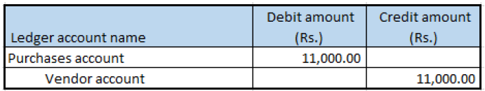

---
# required metadata

title: Purchases of non-GST goods
description: This topic provides information about the purchase of goods that aren't subject to Goods and Services Tax (GST).
author: EricWangChen
ms.date: 06/04/2019
ms.topic: article
ms.prod: 
ms.technology: 

# optional metadata

# ms.search.form: 
audience: Application User
# ms.devlang: 
ms.reviewer: kfend
# ms.tgt_pltfrm: 
# ms.custom: 
ms.search.region: India
# ms.search.industry: 
ms.author: wangchen
ms.search.validFrom: 2019-06-01
ms.dyn365.ops.version: 10.0.4

---

# Purchases of non-GST goods

[!include [banner](../includes/banner.md)]

1. Go to **Accounts payable** \> **Purchase orders** \> **All purchase orders**.
2. Create a purchase order, and define value-added tax (VAT) tax groups for the record.
3. Save the record.
4. Select **Tax information**.
5. In the **Tax Information** field, select the Tax Identification Number (TIN).
5. On the **VAT** FastTab, in the **Non recoverable pct.** field, enter **100.00**.

    

6. Select **OK**.
7. On the **Line details** FastTab, on the **Setup** tab, in the **Item sales tax group** and **Sales tax groups** fields, select values.

## Validate the tax details

1. On the Action Pane, on the **Purchase** tab, in the **Tax** group, select **Sales tax**.

    > [!NOTE]
    > The **Tax document** button isn't available.

2. Verify that VAT is calculated.
3. Select **Close**, and then select **Confirm**.

## Post the purchase invoice

1. On the Action Pane, on the **Invoice** tab, in the **Generate** group, select **Invoice**.
2. In the **Default quantity for lines** field, select **Ordered quantity**.
3. Enter the invoice number.
4. On the Action Pane, on the **Vendor invoice** tab, in the **Actions** group, select **Post** \> **Post**.
5. On the Action Pane, on the **Invoice** tab, in the **Journals** group, select **Invoice**. 
6. On the **Overview** tab, select **Voucher**.

[!INCLUDE[footer-include](../../includes/footer-banner.md)]
