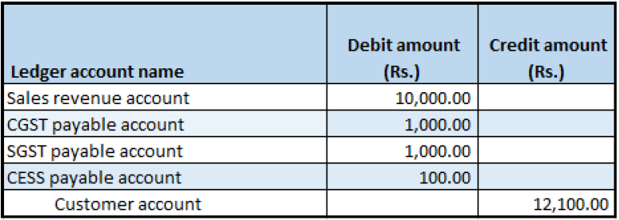

---
# required metadata

title: Return orders
description: This topic explains how to create a return order.
author: EricWangChen
ms.date: 06/04/2019
ms.topic: article
ms.prod: 
ms.technology: 

# optional metadata

# ms.search.form: 
audience: Application User
# ms.devlang: 
ms.reviewer: kfend
# ms.tgt_pltfrm: 
# ms.custom: 
ms.search.region: India
# ms.search.industry: 
ms.author: wangchen
ms.search.validFrom: 2019-06-01
ms.dyn365.ops.version: 10.0.4

---

# Return orders

[!include [banner](../includes/banner.md)]

## Return order page

1. Go to **Sales and marketing** \> **Return orders** \> **All return orders**.
2. Create a return order for a taxable item.
3. On the **Line details** FastTab, in the **Disposition code** field, select **Credit only**.
4. On the Action Pane, on the **Return order** tab, in the **Send** group, select **Return order**.
5. Select **OK**, and then close the page.

## Sales order page

1. Go to **Accounts receivable** \> **Sales orders** \> **All sales orders**.
2. Select the record where the **Order type** field is set to **Returned order**.
3. On the Action Pane, on the **Sales order** tab, in the **Maintain** group, select **Edit**.
4. Select **Tax information**.
5. Select the **GST** tab.
6. Select the **Customer tax information** tab.

    > [!NOTE]
    > The **Tax information** value is automatically set, based on the original sales order that the return order was created against.

7. Select **OK**.
8. On the Action Pane, on the **Sell** tab, in the **Tax** group, select **Tax document**.

    You should see something that resembles the following example:

    - **Taxable amount:** 10,000
    - **CGST:** 10 percent
    - **SGST:** 10 percent
    - **CESS:** 1 percent

9. Select **Close**.

## Post the invoice

1. On the Action Pane, on the **Invoice** tab, in the **Generate** group, select **Invoice**.
2. In the **Quantity** field, select **All**.
3. Select **OK**, and then select **Yes** to acknowledge the warning message that you receive.

## Validate the voucher

1. On the Action Pane, on the **Invoice** tab, in the **Journals** group, select **Invoice**.
2. Select **Voucher**.

The following illustration shows the financial entry for the **Credit only**/**Replace and scrap**/**Scrap** disposition code.

The following illustration shows the financial entry for the **Credit**/**Replace and credit** disposition code.

[!INCLUDE[footer-include](../../includes/footer-banner.md)]
