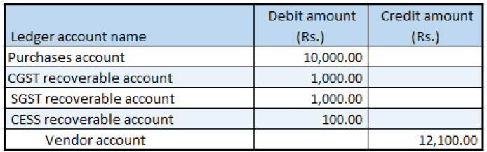

---
# required metadata

title: Revise a purchase invoice that has taxable goods
description: This topic explains how to revise a purchase invoice that has taxable goods.
author: EricWangChen
ms.date: 06/04/2019
ms.topic: article
ms.prod: 
ms.technology: 

# optional metadata

# ms.search.form: 
audience: Application User
# ms.devlang: 
ms.reviewer: kfend
# ms.tgt_pltfrm: 
# ms.custom: 
ms.search.region: India
# ms.search.industry: 
ms.author: wangchen
ms.search.validFrom: 2019-06-01
ms.dyn365.ops.version: 10.0.4

---

# Revise a purchase invoice that has taxable goods

[!include [banner](../includes/banner.md)]

1. Go to **Accounts payable** \> **Purchase orders** \> **All purchase orders**.
2. Create a purchase order for a taxable item.

## Validate the tax details

1. On the Action Pane, on the **Purchase** tab, in the **Tax** group, select **Tax document**.
2. On the **Tax details** FastTab, review the tax calculation.

    What you see might resemble the following example:

    - **Line amount:** 10,000.00
    - **CGST:** 10 percent
    - **SGST:** 10 percent
    - **CESS:** 1 percent

3. Select **Close**, and then select **Confirm**.

## Post the purchase invoice

1. On the Action Pane, on the **Invoice** tab, in the **Generate** group, select **Invoice**.
2. In the **Default quantity for lines** field, select **Ordered quantity**.
3. On the **Lines** FastTab, enter the invoice number.
4. In the **Invoice type** field, select **Revised**.
5. In the **Original invoice number** field, select a value.
6. Verify that the **Original invoice date field** is automatically set, based on the original invoice number that you selected.
7. On the Action Pane, on the **Vendor invoice** tab, in the **Actions** group, select **Post** \> **Post**.
8. On the Action Pane, on the **Invoice** tab, in the **Journals** group, select **Invoice**.
9. On the **Overview** tab, select **Voucher**.

[!INCLUDE[footer-include](../../includes/footer-banner.md)]
