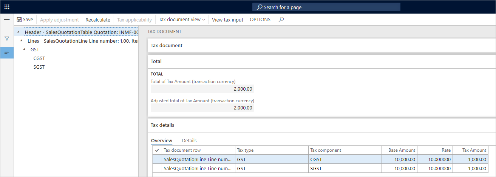

---
# required metadata

title: Sales to registered customers
description: This topic provides information about sales to registered customers.
author: EricWangChen
ms.date: 06/04/2019
ms.topic: article
ms.prod: 
ms.technology: 

# optional metadata

# ms.search.form: 
audience: Application User
# ms.devlang: 
ms.reviewer: kfend
# ms.tgt_pltfrm: 
# ms.custom: 
ms.search.region: India
# ms.search.industry: 
ms.author: wangchen
ms.search.validFrom: 2019-06-01
ms.dyn365.ops.version: 10.0.4

---

# Sales to registered customers

[!include [banner](../includes/banner.md)]

## Create a sales quotation

1. Go to **Sales and marketing** \> **Sales quotation** \> **All quotations**.
2. Create a quotation for a taxable item for the registered customer.
3. Save the record.
4. Select **Tax information**.

    

5. On the **GST** FastTab, validate the default values.

    

6. Select the **Customer tax information** FastTab.

    

    > [!NOTE]
    > - The company address and the customer address are in the same state. Therefore, this transaction is an intrastate transaction.
    > - Customer tax information is defined. Therefore, the dealer is a registered dealer.

7. On the Action Pane, on the **Quotation** tab, in the **Financials** group, select **Tax document**.
8. Select the **GST** node.
9. On the **Sales quotation** and **Tax details** FastTabs, review the tax applicability, tax attributes, and tax calculation.

    What you see might resemble the following example:

    - **Taxable value:** 10,000.00
    - **CGST:** 10 percent
    - **SGST:** 10 percent

    

10. Select **Close**.
11. On the Action Pane, on the **Quotation** tab, in the **Generate** group, select **Send quotation**.
12. Select **OK**, and then close the message that you receive.
13. On the Action Pane, on the **Follow up** tab, in the **Generate** group, select **Confirm**.
14. Select **OK**, close the message that you receive, and then close the pages.

## Create a sales order

1. Go to **Accounts receivable** \> **Sales orders** \> **All sales orders**.
2. Select a record, and then, on the Action Pane, on the **Sales order** tab, in the **Maintain** group, select **Edit**.
3. Select **Tax information**.

    

4. Select the **GST** FastTab.

    

5. Select the **Customer tax information** FastTab.

    

6. Select **OK**.
7. On the Action Pane, on the **Sell** tab, in the **Tax** group, select **Tax document** to review the calculated taxes.

    

8. Select **Close**.

## Post the invoice

1. On the Action Pane, on the **Invoice** tab, in the **Generate** group, select **Invoice**.
2. In the **Quantity** field, select **All**.
3. Select the **Print invoice** check box.
4. Select **OK**, and then select **Yes** to acknowledge the warning message that you receive.

## Validate the voucher

1. On the Action Pane, on the **Invoice** tab, in the **Journals** group, select **Invoice**.
2. Select **Voucher**.

The following illustration shows the financial entries for both the intrastate transactions and the interstate transactions.

[!INCLUDE[footer-include](../../includes/footer-banner.md)]
