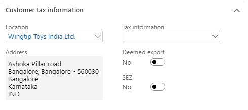
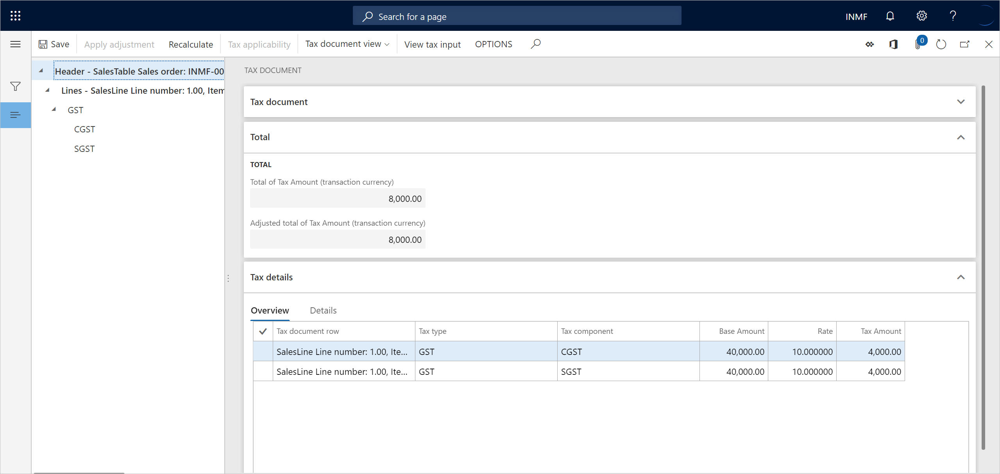

---
# required metadata

title: Sales of taxable goods to consumers
description: This topic provides information about the sale of taxable goods to a consumer.
author: EricWangChen
ms.date: 06/04/2019
ms.topic: article
ms.prod: 
ms.technology: 

# optional metadata

# ms.search.form: 
audience: Application User
# ms.devlang: 
ms.reviewer: kfend
# ms.tgt_pltfrm: 
# ms.custom: 
ms.search.region: India
# ms.search.industry: 
ms.author: wangchen
ms.search.validFrom: 2019-06-01
ms.dyn365.ops.version: 10.0.4

---

# Sales of taxable goods to consumers

[!include [banner](../includes/banner.md)]

1. Go to **Accounts receivable** \> **Sales orders** \> **All sales orders**.
2. Create a sales order for a taxable item, and save the record.
3. Select **Tax information**.

    

4. Select the **GST** FastTab.

    

5. Select the **Customer tax information** FastTab.

    

    > [!NOTE]
    > The **Tax information** field is blank. Therefore, the dealer is an unregistered dealer.

6. Select **OK**.
7. On the Action Pane, on the **Sell** tab, in the **Tax** group, select **Tax document** to review the calculated taxes.

    What you see might resemble the following example:

    - **Taxable value:** 40,000.00
    - **CGST:** 10 percent
    - **SGST:** 10 percent

    

8. Select **Close**.

## Post the invoice

1. On the Action Pane, on the **Invoice** tab, in the **Generate** group, select **Invoice**.
2. In the **Quantity** field, select **Packing slip**.
3. Select the **Print invoice** check box, and then select **OK**.
4. Select **Yes** to acknowledge the warning message that you receive.

## Validate the voucher

1. On the Action Pane, on the **Invoice** tab, in the **Journals** group, select **Invoice**.
2. Select **Voucher**.

The following illustration shows the financial entries for both the intrastate transactions and the interstate transactions.

[!INCLUDE[footer-include](../../includes/footer-banner.md)]
