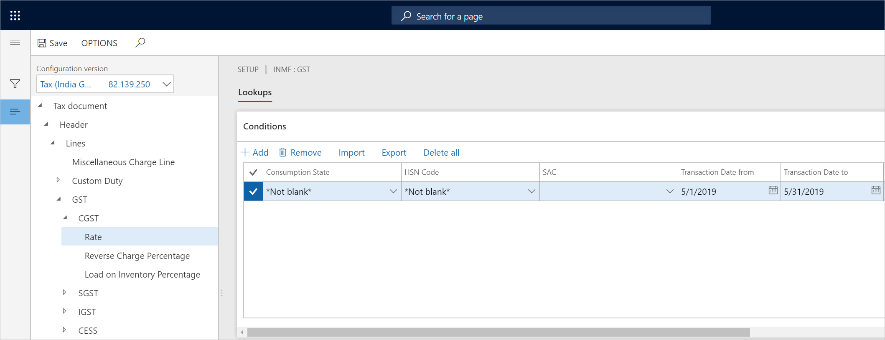
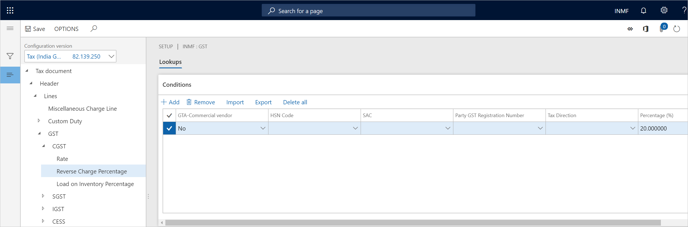
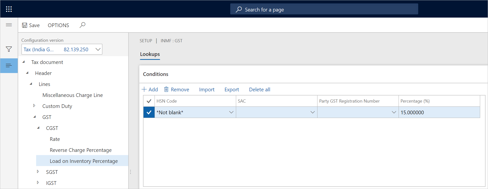
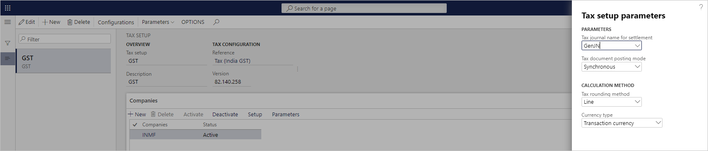

---
# required metadata

title: Set up rate and percentage tables
description: This topic explains how to set up rate and percentage tables.
author: EricWangChen
ms.date: 03/18/2020
ms.topic: article
ms.prod: 
ms.technology: 

# optional metadata

# ms.search.form: 
audience: Application User
# ms.devlang: 
ms.reviewer: kfend
# ms.tgt_pltfrm: 
# ms.custom: 
ms.search.region: India
# ms.search.industry: 
ms.author: wangchen
ms.search.validFrom: 2019-06-01
ms.dyn365.ops.version: 10.0.4

---

# Set up rate and percentage tables

[!include [banner](../includes/banner.md)]

1. Expand the **Tax component** node, and select the **Rate** node.
2. In the **Value** field, enter the tax rate. The remaining fields are used to determine the rate. In the standard GST configuration, there are several pre-defined fields, including **Consumption state**, **HSN code**, and **SAC**. You can select the fields relevant to your business to determine the rate. 

    

    If you leave any input fields empty, then the fields can accept any input values. For example, in the following table, if **HSN** is *998313* and not matter what the value of **Party GST Registration Number** is, then the rate is *12%*. 

     | HSN    | Party GST Registration Number | Value |
     | ------ | ----------------------------- | ----- |
     | 998313 |                               | 12%   |

     > [!NOTE]
     > You can use the [Tax rate type](apac-ind-GST-create-tax-rate-type.md) instead of the HSN and SAC to determine the tax rate. You can also import the [standard GST configurations](apac-ind-gst.md#gst-configurations), which supports tax rate type, or you can extend the earlier configuration by adding tax rate type into the lookup. The tax rate type is supported as of Dynamics 365 Finance version 10.0.5 (October 2019).

3. Select the **Reverse Charge Percentage** node, and in the **Value** field, enter the reverse charge percentage.

    

4. Select the **Load on Inventory Percentage** node, and in the **Value** field, enter the load on inventory percentage.

    

5. Select **Save**, and then select **Close**.
6. On the **Companies** FastTab, select **Parameters**.
7. Enter the parameter values, and then select **OK**.

    

## Import/export tax setup

Prepare the tax setup in Microsoft Excel, and then import the data into the tax setup. 

1. In the rate table, select **Export**. 
2. Open the exported CSV file in Excel, prepare the tax setup, and save the file.
3. In the rate table, select **Import**, choose the file, and then load the data into the setup.

## Validate tax setup

Incorrect tax setup can cause problems that are hard to detect. Common mistakes in tax setup include duplicate tax setup records or entering non-exist master data. 

### Duplicate tax setup records

Duplicate tax setup refers to records with the same values in input fields. Following is an example of two records with the same values for **HSN** and **Party GST Registration Number**, however, they result with two different values.

   | HSN    | Party GST Registration Number | Value |
   | ------ | ----------------------------- | ----- |
   | 998313 |                               | 12%   |
   | 998313 |                               | 15%   |

To resolve and prevent this issue, enable **Tax setup validation** in [Feature Management](../../fin-ops-core/fin-ops/get-started/feature-management/feature-management-overview.md). With this feature enabled, the system will check for duplicates when you enter new data through the UI or when you import the tax setup from a CSV file. 

To check for existing dupclicates, select **Show Duplicates**, and then delete the unwanted records.

### Enter non-exist master data

When **Tax setup validation** is enabled, the system will verify entered and imported master data including HSN and SAC.

[!INCLUDE[footer-include](../../includes/footer-banner.md)]
