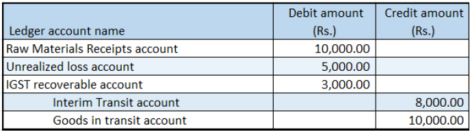

---
# required metadata

title: Stock transfer orders that have tax on the transfer price
description: This topic explains how to create a stock transfer order that has tax on the transfer price.
author: EricWangChen
ms.date: 06/05/2019
ms.topic: article
ms.prod: 
ms.technology: 

# optional metadata

# ms.search.form: 
audience: Application User
# ms.devlang: 
ms.reviewer: kfend
# ms.tgt_pltfrm: 
# ms.custom: 
ms.search.region: India
# ms.search.industry: 
ms.author: wangchen
ms.search.validFrom: 2019-06-01
ms.dyn365.ops.version: 10.0.4

---

# Stock transfer orders that have tax on the transfer price

[!include [banner](../includes/banner.md)]

Complete the procedures in this topic to create a stock transfer order that has tax on the transfer price.

## Create a stock transfer order

1. Go to **Inventory management** \> **Transfer order**.
2. Create a transfer order where the **Transfer type** field is set to **Stock transfer**.

    > [!NOTE]
    > For the selected item, the item cost is 10,000.00, and the transfer price is 15,000.00.

3. At the line level, select **Tax information from warehouse**.
4. Select the **GST** tab.
5. Select **OK**.
6. At the line level, select **Tax information to warehouse**.
7. Select the **GST** tab.
8. Select **OK**.
9. Select **Inquiries** \> **Tax document** to verify that the tax is calculated.

    Here is an example:

    - **Taxable value:** 15,000.00
    - **IGST:** 20 percent

10. Select **Close**.

## Post the shipment

1. Select **Posting** \> **Ship transfer order**.
2. Select the **Edit lines** check box.
3. In the **Update** field, select **All**.
4. Select **Setup** \> **Tax document**.
5. Select **Close**.
6. Select **OK**.

## Validate the shipment voucher

1. Select **Inquiries** \> **Transfer order history**.
2. Select the record where the **Update type** field is set to **Shipment**.
3. Select **Ledger** \> **Voucher**.

> [!NOTE]
> The tax accounts for the "from" warehouse and Goods and Services Tax Identification Number (GSTIN) are posted.

## Post the receipt

1. Select **Posting** \> **Receive**.
2. Select the **Edit lines** check box.
3. In the **Update** field, select **All**.
4. Select **Setup** \> **Tax document**.
5. Select **Close**.
6. Select **OK**.

## Validate the receipt voucher

1. Select **Inquiries** \> **Transfer order history**.
2. Select the record where the **Update type** field is set to **Receive**.
3. Select **Ledger** \> **Voucher**.

> [!NOTE]
> The tax accounts for the "to" warehouse and GSTIN are posted.

[!INCLUDE[footer-include](../../includes/footer-banner.md)]
