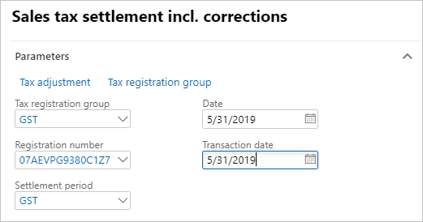
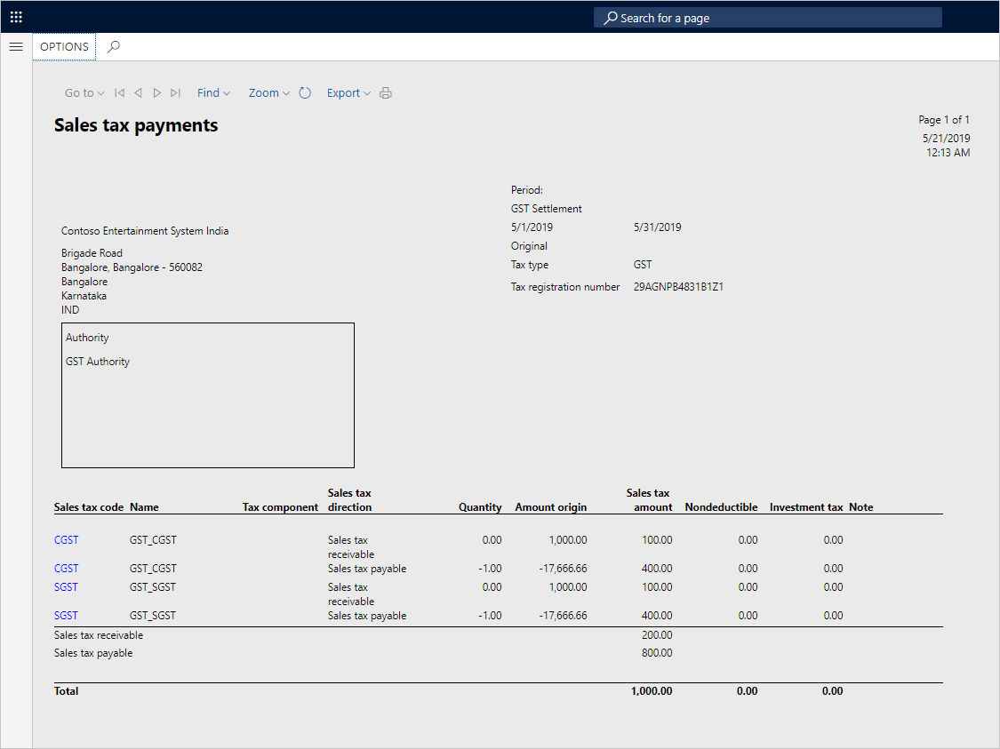

---
# required metadata

title: Rule-based tax settlement
description: This topic explains how to set up and work with rule-based tax settlements.
author: EricWangChen
ms.date: 06/05/2019
ms.topic: article
ms.prod: 
ms.technology: 

# optional metadata

# ms.search.form: 
audience: Application User
# ms.devlang: 
ms.reviewer: kfend
# ms.tgt_pltfrm: 
# ms.custom: 
ms.search.region: India
# ms.search.industry: 
ms.author: wangchen
ms.search.validFrom: 2019-06-01
ms.dyn365.ops.version: 10.0.4

---

# Rule-based tax settlement

[!include [banner](../includes/banner.md)]

## Set up rule-based tax settlement

1. Go to **Tax** \> **Declarations** \> **Sales tax** \> **Settle and post sales tax**.
2. Enter the appropriate values, and then select **OK**.

## Validate tax settlement voucher entries

1. Go to **Tax** \> **Indirect taxes** \> **Sales tax** \> **Sales tax settlement periods**.
2. Select the settlement period, and then select **Sales tax payments**.
3. Verify that the settlement for the selected registration for the period is successfully posted.
4. Select **Print report**.

## GST authority payment

1. Go to **Accounts payable** \> **Payments** \> **Payment journal**.
2. Create a journal.
3. Select **Lines**.
4. Create a journal voucher for the authority account.
5. Select **Settle transactions**.
6. Select the appropriate transaction, and then select **Post** \> **Post**.
7. Select **Inquiries** \> **Voucher**.

## Update challan information

To update challan information, select **Functions** \> **Challan information**.

## Manually adjust a tax settlement

1. Go to **Tax** \> **Declarations** \> **Sales tax** \> **Settle and post sales tax**.
2. Enter the appropriate values.
3. Select **Tax adjustment**.

## Exclude transactions from the settlement

1. Expand the **GST** node.
2. Select the **CGST** node, and then select **Transaction**.
3. Cancel the selection of the transaction that should be excluded from the settlement.
4. Select **Update**.

> [!NOTE] 
> When the tax set-off rule is recalculated, the components are adjusted accordingly.

## Partial settlement of the transactions

1. Select the **SGST** node, and then select **Transaction**.
2. Select the transaction, and then update the **Recoverable amount to settle** field.
3. Select **Update**.

    > [!NOTE]
    > - When the tax set-off rule is recalculated, the components are adjusted accordingly.
    > - Excess recoverable, unsettled transactions, and partially settled transactions should be part of the next settlement period.

4. Select **Close**.
5. Select the **Update** check box.
6. Select **OK**, and close the report.

## Validate the tax settlement voucher entries

1. Go to **Tax** \> **Indirect taxes** \> **Sales tax** \> **Sales tax settlement periods**.
2. Select the settlement period, and then select **Sales tax payments**.
3. Verify that the settlement for the selected registration for the period is successfully posted.

[!INCLUDE[footer-include](../../includes/footer-banner.md)]
