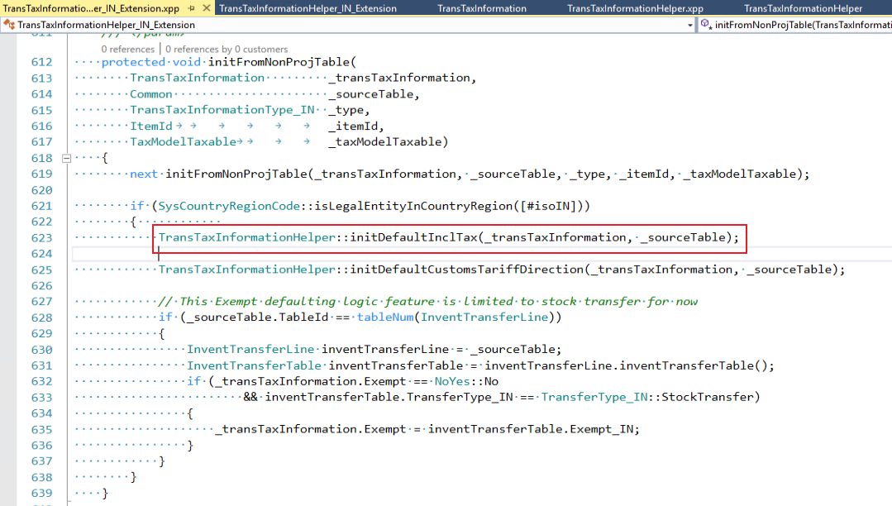
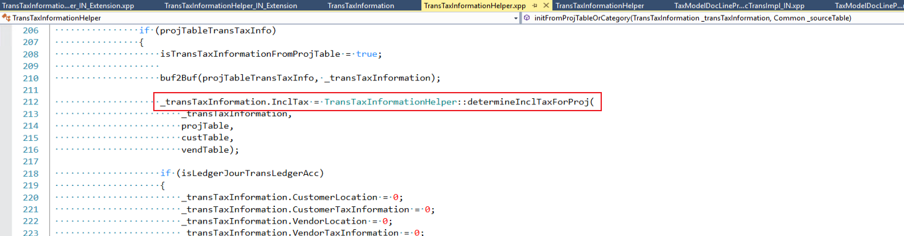
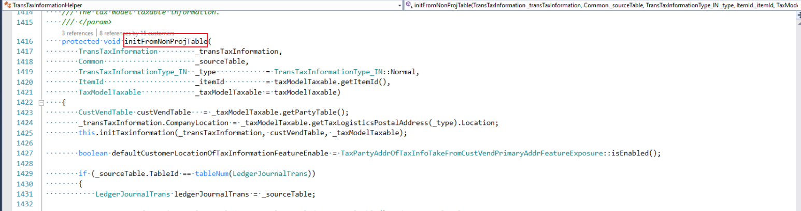
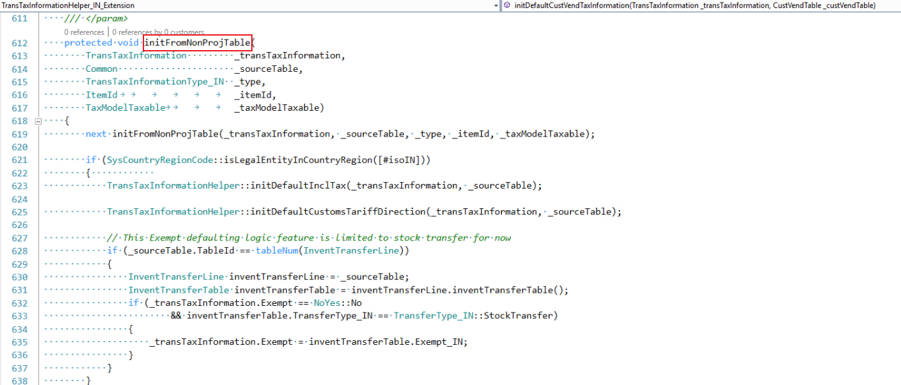
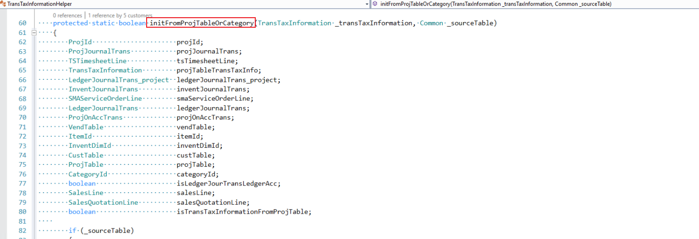
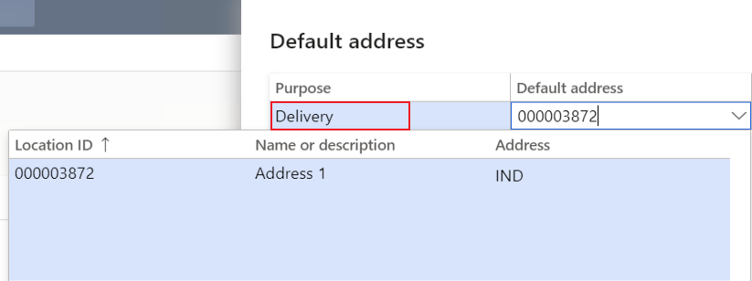
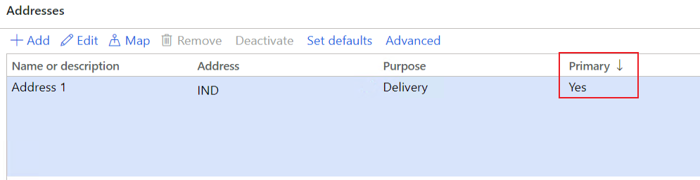
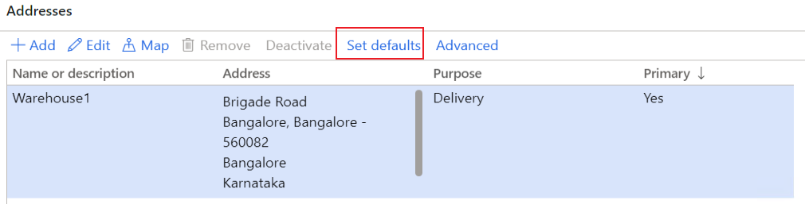
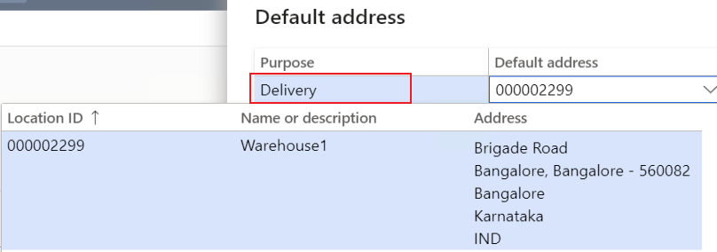
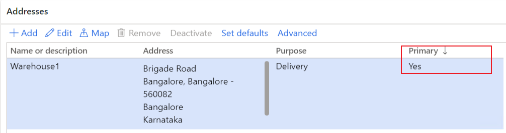

---
# required metadata

title: The default value of the field in tax information is not as expected
description:
author: xuezho,yungu
manager: beya
ms.date: 02/04/2021
ms.topic: article
ms.prod: 
ms.service: dynamics-ax-applications
ms.technology: 

# optional metadata

#ms.search.form:
audience: Application user
# ms.devlang: 
ms.reviewer: kfend
ms.search.scope: Core, Operations
# ms.tgt_pltfrm: 
# ms.custom: 
ms.search.region: India
# ms.search.industry: 
ms.author: wangchen
ms.search.validFrom: 2021-04-01
ms.dyn365.ops.version: 10.0.1
---

# The default value of the field in tax information is not as expected

[!include [banner](https://github.com/MicrosoftDocs/dynamics-365-unified-operations-public/blob/live/articles/finance/includes/banner.md)]

**Symptom**

- The default value of a field in tax information is not as expected.      

  The field in the list below:

  - Company location
  - HSN/SAC 
  - Prices include sales tax

  For other fields, the general debug point is also provided at the end of this trouble shooting guide. 

**Trouble shooting guide**

For each tax information field in the field list from Symptom part, the relevant scenarios are listed and the value is determined based on scenario.

Please find the relevant tax information field, then find the relevant scenario. 

Under each scenario, the fields that the tax information field default value derived from are listed and the paths to these derived from fields are listed in appendix.

- **Tax information field: Company location**

  The default company location in the tax information would be determined based on different scenarios. 

  - For some scenarios, only one location is listed under the scenario, then this location would be used as default company location.

  - For other scenarios, there is a sequential list with all the possible locations to be used as default     company location. Check the locations by following the list sequence until     a location exists in your system. Then this location will be used as     default company location in the tax information.

  - **Scenario: Project contract**

    - Company primary address location

    Debug point

    

  - **Scenario: Project**

    - Project contract tax information company location

  - **Scenario: Project related transactions**

    - Transactions without inventory dimensions (Hour journal, Expense journal, Fee journal, project     on account, subscription)

      1. Project tax information company location

      Debug point

      

    - Transactions with inventory dimensions (Item journal, project sales order)

      1. Warehouse default location for delivery purpose
      2. Warehouse primary address location
      3. Site default location for delivery purpose
      4. Site primary address location
      5. Company default location for delivery purpose
      6. Company primary address location

      Debug point

      

  - **Scenario: Transactions not related to project.**

    - Free text invoice/General journal
    1. Company primary address location
    - Other transactions
    1. Warehouse default location for delivery purpose
      2. Warehouse primary address location
    3. Site default location for delivery purpose
      4. Site primary address location
      5. Company default location for delivery purpose
      6. Company primary address location
  
    Debug point
  
  
  
- **Tax information field: HSN/SAC/Exempt/NonGST**

  The default HSN/SAC in the tax information would be determined based on different scenarios.

- For some scenarios, only one value is listed under the scenario, then this value would be used as     default HSN/SAC/Exempt/NonGST.

- For other scenarios, there is a sequential list with all the possible values to be used as default     HSN/SAC/Exempt/NonGST. Check the values by following the list sequence until a value exists in your system. Then this value would be used as default HSN/SAC/Exempt/NonGST in the tax information.

- **Scenario: Non-project transactions related to inventory item (release product)**

- - HSN/SAC/Exempt/NonGST = item HSN/SAC/Exempt/NonGST

- Debug point

- 

- **Scenario: Non-project transactions related to procurement category**

- - HSN/SAC/Exempt/NonGST = procurement category HSN/SAC/Exempt/NonGST

- Debug point

- 

- **Scenario: Project transactions**

- - **Field: HSN/Exempt/NonGST**

- 1. Project tax information HSN/Exempt/NonGST

     Debug point

     

  2. Inventory item HSN/Exempt/NonGST (Item journal, project sales order)

     Debug point

     

- - **Field: SAC**

    1. Project tax information SAC

       Debug point

       

    2. Inventory Item SAC (Item journal, project sales order)

       Debug point

       

    3. Project category SAC

       Debug point

       

- **Tax information field: Price inclusive**

  The price inclusive would be set in the tax information for the transaction line if any one of the condition is met.

  - **Scenario: Non-project related transactions**

    - **General ledger journal**

      - Journal header is marked as price inclusive 
      - Customer/vendor account used in journal line is marked as default price inclusive

    - **Other non-project related transactions**

      - Head of the transaction is marked as price inclusive

      Debug point

      

  - **Scenario: Project related transactions**

    - **General ledger journal**

    - - Journal header is marked as price inclusive 
      - Customer/vendor account used in journal line is marked as default price inclusive
      - Project tax information is marked as price inclusive
      - The account used in the project is marked as price inclusive

    - **Other project related transactions**

    - - Header of the transaction is marked as price inclusive
      - Project tax information is marked as price inclusive
      - The account used in the project is marked as price inclusive

    - Debug point

    - 

- Other fields

  To check the default value for a certain field in tax information. Debug in the below methods.

  - **Scenario: Non-project related transactions**

  - - **Debug point**

      

      

  - **Scenario: Project related transactions**

  - - **Debug point**

      

**Appendix: How to find the fields related to default value in tax information**

- **Company location derived from fields**

- - Company default location for delivery purpose

    - Path: Organization administration->Organizations->Legal entities->Addresses

      Click on "More options", then "Set defaults"

      

      The default address with purpose "Delivery" is listed as below

      

  - Company primary address location

  - - Path: Organization administration->Organizations->Legal entities->Addresses

      The primary location is marked as "Yes"

      

  - Site default location for delivery purpose

  - - Path: Inventory management->Setup->Inventory breakdown->Sites->Addresses

      Click on "Set defaults"

      

      The default address for delivery purpose is listed as below

      

  - Site primary address location

  - - Path: Inventory management->Setup->Inventory breakdown->Sites->Addresses

      The primary location is marked as "Yes"

      

  - Warehouse default location for delivery purpose 

  - - Path: Inventory management->Setup->Inventory breakdown->Warehouses->Addresses

      Click on "Set defaults"

      

      The default address for delivery purpose is listed as below

      

  - Warehouse primary address location

  - - Path: Inventory management->Setup->Inventory breakdown->Warehouses->Addresses

      The primary location is marked as "Yes"

      

  - Project contract tax information company location

  - - Path: Project management and accounting->Projects->Project contracts

      Enter into the project contract used, then click the "Tax information"

      

      Find the company location used

      

  - Project tax information company location

  - - Path: Project management and accounting->Projects->All projects

      Enter into the project used, then click the "Tax information"

      

    - Find the company location used

    - 

- **HSN/SAC/Exempt/NonGST derived from fields**

  - Inventory item

  - - Path: Product information management->Products->Released Products

      Enter into the item used, find the HSN/SAC/Exempt/NonGST as below

      

  - Procurement category

    - Path: Procurement and sourcing->Consignment->Procurement categories

      Click on the category used, find the HSN/SAC/Exempt/NonGST as below

      

  - Project tax information

  - - Path: Project management and accounting->Projects->Project contracts

      Enter into the project contract used, then click the "Tax information"

      

  - Project category

  - - Path: Project management and accounting->Setup->Categories->Project categories

      Click on the project category used, find the SAC as below

      

- **Price inclusive derived from fields**

- - Customer

    - Path: Accounts receivable->Customers->All customers

      Enter into the customer used, find price inclusive as below

      

  - Vendor

    - Path: Accounts payable->Vendors->All vendors

      Enter into the vendor used, find price inclusive as below

      

    

[!INCLUDE[footer-include](https://github.com/MicrosoftDocs/dynamics-365-unified-operations-public/blob/live/articles/includes/footer-banner.md)]